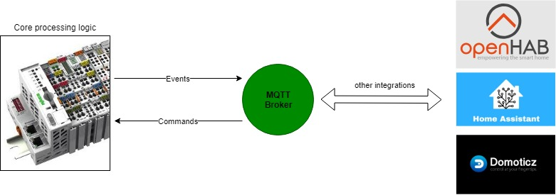

# MQTT enabled CoDeSys 3 Home Automation
This CoDeSys 3.5 project is built for home automation purposes. The goal of the approach is to perform any critical operations like reading inputs, switching light, controlling sunscreens, etc. Inside the PLC itself and make use of MQTT events to send events to an MQTT broker. Using MQTT subscriptions it's possible to send commands to the PLC to switch outputs. 

The goal? One word: redundancy!
- PLC's are very (very) robust controllers: no PC, SoC, etc. is more robust and failure resistant. 
- Avoid performing critical operations that should work 24/7 inside a less redundant controller (it will fail sooner or later).
- Keep your wive/girlfriend happy when you're not at home and your Rpi, Odroid, Banana Pi, Pc crashes (running your MQTT broker, OpenHab, Home Assistant, etc.).

# Architecture
Core processing logic is executed in the (robust) PLC. Meaning that events like reading pushbuttons/switches, updating outputs are executed in the PLC software. To enable integration with external software the PLC sends out events to an MQTT broker when events occur (like pushbutton events, outputs that change state). MQTT subscriptions are enabled as well to allow control from the external software to control -for example- outputs.

# Software Architecture

More information on the software architecture [here](./docs/SoftwareArchitecture.md).

# Function blocks

- [FB_INPUT_PUSHBUTTON_MQTT](./docs/FunctionBlocks/FB_INPUT_PUSHBUTTON_MQTT.md)
- [FB_INPUT_PUSHBUTTON_DIMMER_MQTT](./docs/FunctionBlocks/FB_INPUT_PUSHBUTTON_DIMMER_MQTT.md)
- [FB_INPUT_BINARYSENSOR_MQTT](./docs/FunctionBlocks/FB_INPUT_BINARYSENSOR_MQTT.md)
- [FB_OUTPUT_SWITCH_MQTT](./docs/FunctionBlocks/FB_OUTPUT_SWITCH_MQTT.md)
- [FB_OUTPUT_COVER_MQTT](./docs/FunctionBlocks/FB_OUTPUT_COVER_MQTT.md)

# Additional functionality

- [MQTT Birth and Last will message](./docs/MQTT_Birth_and_Last_will_message.md)

# FAQ

- [Getting started guide](./docs/Getting_started_guide.md)
- [I'm missing some functionality](./docs/Missing_functionality.md)

# Libraries

The following libraries are used in this PLC project and can be found under `src\Libraries`:
- CommonTypesAndFunctions ([stefandreyer/CODESYS-Common](https://github.com/stefandreyer/CODESYS-Common))
- MQTT ([stefandreyer/CODESYS-MQTT](https://github.com/stefandreyer/CODESYS-MQTT))
- OSCAT NETWORK ([link](https://store.codesys.com/oscat-building.html))
- OSCAT BASIC ([link](https://store.codesys.com/oscat-basic.html))
- OSCAT BUILDING ([link](https://store.codesys.com/oscat-network.html))

Special thanks to StefanDreyer for his assistance in some of the MQTT aspects of this project and his great work on his open-source CoDeSys MQTT library.

