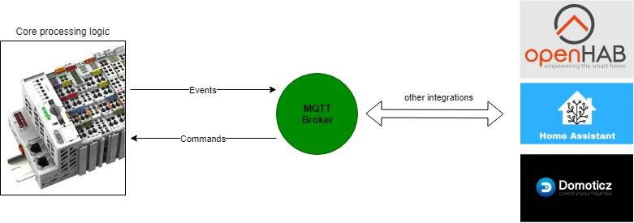

# MQTT enabled CODESYS 3 Home Automation

This CODESYS 3.5 project is built for home automation purposes. The goal of the approach is to perform any critical operations like reading inputs, switching lights, controlling sun blinds, etc. inside the PLC itself and make use of MQTT to send events to an MQTT broker. Using MQTT subscriptions it's possible to send commands to the PLC to control -for example- outputs. 

The purpose? Redundancy on a software level but also on a hardware level!
- PLCs are very (very) robust controllers: no PC, SoC, etc. is more robust and failure resistant. 
- Hardware continuity: Home automation providers often renew their modules every X years, modules aren't sold anymore or a full upgrade is required when something breaks. PLC models and their modules are sold decades after their initial release date. For an example, check out the Wago 750 series controllers and modules. 
- Avoid performing critical operations that should work 24/7 inside a less redundant controller (it will fail sooner or later).
- Keep your wife/girlfriend happy when you're not at home and your RPi, Odroid, Banana Pi, PC crashes (running your MQTT broker, openHAB, Home Assistant, etc.).

# Supported Devices & Getting started
<!-- markdown-link-check-disable -->
The project is developed using the IEC 61131-3 standard in [CODESYS](https://www.codesys.com/).
<!-- markdown-link-check-enable -->
Although CODESYS supports a large number of different device types, this project is specifically tested and developed on the WAGO PFC100/200 device series.
There are multiple generations of the WAGO PFC100/200 series, the documentation below aims to get you acquainted with the differences between generations and their implications:

- [Choosing and preparing your WAGO PFC device](./docs/WagoPfcPrep.md)
- [Getting started guide](./docs/FAQ/Getting_started_guide_CODESYS_3S.md)

# Architecture
Core processing logic is executed in the (robust) PLC. Meaning that events like reading pushbuttons/switches, updating outputs are executed in the PLC software. To enable integration with external software the PLC sends out events to an MQTT broker when events occur (like pushbutton events, outputs that change state). MQTT subscriptions are enabled as well to allow the external software to control -for example- outputs.

# Software Architecture

More information on the software architecture [here](./docs/SoftwareArchitecture.md).

# Function blocks

## Basic function blocks
Basic function blocks for basic IO events and operations.

- [FB_INPUT_PUSHBUTTON_MQTT](./docs/FunctionBlocks/FB_INPUT_PUSHBUTTON_MQTT.md)
- [FB_INPUT_PUSHBUTTON_DIMMER_MQTT](./docs/FunctionBlocks/FB_INPUT_PUSHBUTTON_DIMMER_MQTT.md)
- [FB_INPUT_BINARYSENSOR_MQTT](./docs/FunctionBlocks/FB_INPUT_BINARYSENSOR_MQTT.md)
- [FB_OUTPUT_BINARY_MQTT](./docs/FunctionBlocks/FB_OUTPUT_BINARY_MQTT.md)
- [FB_OUTPUT_DIMMER_MQTT](./docs/FunctionBlocks/FB_OUTPUT_DIMMER_MQTT.md)
- [FB_OUTPUT_COVER_MQTT](./docs/FunctionBlocks/FB_OUTPUT_COVER_MQTT.md)
- [FB_OUTPUT_COVER_POSITION_MQTT](./docs/FunctionBlocks/FB_OUTPUT_COVER_POSITION_MQTT.md)
- [FB_OUTPUT_BISTABLE_MQTT](./docs/FunctionBlocks/FB_OUTPUT_BISTABLE_MQTT.md)

## Modbus RTU over RS485
With many PLCs having an onboard RS485 serial port it is a popular protocol to create a robust Modbus RTU sensor network.

### Using Modbus RTU
How to use Modbus RTU differs depending on the PLC/development environment used. The topics below address the usage of Modbus RTU in several development environments:

- [Using Modbus RTU with the CODESYS 3S runtime](./docs/RS485/UsingModbusRTU_CODESYS3S.md)

### RS485 function blocks
To translate the byte array received by the Modbus device to their actual value and send their values through MQTT the function blocks below have been developed. Note that a specific function block is required for each type of Modbus RTU device.

- [FB_RS485_EASTRON_SDM220_MQTT](./docs/FunctionBlocks/FB_RS485_EASTRON_SDM220_MQTT.md)
- [FB_RS485_EASTRON_SDM_POWER_MQTT](./docs/FunctionBlocks/FB_RS485_EASTRON_SDM_POWER_MQTT.md)
- [FB_RS485_EASTRON_SDM630_MQTT](./docs/FunctionBlocks/FB_RS485_EASTRON_SDM630_MQTT.md)
- [FB_RS485_DUCO_DUCOBOX_MQTT](./docs/FunctionBlocks/FB_RS485_DUCO_DUCOBOX_MQTT.md)
- [FB_RS485_ESERA_OWD_MQTT](./docs/FunctionBlocks/FB_RS485_ESERA_OWD_MQTT.md)
- [FB_RS485_DFROBOT_SEN0492_MQTT](./docs/FunctionBlocks/FB_RS485_DFROBOT_SEN0492_MQTT.md)

Each of them implements the [I_RS485_DEVICE interface](./docs/RS485/RS485Device_Interface.md), which
is what lets one bus be shared between many of them.

The three Eastron meter blocks announce themselves to Home Assistant over MQTT discovery:
give the instance a `FriendlyName` and it appears as a device of its own with its
measurements underneath, no YAML and no init calls. See
[MQTT self-wiring](./docs/AdditionalFunctionality/MQTT_SelfWiring.md).

Three more blocks sit underneath:

- [FB_RS485_BUSCONTROLLER](./docs/FunctionBlocks/FB_RS485_BUSCONTROLLER.md) decides whose turn it
  is, and runs one device's whole transaction — several reads, or a write and the read that
  confirms it — with the bus held throughout.
- [FB_RS485_COMMISSIONER](./docs/FunctionBlocks/FB_RS485_COMMISSIONER.md) puts devices onto the
  bus before any of them is polled. It asks each registered device whether it needs something
  written into it first — a device that ships on a baud rate this bus does not use is inaudible,
  not slow — and knows nothing about any device beyond that answer.
- [FB_RS485_TRANSPORT_RTU](./docs/FunctionBlocks/FB_RS485_TRANSPORT_RTU.md) speaks Modbus RTU over
  the serial port. It sits behind an interface, so a different Modbus implementation can be
  substituted without touching any device block.

## DALI
Control DALI drivers using the WAGO DALI multi-master module (753-647). Needs the
`WagoAppDALI` library, which WAGO's licence does not allow this repository to ship —
[install it once per engineering PC](./docs/WagoPfcPrep.md#installing-the-wago-libraries-dali)
before building.

Two caveats, both on the function block's page: **only a G2 WAGO device can drive
the module under the CODESYS runtime**, because `FbDaliMaster` binds to a port
instance that only WAGO's own device description provides, and the whole feature
is **untested on hardware** — compile-verified on every build, never run against
a real ballast.

- [FB_OUTPUT_DIMMER_DALI_MQTT](./docs/FunctionBlocks/FB_OUTPUT_DIMMER_DALI_MQTT.md)

## DMX
Control DMX drivers.

- [FB_OUTPUT_DIMMER_DMX_MQTT](./docs/FunctionBlocks/FB_OUTPUT_DIMMER_DMX_MQTT.md)

## HVAC
Control your HVAC setup, more detail in the [HVAC getting started guide](./docs/FAQ/HVAC_getting_started_guide.md).

- [FB_HVAC_THERMOSTAT_MQTT](./docs/FunctionBlocks/FB_HVAC_THERMOSTAT_MQTT.md)
- [FB_HVAC_COLLECTOR_MQTT](./docs/FunctionBlocks/FB_HVAC_COLLECTOR_MQTT.md)
- [FB_HVAC_PUMP_MQTT](./docs/FunctionBlocks/FB_HVAC_PUMP_MQTT.md)
- [FB_HVAC_BURNER_MQTT](./docs/FunctionBlocks/FB_HVAC_BURNER_MQTT.md)

# Additional functionality

- [MQTT related settings](./docs/AdditionalFunctionality/MQTT_General.md)
- [MQTT Discovery](./docs/AdditionalFunctionality/MQTT_Discovery.md)
- [Naming a block instead of wiring it](./docs/AdditionalFunctionality/MQTT_SelfWiring.md)
- [Controlling Wago PFC user LEDs](./docs/AdditionalFunctionality/User_leds_CODESYS3S_runtime.md)

# FAQ

- [Contributing guidelines](./docs/CONTRIBUTING.md)
- [Coding style](./docs/CodingStyle.md)
- [Migrating to the naming convention](./docs/NamingConventionMigration.md)
- [How-to: adding a new MQTT subscription](./docs/FAQ/Howto_adding_a_new_MQTT_subscription.md)
- [How-to: verifying resource usage on a Wago PFC PLC](./docs/FAQ/Howto_verifying_resource_usage_WagoPFC.md)
- [How-to: updating function blocks to the latest version](./docs/FAQ/Howto_updating_function_blocks.md)
- [RS485: tips and tricks](./docs/FAQ/RS485_tips_and_tricks.md)
- [I'm missing some functionality](./docs/FAQ/Missing_functionality.md)

# Libraries

The following libraries are used in this PLC project and can be found under `src\Libraries`:
- MQTT ([stefandreyer/CODESYS-MQTT](https://github.com/stefandreyer/CODESYS-MQTT))
    - CommonTypesAndFunctions ([stefandreyer/CODESYS-Common](https://github.com/stefandreyer/CODESYS-Common))
    - PRO_JSON ([stefandreyer/JSON-Library](https://github.com/stefandreyer/JSON-Library))
    - OSCAT_NETWORK_TYPES ([stefandreyer/OSCAT-NETWORK](https://github.com/stefandreyer/OSCAT-NETWORK))
    - BASIC_Extension ([stefandreyer/OSCAT-BASIC](https://github.com/stefandreyer/OSCAT-BASIC))
- OSCAT NETWORK ([link](https://store.codesys.com/oscat-network.html))
- OSCAT BASIC ([link](https://store.codesys.com/oscat-basic.html))
- OSCAT BUILDING ([link](https://store.codesys.com/oscat-building.html))

Special thanks to Stefan Dreyer for his assistance in some of the MQTT aspects of this project and his great work on his open-source CODESYS MQTT library.

