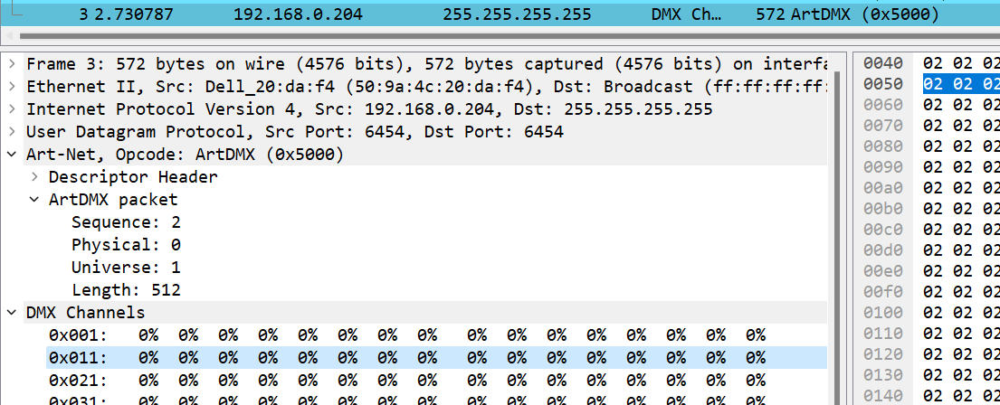

## DMX via Art-Net

### **General**

DMX is a light protocol (alternative to DALI). It is used in stage lighting. It can have multiple universes. A house needs typically one universe, since it contains 512 channels. Each channel has 256 steps. Channels can combined to get more fine grained control.

### **Setup**

<ins>Global parameters</ins> 
In `DMXVariables` you can set an IP. This depends on your topology. Multicast works, if the PLC and art-net node share the sub mask.

    // unicast: 10.1.1.4
    // multicast: 10.1.1.255
    // broadcast: 255.255.255.255

In `DMX_SEND` you can set the universe. `0` is not recommended for art-net. the default is therefore `1`

### **Debug**

With wireshark you can track your network. ArtNet/DMX has a dedicated parser.

