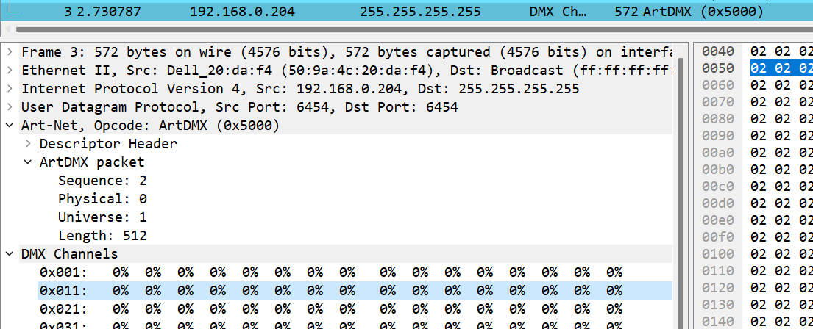

## DMX via Art-Net

### **General**

DMX is a lighting protocol (an alternative to DALI). It is used in stage lighting. It can have multiple universes. A house typically needs only one universe, since it contains 512 channels. Each channel has 256 steps. Channels can be combined to get more fine-grained control.

### **Setup**

<ins>Global parameters</ins></br>
In `GVL_DMX` you can set an IP. This depends on your topology. Multicast works if the PLC and Art-Net node share the subnet mask.

    // unicast: 10.1.1.4
    // multicast: 10.1.1.255
    // broadcast: 255.255.255.255

In `PRG_DMX_SEND` you can set the universe. `0` is not recommended for Art-Net, so the default is `1`.

<ins>Channel numbering</ins></br>
One convention, and both halves are written to it: **`GVL_DMX.DMX.BUFFER[c - 1]` is
DMX channel `c`.** `FB_OUTPUT_DIMMER_DMX_MQTT` writes that slot, and `PRG_DMX_SEND`
copies buffer index `i` into `stSBuf1.BUFFER[i + 18]` — an ArtDmx packet carries its
18-byte header first and then channel 1 at data offset 0, so nothing shifts along
the way. A channel outside 1..512 is refused by `initDMX`, which leaves the block
dormant rather than indexing outside the buffer.

<ins>What a block declares and what actually happens</ins></br>
`initDMX` takes `DmxWidth` and `DmxUniverse`, and both reach the Home Assistant
discovery config — but neither changes what is transmitted:

| Input | Declared as | What the code does |
|:--|:--|:--|
| `DmxChannel` | the fixture's channel | written, one byte per block |
| `DmxWidth` | how many channels the fixture spans | **not acted on** — only the single byte at `DmxChannel` is ever written, so an RGB fixture gets one channel |
| `DmxUniverse` | which universe to transmit on | **not acted on** — `PRG_DMX_SEND` sends one universe, its own `iUniverse`, for every block |

So a block declaring universe 2 transmits on whatever `PRG_DMX_SEND` is set to. Both
are published in discovery because that is where a fixture's addressing belongs; the
sending side has yet to grow a second universe or a multi-channel write.

### **Debug**

With Wireshark you can track your network. Art-Net/DMX has a dedicated parser.



If you work remotely you can SSH into a PLC to check the multicast (in this case `10.1.1.255`). Either use the command line below or pipe SSH directly into Wireshark:

```
ssh root@10.1.1.3 sudo tcpdump --dont-verify-checksums -i ethX2 -U -s0 -w - 'dst host 10.1.1.255' | "C:\Apps\Wireshark\Wireshark.exe" -k -i -
```
