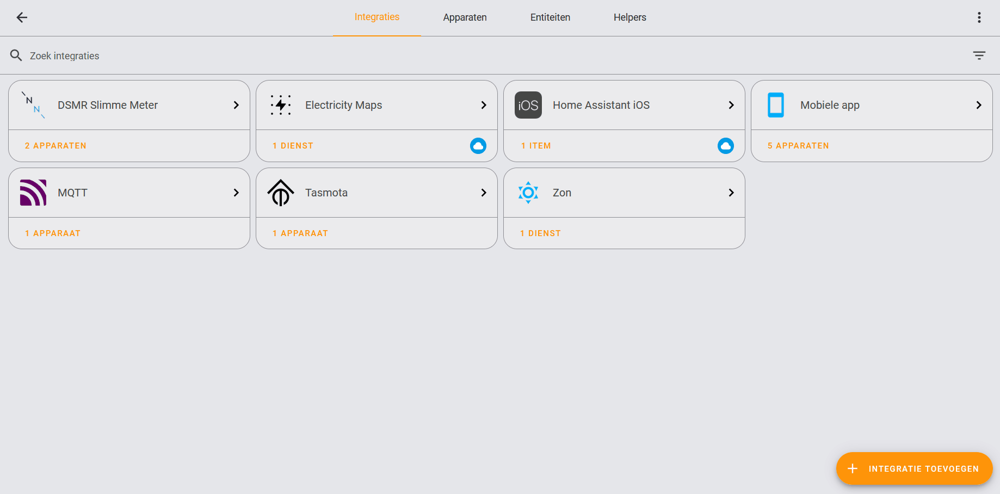
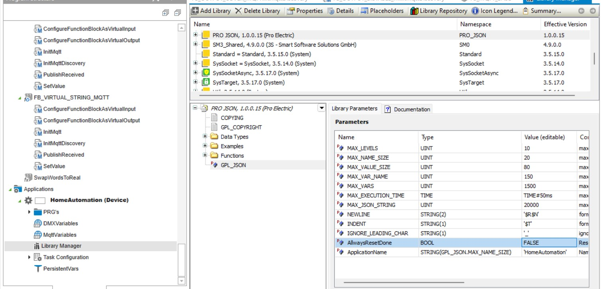

## **MQTT discovery**
Several home automation systems -like Home Assistant- support [MQTT discovery](https://www.home-assistant.io/integrations/mqtt/#mqtt-discovery). Leveraging this functionality in the PLC programming will automatically provision devices in the supported home automation system.

----------------------------

:information_source: Function blocks supporting MQTT discovery are marked with a  badge on their documentation page.

----------------------------

Supported function blocks have a `InitMqttDiscovery` method. The method needs a [FB_PLC_MQTT_DISCOVERY_DEVICE](../FunctionBlocks/FB_PLC_MQTT_DISCOVERY_DEVICE.md) instance to work.

### JSON library configuration
In order to support MQTT discovery the 'PRO_JSON' library is used to generate the required json objects.
This library is configuration sensitive. Amongst others it required the projectName in its variables to function correctly:

  