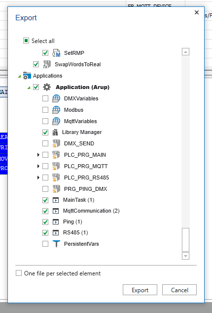

## How to contribute

#### **Did you find a bug?**

* **Ensure the bug was not already reported** by searching on GitHub under [Issues](https://github.com/MichielVanwelsenaere/HomeAutomation.CoDeSys3/issues).

* If you're unable to find an open issue addressing the problem, [open a new one](https://github.com/MichielVanwelsenaere/HomeAutomation.CoDeSys3/issues/new). Be sure to include a **title and clear description**, as much relevant information as possible, and a **code sample** or a **clear explanation** demonstrating the expected behavior that is not occurring.

#### **Did you write a patch that fixes a bug?**

* Make sure there is a GitHub issue for the patch you are writing.

* Open a new GitHub pull request with the patch.

* Ensure the PR description clearly describes the problem and solution. Include the relevant issue number.

In case your specific project differs too much from the reference project in this repository, use the PLCopen XML to export the specific artifacts including the fix and attach them to the relevant GitHub issue.

#### **Do you intend to add a new feature or change an existing one?**

* Suggest your change/feature in the [Gitter chat](https://gitter.im/MichielVanwelsenaere/HomeAutomation.CoDeSys3) and start writing code.

* Do not open an issue on GitHub until you have collected positive feedback about the change. GitHub issues are primarily intended for bug reports, fixes and milestone tracking.

#### **Do you have questions about the source code?**

* Ask any question about how to use the source code in the [Gitter chat](https://gitter.im/MichielVanwelsenaere/HomeAutomation.CoDeSys3).

# Merge request (pull request)

## **GIT side**

1. Create your own fork (if you haven't already).
2. Don't change the default `.project` for your own config.
3. Optional: create a branch.
4. Code.
5. Prepare for export, see below.
6. Add documentation in the markdown files.
7. Create a merge/pull request from your repo to this one.

## **Prepare for export**

An export contains `.export` and `.xml` for people to update. The `.project` is upgraded with the new changes, so it stays a basic version for newcomers.

1. Save the `.project` file

   - Make sure the original project is **unmodified**
   - Save with another name.

2. Run export (from your modified project)

   - Export all files except configs

     

     So no `*variables`, `PRGs` and `PersistenceVars`
   - You can export Variables/Library if you see fit
     - PLCopen XML >>> [Exports\PLCopen.xml](../src/Exports/PLCopen.xml)
     - CODESYS v3 >>> [Exports\CodesysV3.export](../src/Exports/CodesysV3.export)

3. Open the original `.project`. Keep your config out.
    - Follow [this guide](FAQ/Howto_updating_function_blocks.md) to update your blocks

    - Add 1 example of the new function block/methods to the POU
    - Document the new function block/methods in the POU!