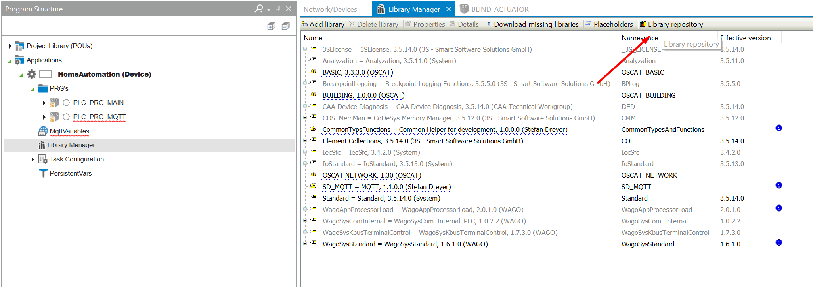
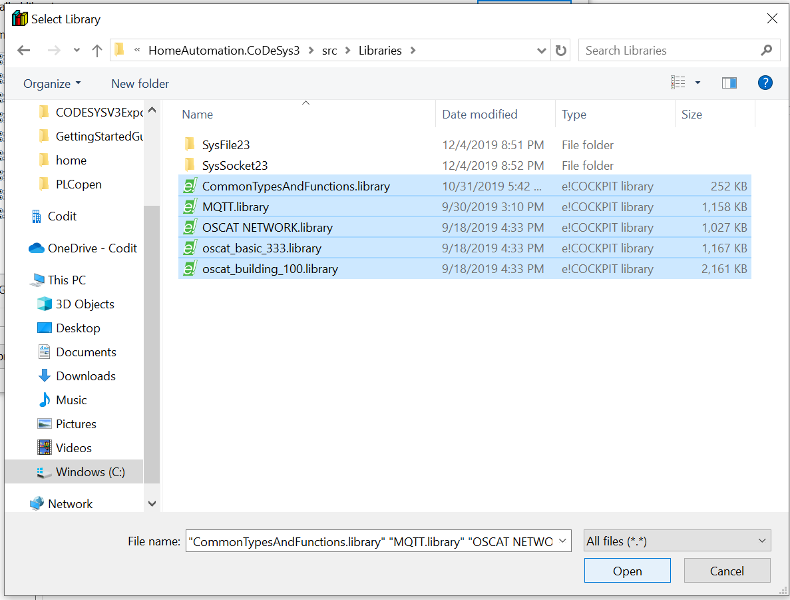
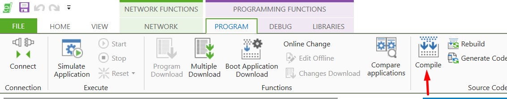

## Getting started guide (é!COCKPIT runtime)

### __Getting to know CoDeSys3__
If you have experience with programming in CodeSys3 you can skip this part. Otherwise, it's advised to gain some experience by checking the sources below:

- Setup environment and creation first project: [YouTube video](https://www.youtube.com/watch?v=hI8t9UHPV8s)
- CoDeSys start guide (uses CoDeSys 2.3 but principles still applicable): [YouTube playlist](https://www.youtube.com/watch?v=WP9pUfBi6Pw&list=PL08CDB741463CA7B4&index=1)
- CoDeSys Sequential Function Charts Explained: [YouTube video](https://www.youtube.com/watch?v=eP42t9O5drk)
- Getting to know the IEC 61131-3 standard: [iec 61131-3 reference](https://bitbucket.org/ntphx/iec-61131)

### __Setup CoDeSys 3S__

1. Download é!COCKPIT from the [WAGO website](https://www.wago.com/global/automation-technology/discover-software/ecockpit-engineering-software). 

### __Open the project__

1. open the file with *.ecp* extension in é!COCKPIT.

### __Libraries__

1. Go to the *Library Manager* &rarr; *Libary repository* menu:

2. install all libraries from the [src/Libraries](https://github.com/MichielVanwelsenaere/HomeAutomation.CoDeSys3/tree/master/src/Libraries) folder.

### __Build__

1. Build the project

### __Uploading and running the project__

[This video](https://www.youtube.com/watch?v=K-zUGiEQRAw) provides all instructions. 