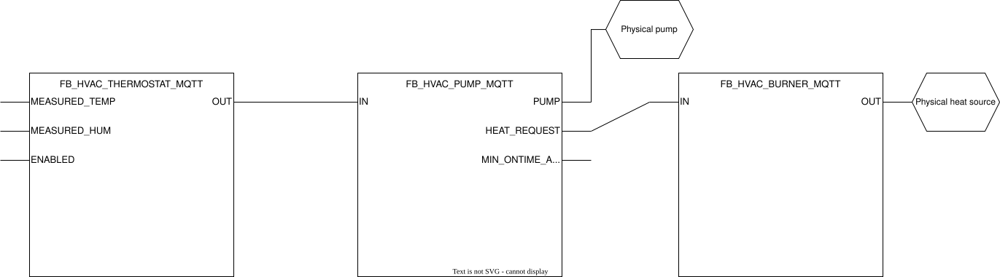
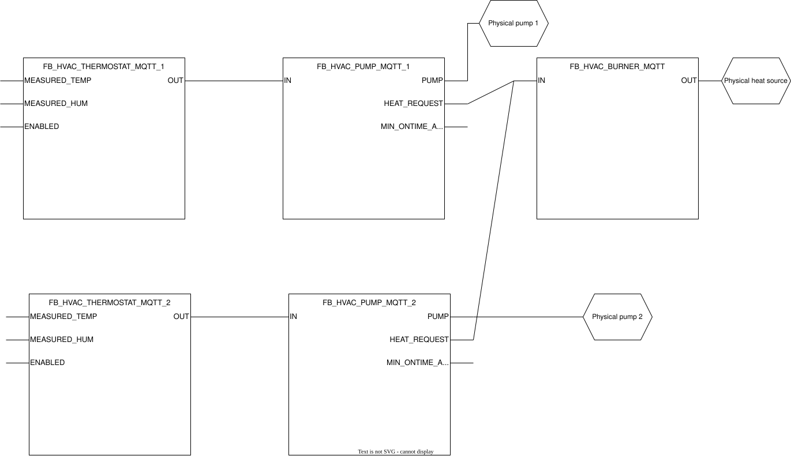
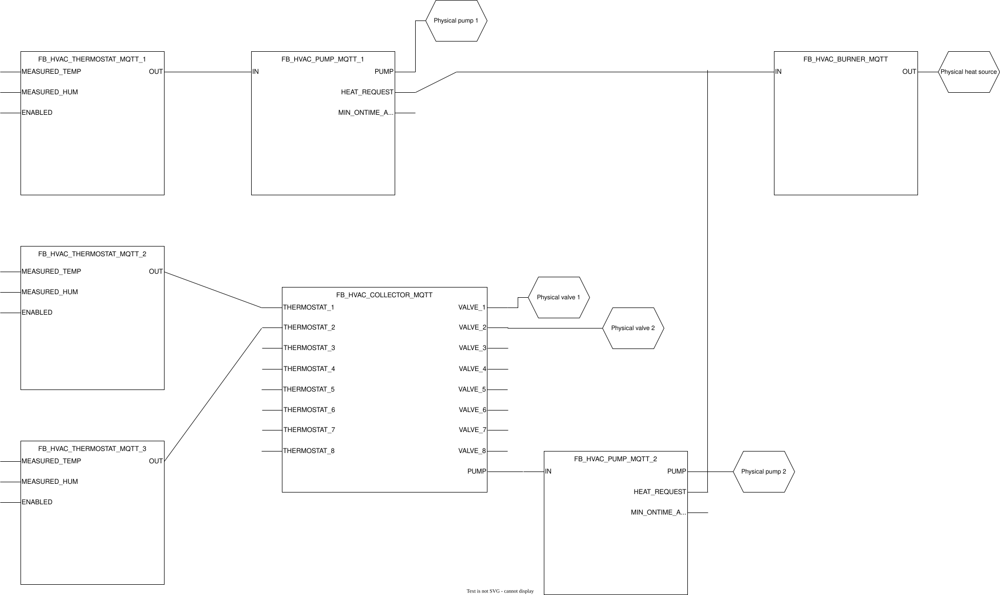

## HVAC Getting Started

### **General**

This guide aims to get you acquainted with the principles applied in the HVAC function blocks and how they are designed to work together. An implementation of scenario C can be found in the project under program `PRG_HVAC`. 

### **Scenario A: Floor heating**

This scenario assumes a single floor heating system with one thermostat and one pump. To control this system the following logical components are required:
- a thermostat that measures the temperature in the room and allows setting the desired temperature.
- a pump that controls the flow of water through the floor heating circuit.
- a heat source that produces warm water when the pump is on.




### **Scenario B: 2 Floor heating circuits**

Building upon scenario A, consider a scenario where there is not one floor heating circuit but two. In a real life situation this could for example be the floor heating on the first floor and the floor heating on the second floor, each with its own thermostat.



### **Scenario C: 1 Floor heating circuit and 2 radiators on the same collector**

Not all buildings leverage floor heating in every single room. In many setups radiators are used to heat multiple rooms in a building. This scenario covers such an example and assumes a thermostat in every room heated by a radiator:

---

:information_source: Due to the lack of PID logic in the function blocks the target temperature will always overshoot. This is only the case for radiators and not floor heating as they generate heat much faster.

---



### **Getting the timings right**

Three timings shape the chain, and they are set at three different declaration
sites. Two of them interact, which is easy to miss because each one looks
self-contained where it is written:

| Timing | Where | What it does |
|:--|:--|:--|
| `ValveCycleTime` | `FB_HVAC_COLLECTOR_MQTT` `FB_init` | Holds the pump off after heat is first requested, so a valve can open before there is flow. |
| `MIN_ONTIME` / `MIN_OFFTIME` | `FB_HVAC_PUMP_MQTT` `FB_init` | Minimum run and minimum pause, so the pump cannot short-cycle. |
| `MIN_ONTIME` / `MIN_OFFTIME` | `FB_HVAC_BURNER_MQTT` `FB_init` | The same, for the heat source. |

**The pump's minimum on-time outlives the demand that started it.** Once the pump
is running it keeps running until `MIN_ONTIME` has elapsed, however quickly the
thermostat is satisfied. So on a collector, whatever closes the valves has to wait
for the pump rather than for the thermostat — otherwise the pump spends the rest of
its minimum on-time pushing against a manifold that is closing.

The approach is to wire it, not to tune it:

```ST
fbPump2Collector.PUMP_MIN_ONTIME_ACTIVE := fbPump2.MIN_ONTIME_ACTIVE;
```

Scenario A has no valve at all — the thermostat drives the pump directly — so it is
not exposed to this. Scenario B and Scenario C are.

:bulb: On real hardware, a differential bypass on the manifold is the belt to this
braces: it gives the pump a path no matter what the control logic believes.
