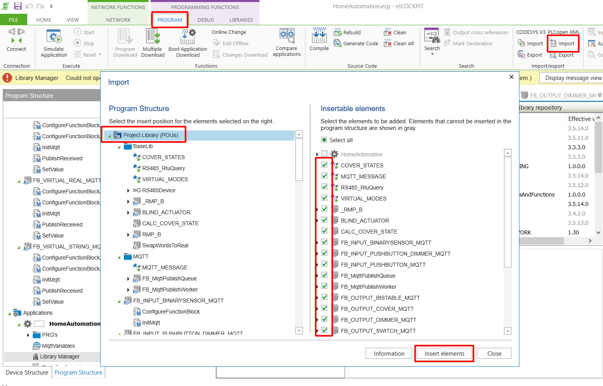
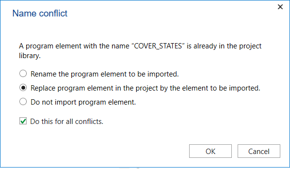

## How-to: updating function blocks to the latest version
This page describes the advised process to upgrade the function blocks in the project the latest version.

1. Navigate to the [src/PLCOpen](https://github.com/MichielVanwelsenaere/HomeAutomation.CoDeSys3/tree/master/src/PLCopen) directory on GitHub.
2. Download the xml file. This file contains an export of the entire project. 
3. Open your personal project, and navigate to the 'import PLCOpen' option.
4. Select everything to import except 'HomeAutomation':

5. Resolve all conflicts by replacing:

