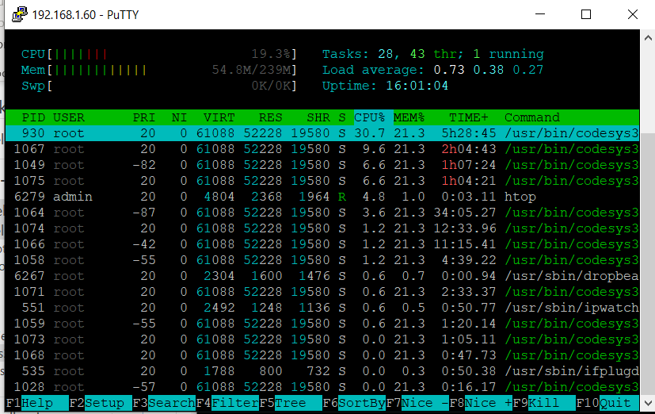

## How-to: Verifying resource usage on a Wago PFC PLC
This page describes the steps required to verify the resource usage (CPU/memory) on a Wago PFC.
Steps might be similair for other PLCs.  

1. Using an SSH client -for example PuTTY- SSH into the IP address of your PLC.
2. Run the `htop` command to verify the resource usage on your PLC:

