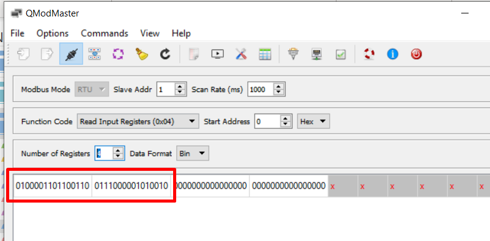

## RS485: Tips and Tricks
This page describes some tips and tricks to verify and resolve RS485 issues. 

### __Testing the RS485 device__
In many cases it can be usefull to test the RS485 device from a PC before attempting to connect and read it out by your PLC device. In first instance it allows detection of faulty devices but in parallel also provides more insights in the structure of the device modbus registers .

To be able to communicate with modbus RTU devices from a PC you'll need a USB to RS485 convertor ([example here](https://www.aliexpress.com/item/32638090708.html?spm=a2g0s.9042311.0.0.27424c4dWhWZOx)). 
Consider acquiring two convertors to simultaneously send modbus commands and sniff the traffic. 

Using [QModMaster](https://sourceforge.net/projects/qmodmaster/) specific modbus RTU commands can be executed. For example:

Note: use 'Device Manager' to establish on what COM port the USB to RS485 convertor is located.

In addition to targeted modbus commands the QModMaster software also allows scanning of the RS485 bus to find any devices. This can be usefull if you don't now the address of your device.

### __Verifying traffic on the bus__
When not able to perform and modbus read/write commands it's often hard to establish the exact cuase. Is the device faulty, is there a problem on the bus or is the master device not able to send a command on the RS485 bus?
An easy trick to narrow it down is using a regular led diode and placing it on the RS485 bus datawires.
The led will light up everytime data passes over the bus providing more information to where the problem might occur.

### __RS485 Wiring__
There's plenty of information on RS485 wiring on the internet (tip, use Google!). The main principles to take into account are 120Ω bus terminator resistors on both sides of the bus but more importantly it's adviced to use wiring cables that twist the RS485 datacables. CAT cables can be considered as a good practice. 