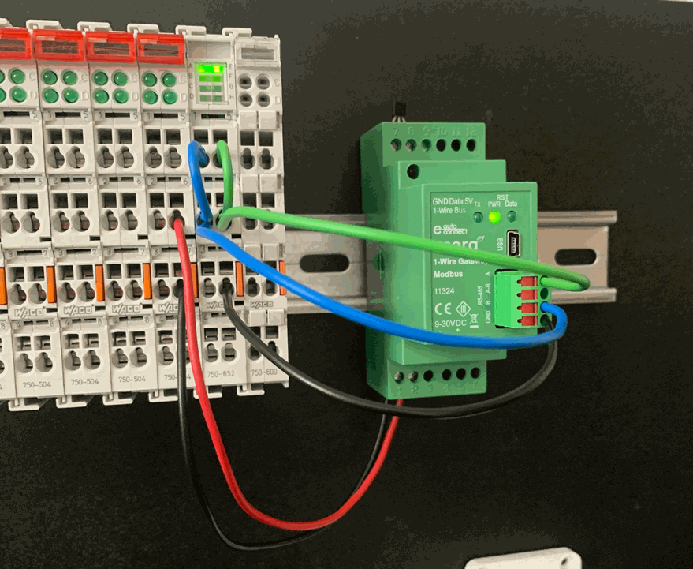

## RS485: Tips and Tricks
This page describes some tips and tricks to verify and resolve RS485 issues. 

### **Testing the RS485 device**
In many cases it can be usefull to test the RS485 device from a PC before attempting to connect and read it out by your PLC device. In first instance it allows detection of faulty devices but in parallel also provides more insights in the structure of the device modbus registers .
<!-- markdown-link-check-disable -->
To be able to communicate with modbus RTU devices from a PC you'll need a USB to RS485 convertor ([example here](https://www.aliexpress.com/item/32638090708.html)). 
Consider acquiring two convertors to simultaneously send modbus commands and sniff the traffic. 
<!-- markdown-link-check-enable -->
Using [QModMaster](https://sourceforge.net/projects/qmodmaster/) specific modbus RTU commands can be executed. For example:

Note: use 'Device Manager' to establish on what COM port the USB to RS485 convertor is located.

In addition to targeted modbus commands the QModMaster software also allows scanning of the RS485 bus to find any devices. This can be usefull if you don't now the address of your device.

### **Verifying traffic on the bus**
When not able to perform and modbus read/write commands it's often hard to establish the exact cause. Is the device faulty, is there a problem on the bus or is the master device not able to send a command on the RS485 bus?
An easy trick to narrow it down is using a regular led diode and placing it on the RS485 bus datawires.
The led will light up everytime data passes over the bus providing more information to where the problem might occur.

### **RS485 cabling best practices**
<!-- markdown-link-check-disable -->
Consider [this article on electrical-engineering](https://electrical-engineering-portal.com/correct-cabling-modbus-rs485) a must read. 
<!-- markdown-link-check-enable -->

### **Using an external Wago module**
Depending on requirements a dedicated RS485 module might be required instead of using the onboard serial port of the device (is available).

Based on user experience in this field, pay attention to:
- reset the module to factory settings before using
- last confirmed working version of required libraries:
    - WagoSysModule_75x_65x: Version 1.9.5.2 
    - WagoTypesCom: Version 1.6.1.3
- change the 'comport' in the RS485 master function block you intend to use.
- make sure the wiring of the module is correct:

