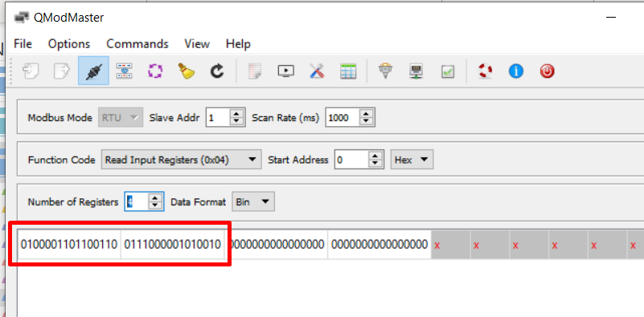
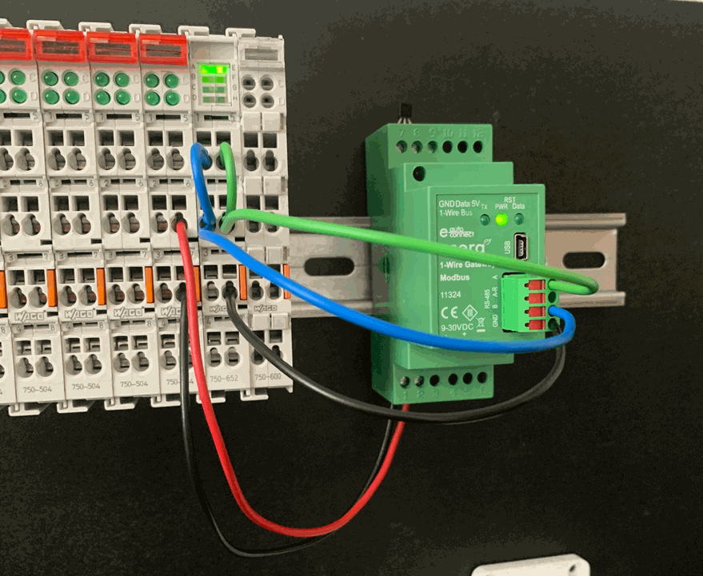

## RS485: Tips and Tricks
This page describes some tips and tricks to verify and resolve RS485 issues. 

### **Testing the RS485 device**
In many cases it can be useful to test the RS485 device from a PC before attempting to connect to it and read it out from your PLC device. In the first instance it allows detection of faulty devices, but it also provides more insight into the structure of the device Modbus registers.
<!-- markdown-link-check-disable -->
To be able to communicate with Modbus RTU devices from a PC you'll need a USB to RS485 converter ([example here](https://www.aliexpress.com/item/32638090708.html)). 
Consider acquiring two converters to simultaneously send Modbus commands and sniff the traffic. 
<!-- markdown-link-check-enable -->
Using [QModMaster](https://sourceforge.net/projects/qmodmaster/) specific Modbus RTU commands can be executed. For example:

Note: use 'Device Manager' to establish which COM port the USB to RS485 converter is located on.

In addition to targeted Modbus commands the QModMaster software also allows scanning of the RS485 bus to find any devices. This can be useful if you don't know the address of your device.

### **Verifying traffic on the bus**
When not able to perform any Modbus read/write commands it's often hard to establish the exact cause. Is the device faulty, is there a problem on the bus or is the master device not able to send a command on the RS485 bus?
An easy trick to narrow it down is using a regular LED and placing it on the RS485 bus data wires.
The LED will light up every time data passes over the bus, providing more information about where the problem might occur.

### **RS485 cabling best practices**
<!-- markdown-link-check-disable -->
Consider [this article on electrical-engineering](https://electrical-engineering-portal.com/correct-cabling-modbus-rs485) a must-read.
<!-- markdown-link-check-enable -->

### **Using a dedicated Wago RS485 module**
Depending on requirements a dedicated RS485 module might be required instead of using the onboard serial port of the device (if available).

Based on user experience in this field, pay attention to:
- reset the module to factory settings before use.
- last confirmed working version of required libraries:
    - WagoSysModule_75x_65x: Version 1.9.5.2 
    - WagoTypesCom: Version 1.6.1.3
- change the 'comport' in the RS485 master function block you intend to use.
- make sure the wiring of the module is correct:

