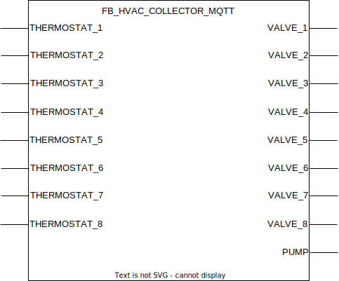

## FB_HVAC_COLLECTOR_MQTT

### **General**

Designed to control multiple valves that share the same pump. Valves can be controlled via the thermostats function blocks

### **Block diagram**

INPUT(S)

- THERMOSTAT_X: datatype _BOOL_, input for the signal coming from a thermostat function block. When high the valve should be opened and flow provided by the pump.

OUTPUT(S)

- VALVE_X: datatype _BOOL_, output for the valve that should be controlled by the matching thermostat.
- PUMP: datatype _BOOL_, output that should be directed to a HVAC pump function block in order to turn a pump on or off.

METHOD(S)

- FB_init: constructor, overview of the parameters:
  - `ValveCycleTime`: datatype _TIME_, time required to fully open or close a valve. Pump output will only be switched when at least one valve is fully open.

- InitMQTT: enables MQTT events on the FB, an overview of the parameters:
  - `MQTTPublishPrefix`: datatype _POINTER TO STRING_, pointer to the MQTT publish prefix that should be used for publishing any messages/events for this FB. Suffix is automatically set to FB name.
  - `MQTTSubscribePrefix`: datatype _POINTER TO STRING_, pointer to the MQTT subscribe prefix that should be used for publishing any messages/events to this FB. Suffix is automatically set to FB name.
  - `pMqttPublishQueue`: datatype _POINTER TO FB_MqttPublishQueue_, pointer to the MQTT queue to publish messages.
  - `pMqttCallbackCollector`: datatype _SD_MQTT.CallbackCollector_, pointer to the MQTT callback collector, required to register FB for subscriptions on a certain topic.
  - `MqttQos`: datatype _SD_MQTT.QoS_, configures the MQTT Qos for the function block published messages.
  - `MqttRetain`: datatype _BOOL_, configures the MQTT retain flag for the function block published messages.

### **MQTT publish behavior**

Requires method call `InitMQTT` to enable MQTT capabilities. 

| Event                 | Description                         | MQTT payload | QoS                                  | Retain flag                          | Published on startup                 |
| :-------------------- | :---------------------------------- | :----------- | :----------------------------------- | :----------------------------------- | :----------------------------------- |
| **output changes: VALVE_X** | A change is detected on output `VALVE_X`. | `TRUE/FALSE` | 2 | `TRUE` | yes |

MQTT publish topic is a concatenation of the publish prefix and the function block name.
