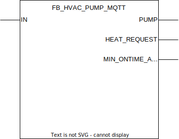

## FB_HVAC_PUMP_MQTT

### **General**

Designed to control a pump with a simple on/off signal and request heat from the burner function block when it is required. Respects any minimum runtime requirements.

### **Block diagram**

INPUT(S)

- IN: datatype _STRING_, should be made high if pump flow is required.

OUTPUT(S)

- PUMP: datatype _BOOL_, output for switching the pump on and off. Respects a minimum on and off runtime value to prevent damaging the pump
- HEAT_REQUEST: datatype _BOOL_, output for requesting heat from the burner. Follows the input `IN` more closely then output `PUMP` since the minimum runtime for the burner is controlled in the burner function block. 
- MIN_ONTIME_ACTIVE: datatype _BOOL_, output indicating when the pump is in it's minimum runtime time cycle.

METHOD(S)

- FB_init: constructor, overview of the parameters:
  - `MIN_ONTIME`: datatype _TIME_, time that the pump should be on at a minimum before turning it off again.
  - `MIN_OFFTIME`: datatype _TIME_, time that the pump should be off at a minimum before turning it on again.

- InitMQTT: enables MQTT events on the FB, an overview of the parameters:
  - `MQTTPublishPrefix`: datatype _POINTER TO STRING_, pointer to the MQTT publish prefix that should be used for publishing any messages/events for this FB. Suffix is automatically set to FB name.
  - `MQTTSubscribePrefix`: datatype _POINTER TO STRING_, pointer to the MQTT subscribe prefix that should be used for publishing any messages/events to this FB. Suffix is automatically set to FB name.
  - `pMqttPublishQueue`: datatype _POINTER TO FB_MqttPublishQueue_, pointer to the MQTT queue to publish messages.
  - `pMqttCallbackCollector`: datatype _SD_MQTT.CallbackCollector_, pointer to the MQTT callback collector, required to register FB for subscriptions on a certain topic.
  - `MqttQos`: datatype _SD_MQTT.QoS_, configures the MQTT Qos for the function block published messages.
  - `MqttRetain`: datatype _BOOL_, configures the MQTT retain flag for the function block published messages.

### **MQTT publish behavior**

Requires method call `InitMQTT` to enable MQTT capabilities. O

| Event                 | Description                         | MQTT payload | QoS                                  | Retain flag                          | Published on startup                 |
| :-------------------- | :---------------------------------- | :----------- | :----------------------------------- | :----------------------------------- | :----------------------------------- |
| **output changes: PUMP** | A change is detected on output `PUMP`. | `TRUE/FALSE` | 2 | `TRUE` | yes |

MQTT publish topic is a concatenation of the publish prefix and the function block name.
