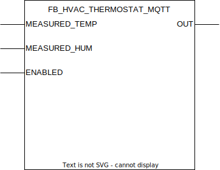

## FB_HVAC_THERMOSTAT_MQTT

### **General**

Designed to control the heat requirements in a room.

### **Block diagram**

INPUT(S)

- MEASURED_TEMP: datatype _REAL_, measured temperature in the room.
- MEASURED_HUM: datatype _REAL_, measured humidity in the room.
- ENABLED: datatype _BOOL_, enables or disables the thermostat.

OUTPUT(S)

- OUT: datatype _BOOL_, when high the room requires heating.

METHOD(S)

- FB_init: constructor, overview of the parameters:
  - `MinAllowedTemp`: datatype _REAL_, minimum allowed temperature in the room. If the thermostat is on 'auto' mode the thermostat will heat up the room when the temperature drops below this value. Not possible to set the thermostat to a lower temperature value.
  - `MaxAllowedTemp`: datatype _REAL_, maximum allowed temperature in the room. Not possible to set the thermostat to a higher temperature value.
  - `Hysteresis`: datatype _REAL_, allowed temperature delta from the target temperature. If the measured temperature drops below the target temperature minus the hysteresis value the heating will be turned on.

- InitMQTT: enables MQTT events on the FB, an overview of the parameters:
  - `MQTTPublishPrefix`: datatype _POINTER TO STRING_, pointer to the MQTT publish prefix that should be used for publishing any messages/events for this FB. Suffix is automatically set to FB name.
  - `MQTTSubscribePrefix`: datatype _POINTER TO STRING_, pointer to the MQTT subscribe prefix that should be used for publishing any messages/events to this FB. Suffix is automatically set to FB name.
  - `pMqttPublishQueue`: datatype _POINTER TO FB_MqttPublishQueue_, pointer to the MQTT queue to publish messages.
  - `pMqttCallbackCollector`: datatype _SD_MQTT.CallbackCollector_, pointer to the MQTT callback collector, required to register FB for subscriptions on a certain topic.
  - `MqttQos`: datatype _SD_MQTT.QoS_, configures the MQTT Qos for the function block published messages.
  - `MqttRetain`: datatype _BOOL_, configures the MQTT retain flag for the function block published messages.
- PublishReceived: callback method called by the callbackcollector when a message is received on the subscribed topic by the callbackcollector.

### **MQTT publish behavior**

Requires method call `InitMQTT` to enable MQTT capabilities.

| Event                 | Description                         | MQTT payload | QoS                                  | Retain flag                          | Published on startup                 |
| :-------------------- | :---------------------------------- | :----------- | :----------------------------------- | :----------------------------------- | :----------------------------------- |
| **output changes: OUT** | A change is detected on output `OUT`. | `TRUE/FALSE` | 2 | `TRUE` | yes |
| **input changes: MEASURED_TEMP** | A change is detected on input `MEASURED_TEMP`. | `TRUE/FALSE` | 2 | `TRUE` | yes |
| **input changes: MEASURED_HUM** | A change is detected on output `MEASURED_HUM`. | `TRUE/FALSE` | 2 | `TRUE` | yes |

MQTT publish topic is a concatenation of the publish prefix and the function block name.

### **MQTT subscribe behavior**

Requires method call `InitMQTT` to enable MQTT capabilities. Commands are executed by the FB if the topic `MQTTSubscribeTopic` matches the MQTT topic and the payload exists in the table below.

| Command                     | Description                                          | expected payload | Additional notes                                                 |
| :-------------------------- | :--------------------------------------------------- | :--------------- | :--------------------------------------------------------------- |
| **Set desired temperature**  | Request to set specific temperature value. value expected on `DESIRED_TEMP` subtopic.                   | any number          | Command executed when value is between `MinAllowedTemp` and `MaxAllowedTemp` . |
| **Set desired thermostat mode**  | Request to set thermostat to a specific mode. value expected on `MODE` subtopic.                   | `auto`, `off` or `heat`  |  |

MQTT subscription topic is a concatenation of the subscribe prefix variable and the function block name.
