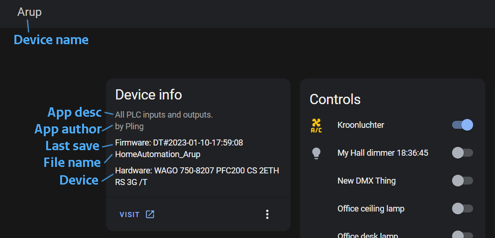

## FB_MQTT_DEVICE


INPUT(S)
- URL: this sets the url to your PLC. 

OUTPUT(S)


METHOD(S)
- initDevice: collects all device info once


### __Code example__
- variables initiation:
```
MQTT_device							:FB_MQTT_DEVICE
```

- Init MQTT method call (called once during startup):
```
MQTT_device.initDevice(
  url:= 'http://wago.local' 
);
```


## Device info in Home Assistant

Device name: 
- open device structure
- change controller

App desc/auth:
- edit application settings

Time last start:
- autogenerated from the moment the first run

Device:
- autogenerated from hardware


  