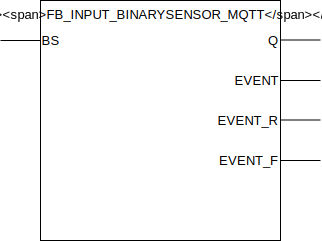

## FB_INPUT_BINARYSENSOR_MQTT

### __General__
Binary sensors gather information about the state of devices which have a "digital" return value (either 1 or 0). These can be switches, contacts, pins, etc. These sensors only have two states: *0/off/low/closed/false* and *1/on/high/open/true*
Requires method call `InitMQTT` to enable MQTT capabilities.
Sends events `ON` and `OFF`, to the `MQTTPublishQueue` with Retain flat set to `TRUE`.

### __Block diagram__



INPUT(S)
- BS: digital input linked to the signal wire of the binary sensor.

OUTPUT(S)
- Q: follows the input `BS` but debounced.
- EVENT: output high for one clock cycle when any event occurs on debounced input `BS`.
- EVENT_R: output high for one clock cycle when a rising edge is detected on debounced input `BS`.
- EVENT_F: output high for one clock cycle when a falling edge is detected on debounced input `BS`.

METHOD(S)
- InitMQTT: enables MQTT events on the FB: sets the topic to publish to and sets the pointer to the `MQTTPublishQueue`.

### __Code example__

- variables initiation:
```
MQTTBinarySensorPrefix  :STRING(100) := 'WAGO-PFC200/Out/DigitalInputs/BinarySensors/';
FB_DI_BS_001            :FB_INPUT_BINARYSENSOR_MQTT;
```

- Init MQTT method call (called once during startup):
```
FB_INPUT_BINARYSENSOR_MQTT.InitMQTT(MQTTPublishPrefix:= ADR(MQTTBinarySensorPrefix),    (* pointer to string prefix for the MQTT publish topic *)
    MQTTTopicSuffix := 'FB_DI_BS_001',                                  (* value to suffix the the MQTT topic, should be unique for each FB *)
    pMQTTPublishQueue := ADR(MQTTVariables.fbMQTTPublishQueue)          (* pointer to MQTTPublishQueue to send a new MQTT event *)
);
```

- reading digital input for events (cyclic):
```
FB_DI_BS_001(BS:= DI_001);
```

- integration with `FB_OUTPUT_SWITCH_MQTT`:
```
FB_DO_SW_001(OUT=>  DO_001,                 (* couple the function block to the physical output *)
    PRIOHIGH:=      FALSE,                  (* brings the output high regardless of other input values *)
    PRIOLOW:=       FALSE,                  (* brings the output low regardless of other input values. NOTE: Priohigh overrules Priolow input *)
    TOGGLE:=        FB_DI_BS_001.EVENT      (* for toggling the output *)	
);
```

### __Home Assistant yaml__
To integrate with Home Assistant use the yaml code below in your [MQTT binary sensor](https://www.home-assistant.io/components/binary_sensor.mqtt/) config:

```yaml
- platform: MQTT
  name: "FB_DI_BS_001"
  state_topic: "WAGO-PFC200/Out/DigitalInputs/BinarySensors/FB_DI_BS_001"
  qos: 2  
  payload_on: "ON"
  payload_off: "OFF"
  availability_topic: "Devices/WAGO-PFC200/availability"
  payload_available: "online"
  payload_not_available: "offline"
```