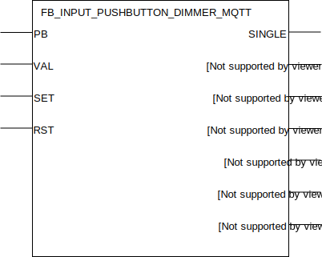

## FB_INPUT_PUSHBUTTON_DIMMER_MQTT

### **General**
Big brother of input function block [FB_INPUT_PUSHBUTTON_MQTT](./FB_INPUT_PUSHBUTTON_MQTT.md) with additional functionality to output a realtime dimmer value (range 0-255).

### **Block diagram**



INPUT(S)
- PB: digital input linked to the signal wire of a pushbutton.
- VAL: byte value for SET operation.
- SET: input for switching output DIM to input VAL value.
- RST: input to switch of the output.

OUTPUT(S)
- SINGLE: output high for one clock cycle when a single push is detected on input `PB`.
- DOUBLE: output high for one clock cycle when a double push is detected on input `PB`.
- LONG: output high for one clock cycle when a long push is detected on input `PB`.
- P_LONG: output becomes high when a long push is detected on input `PB`, remains high as long as `PB` remains high.
- Q: output.
- DBL: double-click output.
- DIM: dimmer value, byte datatype. 

METHOD(S)
- InitMQTT: enables MQTT events on the FB, an overview of the parameters:
    - `MQTTPublishPrefix`: datatype *POINTER TO STRING*, pointer to the MQTT publish prefix that should be used for publishing any messages/events for this FB. Suffix is automatically set to FB name. 
    - `pMqttPublishQueue`: datatype *POINTER TO FB_MqttPublishQueue*, pointer to the MQTT queue to publish messages.
    - `OutputDimmer`: datatype *BOOL*, specify whether the DIM values (0-255) should be outputted as MQTT events.
    - `Qos_Dimm`: datatype *SD_MQTT.QoS*, MQTT QoS of the DIM MQTT events.
    - `Delta_Dimm`: datatype *INT*, resolution of the MQTT DIM events. For example: specifying value *5* will configure the FB to only emit an MQTT event when the DIM output differs *5* or more than its previous value. Note that the last value of output DIM (when input `PB` becomes low again) is always published. Even if the resolution delta hasn't been reached yet. This way the last DIM value published through MQTT is always synchronized with the DIM output of the FB.

- ConfigureFunctionBlock: configures the dimmer with your prefered configurations, an overview of the parameters and their default values:
    - `T_Debounce`: debounce time for input PB, defaults to 10ms.
    - `T_Reconfig`:  reconfiguration time, defaults to 10S.
    - `T_On_Max`: start limitation, defaults to 0ms.
    - `T_Dimm_Start`: reaction time to dim, defaults to 400ms.
    - `T_Dimm`: time for a dimming ramps, defaults to 3s.
    - `Min_On`: minimum value of output DIM at startup, defaults to 50.
    - `Max_On`: maximum value of output DIM at startup, defaults to 255.
    - `Soft_Dimm`: if TRUE dimming begins after ON and at 0. 
    - `Dbl_Toggle`: if TRUE the output DBL is inverted at each double-click, defaults to FALSE.
    - `Rst_Out`: if input Rst is TRUE, ouput DIM is set to 0, defaults to FALSE.
    - `T_Long`: configures the time parameter specifying the decoding time for long key press. Defaults to 400mS. When this timespan is reached while pushing the pushbutton a long push is detected on input `PB`.

### **Function Block Behaviour**
This MQTT function block is a wrapper of the `DIMM_I` function block in the OSCAT building library enhanced with additional functionality in order to be able to emit MQTT events for single, double, long and dimmer events. To fully understand it's logic it's advised to give the documentation present in [the OSCAT building library docs](../_img/oscat_building100_en.pdf) a good read (page 52).

### **MQTT Event Behaviour**
Requires method call `InitMQTT` to enable MQTT capabilities.

| Event | Description | MQTT payload | QoS | Retain flag | Published on startup |
|:-------------|:------------------|:------------------|:------------------|:--------------------------|:--------------------------|
| **Pushbutton single press** | A single pushbutton press is detected on input `PB`. | `SINGLE` | 2 | `FALSE` | no
| **Pushbutton double press** | A double pushbutton press is detected on input `PB`. | `DOUBLE` | 2 | `FALSE` | no
| **Pushbutton long press**   | A long pushbutton press is detected on input `PB`. | `LONG` | 2 | `FALSE` | no
| **Output changes: P_LONG**   | A change is detected on output `P_LONG`. (*) | `TRUE/FALSE` | 2 | `TRUE` | no
| **Output changes: Q**   | A change is detected on output `Q`. (*) | `TRUE/FALSE` | 2 | `TRUE` | no
| **Output changes: DBL**   | A change is detected on output `DBL`. (*) | `TRUE/FALSE` | 2 | `TRUE` | no
| **Output changes: DIM**   | A change is detected on output `DIM`. (*) | `0-255` | configured in method call `InitMQTT` | `FALSE` | no

MQTT publish topic is a concatenation of the publish prefix variable and the function block name.

(*): MQTT publish topic is a concatenation of the publish prefix variable, the function block name and the name of the output. 

### **Code example**

- variables initiation:
```
MQTTPushbuttonPrefix    :STRING(100) := 'Devices/PLC/House/Out/DigitalInputs/Pushbuttons/';
FB_DI_PB_001            :FB_INPUT_PUSHBUTTON_DIMMER_MQTT;
```

- Init MQTT method call (called once during startup):
```
FB_DI_PB_001.InitMQTT(MQTTPublishPrefix:= ADR(MQTTPushbuttonPrefix),    (* pointer to string prefix for the MQTT publish topic *)
    pMQTTPublishQueue := ADR(MQTTVariables.fbMQTTPublishQueue),         (* pointer to MQTTPublishQueue to send a new MQTT event *)
    TRUE,                                                               (* specify whether dimmer value should be outputted on MQTT topic *)
    SD_MQTT.QoS.ExactlyOnce,                                            (* specify the QoS for the dimmer mqtt events (values 0-255) *)    
    5                                                                   (* specify the resolution for the dimmer mqtt events *)    
);
```
The MQTT publish topic in this code example will be `Devices/PLC/House/Out/DigitalInputs/Pushbuttons/FB_DI_PB_001` (MQTTPushbuttonPrefix variable + function block name). Note that for the outputs `Q`, `DBL` and `DIM` the MQTT publish topic has an additional concatination being the name of the output. For example: `Devices/PLC/House/Out/DigitalInputs/Pushbuttons/FB_DI_PB_001/DIM`.

- reading digital input for events (cyclic):
```
FB_DI_PB_001(PB:= DI_001);
```

- integration with `?`: The output dimmer values can be connected to any light supporting integration through Home Assistant, OpenHAB, etc. For dimming using a PLC analog output check out the [FB_OUTPUT_DIMMER_MQTT docs](./FB_OUTPUT_DIMMER_MQTT.md)

### **Home Assistant YAML**
To integrate with Home Assistant use the YAML code below in your [MQTT sensors](https://www.home-assistant.io/components/sensor.mqtt/) config:

```YAML
mqtt:
  sensor:
  # To receive single/double/long events  
  - name: "FB_DI_PB_001"
    state_topic: "Devices/PLC/House/Out/DigitalInputs/Pushbuttons/FB_DI_PB_001"
    qos: 2
    expire_after: 3
    availability_topic: "Devices/PLC/House/availability"
    payload_available: "online"
    payload_not_available: "offline"
  # To receive state of output Q
  - name: "FB_DI_PB_001_Q"
    state_topic: "Devices/PLC/House/Out/DigitalInputs/Pushbuttons/FB_DI_PB_001/Q"
    qos: 2
    availability_topic: "Devices/PLC/House/availability"
    payload_available: "online"
    payload_not_available: "offline"
  # To receive state of output DBL
  - name: "FB_DI_PB_001_DBL"
    state_topic: "Devices/PLC/House/Out/DigitalInputs/Pushbuttons/FB_DI_PB_001/DBL"
    qos: 2
    availability_topic: "Devices/PLC/House/availability"
    payload_available: "online"
    payload_not_available: "offline"
  # To receive state of output DIM
  - name: "FB_DI_PB_001_DIM"
    state_topic: "Devices/PLC/House/Out/DigitalInputs/Pushbuttons/FB_DI_PB_001/DIM"
    qos: 2
    availability_topic: "Devices/PLC/House/availability"
    payload_available: "online"
    payload_not_available: "offline"
  # To receive state of output P_LONG
  - name: "FB_DI_PB_001_P_LONG"
    state_topic: "Devices/PLC/House/Out/DigitalInputs/Pushbuttons/FB_DI_PB_001/P_LONG"
    qos: 2
    availability_topic: "Devices/PLC/House/availability"
    payload_available: "online"
    payload_not_available: "offline"
```