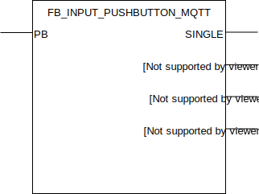

## FB_INPUT_PUSHBUTTON_MQTT

### __General__
Reads out a digital input and sets a single, double or long output high for one cycle when one of those events has been detected on the configured input.

### __Block diagram__



INPUT(S)
- PB: digital input linked to the signal wire of a pushbutton.

OUTPUT(S)
- SINGLE: output high for one clock cycle when a single push is detected on input `PB`.
- DOUBLE: output high for one clock cycle when a double push is detected on input `PB`.
- LONG: output high for one clock cycle when a long push is detected on input `PB`.
- P_LONG: output becomes high when a long push is detected on input `PB`, remains high as long as `PB` remains high.

METHOD(S)
- InitMQTT: enables MQTT events on the FB, an overview of the parameters:
    - `MQTTPublishPrefix`: datatype *POINTER TO STRING*, pointer to the MQTT publish prefix that should be used for publishing any messages/events for this FB. Suffix is automatically set to FB name. 
    - `pMqttPublishQueue`: datatype *POINTER TO FB_MqttPublishQueue*, pointer to the MQTT queue to publish messages.

- ConfigureFunctionBlock: configures the time parameter specifing the decoding time for long key press. Defaults to 400ms.

### __MQTT Event Behaviour__
Requires method call `InitMQTT` to enable MQTT capabilities.

| Event | Description | MQTT payload | QOS | Retain flag | Published on startup |
|:-------------|:------------------|:------------------|:------------------|:--------------------------|:--------------------------|
| **Pushbutton single press** | A single pushbutton press is detected on input `PB`. | `SINGLE` | 2 | `FALSE` | no
| **Pushbutton double press** | A double pushbutton press is detected on input `PB`. | `DOUBLE` | 2 | `FALSE` | no
| **Pushbutton long press**   | A long pushbutton press is detected on input `PB`. | `LONG` | 2 | `FALSE` | no
| **Output changes: P_LONG**   | A change is detected on output `P_LONG`. (*) | `TRUE/FALSE` | 2 | `TRUE` | no

MQTT publish topic is a concatenation of the publish prefix variable and the function block name.

(*): MQTT publish topic is a concatenation of the publish prefix variable, the function block name and the name of the output. 

### __Code example__

- variables initiation:
```
MQTTPushbuttonPrefix    :STRING(100) := 'WAGO-PFC200/Out/DigitalInputs/Pushbuttons/';
FB_DI_PB_001            :FB_INPUT_PUSHBUTTON_MQTT;
```

- Init MQTT method call (called once during startup):
```
FB_DI_PB_001.InitMQTT(MQTTPublishPrefix:= ADR(MQTTPushbuttonPrefix),    (* pointer to string prefix for the MQTT publish topic *)
    pMQTTPublishQueue := ADR(MQTTVariables.fbMQTTPublishQueue)          (* pointer to MQTTPublishQueue to send a new MQTT event *)
);
```
The MQTT publish topic in this code example will be `WAGO-PFC200/Out/DigitalInputs/Pushbuttons/FB_DI_PB_001` (MQTTPushbuttonPrefix variable + function block name).

- reading digital input for events (cyclic):
```
FB_DI_PB_001(PB:= DI_001);
```

- integration with `FB_OUTPUT_SWITCH_MQTT`:
```
FB_DO_SW_001(OUT=>  DO_001,                 (* couple the function block to the physical output *)
    PRIOHIGH:=      FALSE,                  (* brings the output high regardless of other input values *)
    PRIOLOW:=       FALSE,                  (* brings the output low regardless of other input values. NOTE: Priohigh overrules Priolow input *)
    TOGGLE:=        FB_DI_PB_001.SINGLE     (* for toggling the output *)	
);
```

### __Home Assistant YAML__
To integrate with Home Assistant use the YAML code below in your [MQTT sensors](https://www.home-assistant.io/components/sensor.mqtt/) config:

```YAML
# To receive single/double/long events
- platform: MQTT
  name: "FB_DI_PB_001"
  state_topic: "WAGO-PFC200/Out/DigitalInputs/Pushbuttons/FB_DI_PB_001"
  qos: 2
  expire_after: 3
  availability_topic: "Devices/WAGO-PFC200/availability"
  payload_available: "online"
  payload_not_available: "offline"
# To receive state of output P_LONG
- platform: MQTT
  name: "FB_DI_PB_001_P_LONG"
  state_topic: "WAGO-PFC200/Out/DigitalInputs/Pushbuttons/FB_DI_PB_001/P_LONG"
  qos: 2
  availability_topic: "Devices/WAGO-PFC200/availability"
  payload_available: "online"
  payload_not_available: "offline"
```