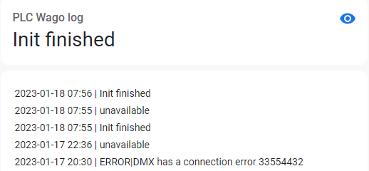

## FB_MQTT_DEVICE



INPUT(S)

OUTPUT(S)

METHOD(S)

- InitMQTT: enables MQTT events on the FB, an overview of the parameters:
  - `MQTTPublishPrefix`: datatype _POINTER TO STRING_, pointer to the MQTT publish prefix that should be used for publishing any messages/events for this FB. Suffix is automatically set to FB name.
  - `pMqttPublishQueue`: datatype _POINTER TO FB_MqttPublishQueue_, pointer to the MQTT queue to publish messages.
  - `MqttQos`: datatype _SD_MQTT.QoS_, configures the MQTT Qos for the function block published messages.
  - `MqttRetain`: datatype _BOOL_, configures the MQTT retain flag for the function block published messages.
- send: allows logging to MQTT. The output string is formatted as follows: `instance | payload`
  - `instance` String for your own choice.
  - `payload`: datatype _STRING_, the payload to be sent to MQTT. String(128)
- InitMqttDiscovery:
  - See [MQTT Discovery](./../AdditionalFunctionality/MQTT_Discovery.md) for more info.

### **Code example**

- variables initiation: (inside MqttVariables)

```
	MQTT_logger							:FB_MQTT_LOG;
```

- Init MQTT method call (called once during startup):

```
MqttVariables.MQTT_logger.InitMqtt(
	MQTTPublishPrefix:= ADR(MqttPubLogPrefix),
	pMqttPublishQueue := ADR(MqttVariables.fbMqttPublishQueue),
	MqttQos:=MQTT.QoS.ExactlyOnce,
	MqttRetain:=FALSE
);
```

To send a message to MQTT:

```
MqttVariables.MQTT_logger.send('Init finished');
```

### **Home Assistant Auto discovery**

See [MQTT Auto discovery](../MQTT_Auto_Discovery/README.md) for more information.

### **Home Assistant YAML**

If home asistant auto discovery is not working for you, you can use the following to your `configuration.yaml`:

```yaml
- name: "plc_log"
  object_id: "plc_log"
  unique_id: "plc_log"
  state_topic: "Devices/PLC/House/debug"
  qos: 0
  device: *device # write or link your device here
  availability: *availability # write or link your availability here

```

### **Home Assistant dashboard**

You can use the following card:

```yaml
type: logbook
entities:
  - sensor.plc_log
```
