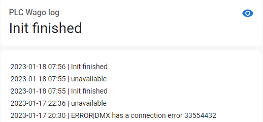

## FB_MQTT_LOG
<!-- fb-badge:start -->

<!-- fb-badge:end -->



<!-- fb-interface:start -->
### **Methods**

**`InitMqtt`** — Enables MQTT on the function block. Call once at startup.

| Parameter | Type | Default | Description |
|:--|:--|:--|:--|
| `MQTTPublishPrefix` | POINTER TO STRING |  | Pointer to the MQTT publish prefix used for this block. The function block name is appended automatically. |
| `pMqttPublishQueue` | POINTER TO FB_MQTT_PUBLISH_QUEUE |  | Pointer to the shared MQTT queue that carries messages to the broker. |
| `MqttQos` | MQTT.QoS | `MQTT.QoS.ExactlyOnce` | MQTT QoS used for messages published by this block. |
| `MqttRetain` | BOOL | `FALSE` | MQTT retain flag used for messages published by this block. |

**`InitMqttDiscovery`** — Publishes a Home Assistant MQTT discovery config so the entity is created automatically. Call once at startup, after `InitMqtt`.

| Parameter | Type | Default | Description |
|:--|:--|:--|:--|
| `Device` | POINTER TO FB_PLC_MQTT_DISCOVERY_DEVICE |  | Pointer to the discovery device this entity belongs to, normally `GVL_MQTT.PLC_Device`. |
| `Name` | STRING(255) | `'plc_log'` | Name shown in the Home Assistant front-end. |
| `overruleId` | STRING(255) | `''` | Overrides the generated entity id. Leave empty to derive it from the function block name. |
| `meta` | STRING(255) | `''` | Extra JSON merged into the discovery config. Leave empty for none. |

**`send`** — Allows logging to MQTT. The output string is formatted as follows: `instance \| payload`

| Parameter | Type | Default | Description |
|:--|:--|:--|:--|
| `str` | STRING(128) |  | Message to log. Published as `instance \| payload`. |
| `instance` | STRING | `''` | A label of your own choice. |
<!-- fb-interface:end -->

### **Code example**

You normally do not instantiate this block yourself. The discovery device owns
an instance (`logger`, inside `FB_BASE_MQTT_DISCOVERY_DEVICE`) and wires it up
as part of its own initialisation, so logging is available as soon as
`GVL_MQTT.PLC_Device` is declared — see
[FB_PLC_MQTT_DISCOVERY_DEVICE](./FB_PLC_MQTT_DISCOVERY_DEVICE.md).

- To send a log message:
```
GVL_MQTT.PLC_Device.SendLogMessage(
	str      := 'Init finished',
	instance := 'PRG_MAIN'
);
```

The published string is formatted as `instance | str`.
### **Home Assistant dashboard**

You can use the following card:

```yaml
type: logbook
entities:
  - sensor.plc_log
```
