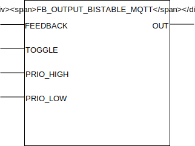

## FB_OUTPUT_BISTABLE_MQTT

### __General__
Designed to control bistable relays, can be switched using pulses that are high for one clock cycle (for example from `FB_INPUT_PUSHBUTTON_MQTT`), requires a feedback loop from the bistable relay.

----------------------------

:warning: Usage of this function block with a bistable relay requires a wired feedback loop from the relay to the PLC. Without it, it is not possible for the PLC to know the state of the relay and thus control it with `TRUE/FALSE` MQTT messages!

----------------------------

### __Block diagram__



INPUT(S)
- FEEDBACK: feedback from the bistable input, should be high when the relay is turned on and low when turned off.
- TOGGLE: when high the output `OUT` gets a pulse. input should one be high for one clockcycle.
- PRIO_HIGH: when high and input `FEEDBACK` low, the output `OUT` gets a pulse. Has priority over the `TOGGLE` and `PRIO_LOW` input.
- PRIO_LOW: when high and input `FEEDBACK` low, the output `OUT` gets a pulse. Has priority over the `TOGGLE` input.

OUTPUT(S)
- OUT: pulse output to control a bistable relay. 

METHOD(S)
- InitMQTT: enables MQTT events on the FB, an overview of the parameters:
    - `MQTTPublishPrefix`: datatype *POINTER TO STRING*, pointer to the MQTT publish prefix that should be used for publishing any messages/events for this FB. Suffix is automatically set to FB name. 
    - `MQTTSubscribePrefix`: datatype *POINTER TO STRING*, pointer to the MQTT subscribe prefix that should be used for publishing any messages/events to this FB. Suffix is automatically set to FB name. 
    - `pMqttPublishQueue`: datatype *POINTER TO FB_MqttPublishQueue*, pointer to the MQTT queue to publish messages.
    - `pMqttCallbackCollector`: datatype *SD_MQTT.CallbackCollector*, pointer to the MQTT callback collector, required to register FB for subscriptions on a certain topic.
    
- PublishReceived: callback method called by the callbackcollector when a message is received on the subscribed topic by the callbackcollector.

- ConfigureFunctionBlock: configures the behaviour of output `OUT` using the parameters below:
    - `T_Hold`: duration of the pulse generated on output `OUT` to switch the bistable relais.

### __MQTT Event Behaviour__
Requires method call `InitMQTT` to enable MQTT capabilities.

| Event | Description | MQTT payload | QoS | Retain flag | Published on startup |
|:-------------|:------------------|:------------------|:------------------|:--------------------------|:--------------------------|
| **Input changes: FEEDBACK**   | A change is detected on input `FEEDBACK`. | `TRUE/FALSE` | 2 | `TRUE` | yes

MQTT publish topic is a concatination of the publish prefix and the function block name. 

### __MQTT Subscription Behaviour__
Requires method call `InitMQTT` to enable MQTT capabilities.
Commands are executed by the FB if the topic `MQTTSubscribeTopic` matches the MQTT topic and the payload exists in the table below.

| Command | Description | expected payload | Additional notes | 
|:-------------|:------------------|:------------------|:------------------|
| **Change output to high** | Request to generate a pulse on output `OUT` if input `FEEDBACK` is low. | `TRUE` | Command executed when `PRIO_HIGH` and `PRIO_LOW` inputs are low.
| **Change output to low** | Request to generate a pulse on output `OUT` if input `FEEDBACK` is high. | `FALSE` | Command executed when `PRIO_HIGH` and `PRIO_LOW` inputs are low.

MQTT subscription topic is a concatenation of the subscribe prefix variable and the function block name. 

### __Code example__

- variables initiation:
```
MQTTPubSwitchPrefix     :STRING(100) := 'Devices/PLC/House/Out/DigitalOutputs/';
MQTTSubSwitchPrefix     :STRING(100) := 'Devices/PLC/House/In/DigitalOutputs/';
FB_DO_BISTABLE_001      :FB_OUTPUT_BISTABLE_MQTT;
```

- Init MQTT method call (called once during startup):
```
FB_DO_BISTABLE_001.InitMQTT(MQTTPublishPrefix:= ADR(MQTTPubSwitchPrefix),           (* pointer to string prefix for the MQTT publish topic *)
    MQTTSubscribePrefix:= ADR(MQTTSubSwitchPrefix),                                 (* pointer to string prefix for the MQTT subscribe topic *)
    pMQTTPublishQueue := ADR(MQTTVariables.fbMQTTPublishQueue),                     (* pointer to MQTTPublishQueue to send a new MQTT event *)
    pMQTTCallbackCollector := ADR(MQTTVariables.collector_FB_OUTPUT_SWITCH_MQTT)    (* pointer to CallbackCollector to receive MQTT subscription events *)
);
```
The MQTT publish topic in this code example will be `Devices/PLC/House/Out/DigitalOutputs/FB_DO_BISTABLE_001` (MQTTPubSwitchPrefix variable + function block name). The subscription topic will be `Devices/PLC/House/In/DigitalOutputs/FB_DO_BISTABLE_001` (MQTTSubSwitchPrefix variable + function block name).


- checking for events to switch the digital output (cyclic):
```
FB_DO_BISTABLE_001(OUT=>  DO_001,           (* couple the function block to the physical output *)
    PRIO_HIGH:=     FALSE,                  (* brings the output high regardless of other input values *)
    PRIO_LOW:=      FALSE                   (* brings the output low regardless of other input values. NOTE: Priohigh overrules Priolow input *)
    TOGGLE:=        FB_DI_PB_009.SINGLE,    (* for toggling the output *)	
    FEEDBACK:=      DI_001                  (* feedback input, required to know state *)	
);
```

- integration with `FB_INPUT_PUSHBUTTON_MQTT`:
```
FB_DO_BISTABLE_001(OUT=>  DO_001,           (* couple the function block to the physical output *)
    PRIO_HIGH:=     FALSE,                  (* brings the output high regardless of other input values *)
    PRIO_LOW:=      FALSE,                  (* brings the output low regardless of other input values. NOTE: Priohigh overrules Priolow input *)
    TOGGLE:=        FB_DI_PB_001.SINGLE,    (* for toggling the output *)	
    FEEDBACK:=      DI_001                  (* feedback input, required to know state *)	
);
```

### __Home Assistant YAML__
To integrate with Home Assistant use the YAML code below in your [MQTT lights](https://www.home-assistant.io/components/light.mqtt/) config:

```YAML
- platform: mqtt
  name: "FB_DO_BISTABLE_001"
  state_topic: "Devices/PLC/House/Out/DigitalOutputs/FB_DO_BISTABLE_001"
  command_topic: "Devices/PLC/House/In/DigitalOutputs/FB_DO_BISTABLE_001"
  payload_on: "TRUE"
  payload_off: "FALSE"
  qos: 2
  optimistic: false
  availability_topic: "Devices/PLC/House/availability"
  payload_available: "online"
  payload_not_available: "offline"
```