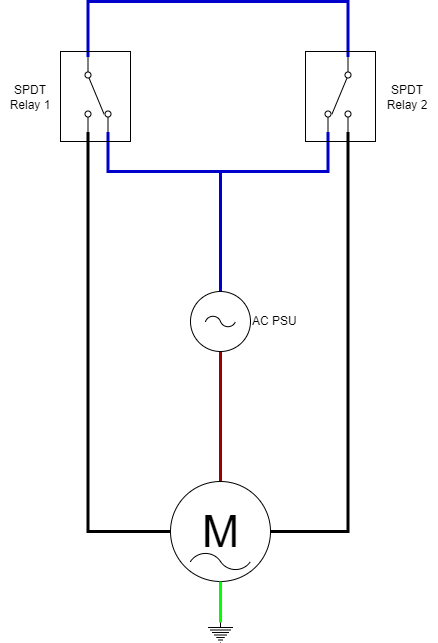
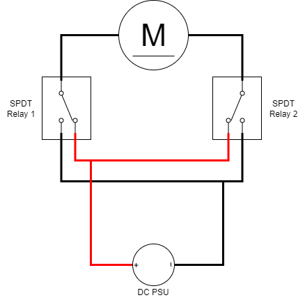
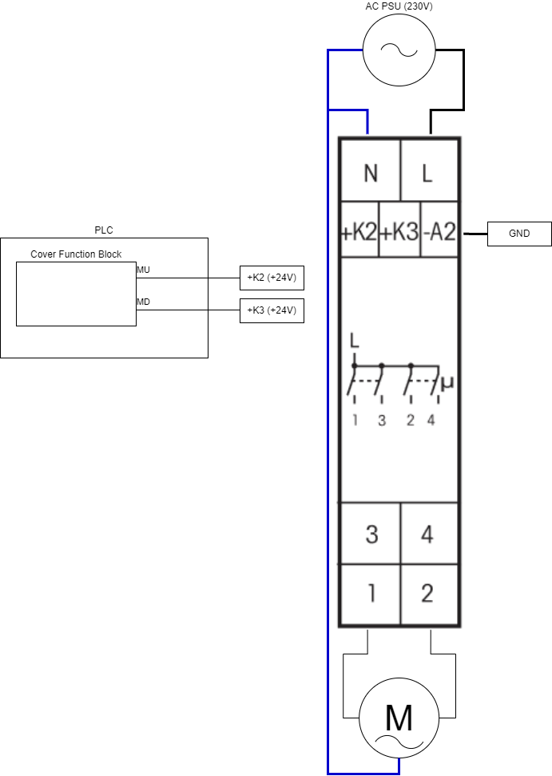
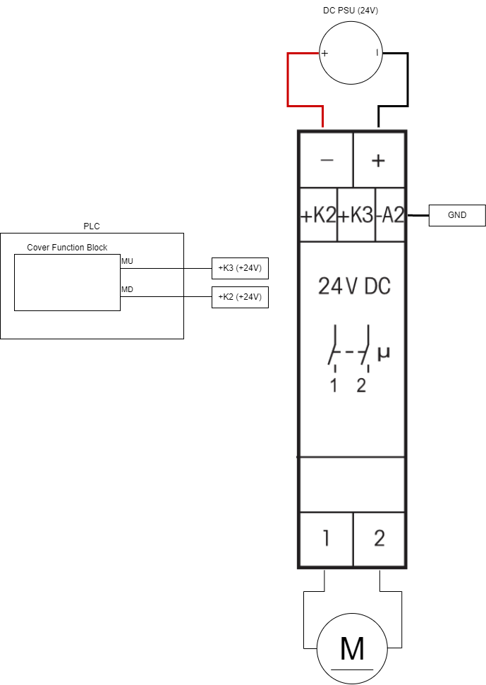

## FB_OUTPUT_COVER_MQTT

### __General__
The cover function block allows you to control covers such as a roller shutter or a garage door. Using a time variable (`T_UD`) that specifies the time to close/open a cover completely its possible to control the specific position of the cover. That specific position variable is maintained through power cycles using a persistent variable.

----------------------------

:rotating_light: Do not use this function block if the mechanical safety on your electric roller shutters hasn't been configured properly!

----------------------------

### __Block diagram__


INPUT(S)
- UP: bool input, when high the cover moves up.
- DN: bool input, when high the cover moves down.
- PI: byte input, position to move the cover to in automode. Automode can be enabled by making UP and DN high simultaneous. 
- PRIO_LOCK: bool input, when high the cover will be locked in its current position ignoring all other inputs. (*)
- PRIO_UP: bool input, when high the cover will receive a constant signal to move up with a maximum time of twice `T_UD`. (*)
- PRIO_DN: bool input, when low the cover will receive a constant signal to move down with a maximum time of twice `T_UD`. (*)

(*) When high, all incoming MQTT commands and the UP/DN inputs will be ignored.

OUTPUT(S)
- POS: byte output, cover position value (range 0-255).
- MU: bool output, motor up signal.
- MD: bool output, motor down signal.

METHOD(S)
- InitMQTT: enables MQTT events on the FB, an overview of the parameters:
    - `MQTTPublishPrefix`: datatype *POINTER TO STRING*, pointer to the MQTT publish prefix that should be used for publishing any messages/events for this FB. The suffix is automatically set to FB name. 
    - `pMqttPublishQueue`: datatype *POINTER TO FB_MqttPublishQueue*, pointer to the MQTT queue to publish messages.
    - `Qos_POS`: datatype *SD_MQTT.QoS*, MQTT QoS of the POS MQTT events.
    - `Delta_POS`: datatype *INT*, resolution of the MQTT POS events. For example: specifying value *5* will configure the FB to only emit an MQTT event when the POS output differs *5* or more than its previous value. Note that the last value of output POS (when it has reached position the desired position) is always published. Even if the resolution delta hasn't been reached yet. This way the last POS value published through MQTT is always synchronized with the POS output of the FB.

- ConfigureFunctionBlock: configures the behaviour of the cover using the parameters below:
    - `T_LOCKOUT`: delay between change of direction. 
    - `T_UD`: run time to move the cover completely up/down.

- PublishReceived: callback method called by the callbackcollector when a message is received on the subscribed topic by the callbackcollector.

### __MQTT Event Behaviour__
Requires method call `InitMQTT` to enable MQTT capabilities.

| Event | Description | MQTT payload | QoS | Retain flag | Published on startup |
|:-------------|:------------------|:------------------|:------------------|:--------------------------|:--------------------------|
| **Output changes: POS**   | A change is detected on output `POS`. | `0-100` | configured in method call `InitMQTT` | `TRUE` | yes

MQTT publish topic is a concatination of the publish prefix and the function block name. 

### __MQTT Subscription Behaviour__
Requires method call `InitMQTT` to enable MQTT capabilities.
Commands are executed by the FB if the topic `MQTTSubscribeTopic` matches the MQTT topic and the payload exists in the table below.

| Command | Description | expected payload | Additional notes | 
|:-------------|:------------------|:------------------|:------------------|
| **Open cover** | Request to open the cover. | `OPEN` | Command only executed when `PRIO_UP` and `PRIO_DN` inputs are low.
| **Close cover** | Request to close the cover. | `CLOSE` | Command only executed when `PRIO_UP` and `PRIO_DN` inputs are low.
| **Stop cover** | Request to stop the cover from moving. | `STOP` | Command only executed when `PRIO_UP` and `PRIO_DN` inputs are low.
| **Calibrate cover up** | Request to power the up motor (`MU` output) for twice the time of `T_UD`. | `CAL_UP` (*) | Command only executed when `PRIO_UP` and `PRIO_DN` inputs are low.
| **Calibrate cover down** | Request to power the down motor (`MD` output) for twice the time of `T_UD`. | `CAL_DN` (*) | Command only executed when `PRIO_UP` and `PRIO_DN` inputs are low.
| **Move cover to position** | Request to move the cover to a specific position. | `0-100` (**) | Command only executed when `PRIO_UP` and `PRIO_DN` inputs are low.

MQTT subscription topic is a concatenation of the subscribe prefix variable and the function block name. 

(*): Useful for calibrating the cover in case the persistent position got lost (by, for example, uploading a new program to the PLC). When this command is executed the cover will be powered up or down by twice the time of `T_UD` guaranteeing a correct `POS` output.

(**): `0` meaning completely closed, `100` completely open.

### __Code example__

- variables initiation:
```
MqttPubCoverPrefix			:STRING(100) := 'Devices/PLC/House/Out/Covers/';
MqttSubCoverPrefix			:STRING(100) := 'Devices/PLC/House/In/Covers/';
FB_DO_COVER_001				:FB_OUTPUT_COVER_MQTT;
```

- Init MQTT method call (called once during startup):
```
FB_DO_COVER_001.InitMqtt(MQTTPublishPrefix:= ADR(MqttPubCoverPrefix),               (* pointer to string prefix for the mqtt publish topic *)
    MQTTSubscribePrefix:= ADR(MqttSubCoverPrefix),                                  (* pointer to string prefix for the mqtt subscribe topic *)
    pMqttPublishQueue := ADR(MqttVariables.fbMqttPublishQueue),                     (* pointer to MqttPublishQueue to send a new Mqtt event *)
    pMqttCallbackCollector := ADR(MqttVariables.collector_FB_OUTPUT_COVER_MQTT),    (* pointer to CallbackCollector to receive Mqtt subscription events *)
    SD_MQTT.QoS.ExactlyOnce,                                                        (* specify the QoS for the POS mqtt events (values 0-100) *)
    2                                                                               (* specify the resolution for the POS mqtt events *)
);
```

- Init configuration method call (called once during startup):
```
FB_DO_COVER_001.ConfigureFunctionBlock(T_LOCKOUT:=T#1S,                             (* delay between change of direction *)
    T_UD:=T#20S                                                                     (* run time to move the cover completely up/down *)
);
```


- checking for events to move the cover (cyclic):
```
FB_DO_COVER_001(
    UP:=DI_001,                                                                     (* digital input to receive signal to move cover up *)
    DN:=DI_002,                                                                     (* digital input to receive signal to move cover down *)
    MU=>DO_001,                                                                     (* digital output to couple to cover motor up wire *)
    MD=>DO_002                                                                      (* digital output to couple to cover motor down wire *)
    );
```

- integration with `FB_INPUT_PUSHBUTTON_MQTT`:
```
FB_DO_COVER_001(
    UP:=FB_DI_PB_001.P_LONG,                                                        (* move cover up during a longpush on input pushbutton 1 *)
    DN:=FB_DI_PB_002.P_LONG,                                                        (* move cover down during a longpush on input pushbutton 2 *)
    MU=>DO_001,                                                                     (* digital output to couple to cover motor up wire *)
    MD=>DO_002                                                                      (* digital output to couple to cover motor down wire *)
    );
```

### __Wiring__

#### __Using SPDT relays__
Using two SPDT relays it's possible to wire an AC or DC motor so that shortciruiting the motor is impossible. 

AC Wiring                   | DC Wiring
:--------------------------:|:-------------------------:
  |  

#### __Using ELTAKOs__
If two SPDT relays for each cover from the appraoch above consumes to much place in your electricity installation you can opt for (more costly) ELTAKOs.

AC Wiring (uses MTR12-UC)   | DC Wiring (uses DCM12-UC)
:--------------------------:|:-------------------------:
  |  

## __Home Assistant Auto discovery__

See [General MQTT Auto discovery](../MQTT_Auto_Discovery/README.md) for more information. 

### __Home Assistant YAML__
If home asistant auto discovery is not working for you, you can use the YAML code below in your [MQTT cover](https://www.home-assistant.io/components/cover.mqtt/) config:

```YAML
mqtt:
  cover:
  - name: "FB_DO_COVER_001"
    command_topic: "Devices/PLC/House/In/Covers/FB_DO_COVER_001" 
    position_topic: "Devices/PLC/House/Out/Covers/FB_DO_COVER_001" 
    set_position_topic: "Devices/PLC/House/In/Covers/FB_DO_COVER_001" 
    payload_open: "OPEN" 
    payload_close: "CLOSE" 
    payload_stop: "STOP" 
    position_open: 100 
    position_closed: 0 
    qos: 2 
    optimistic: false 
    availability_topic: "Devices/PLC/House/availability" 
    payload_available: "online" 
    payload_not_available: "offline"
```