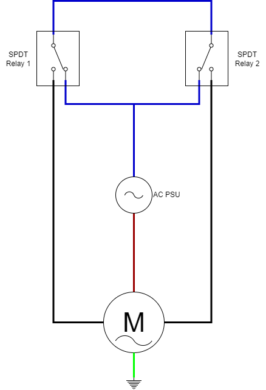
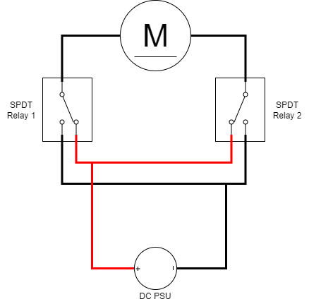
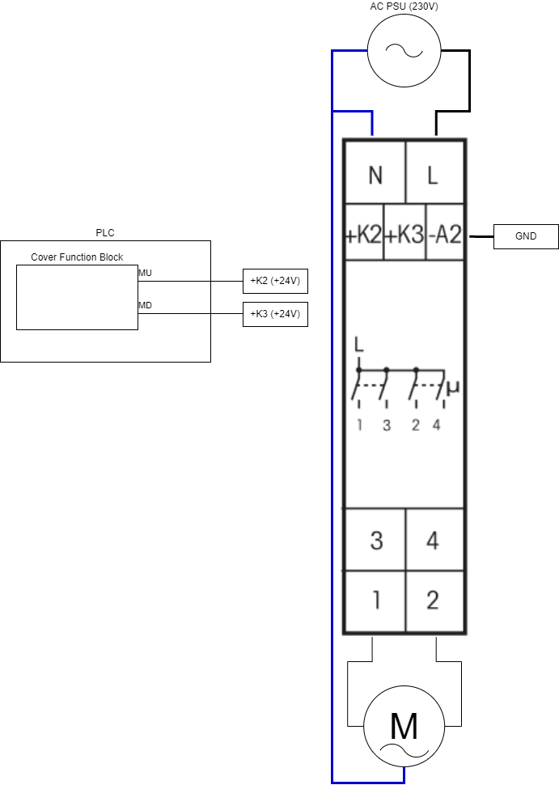
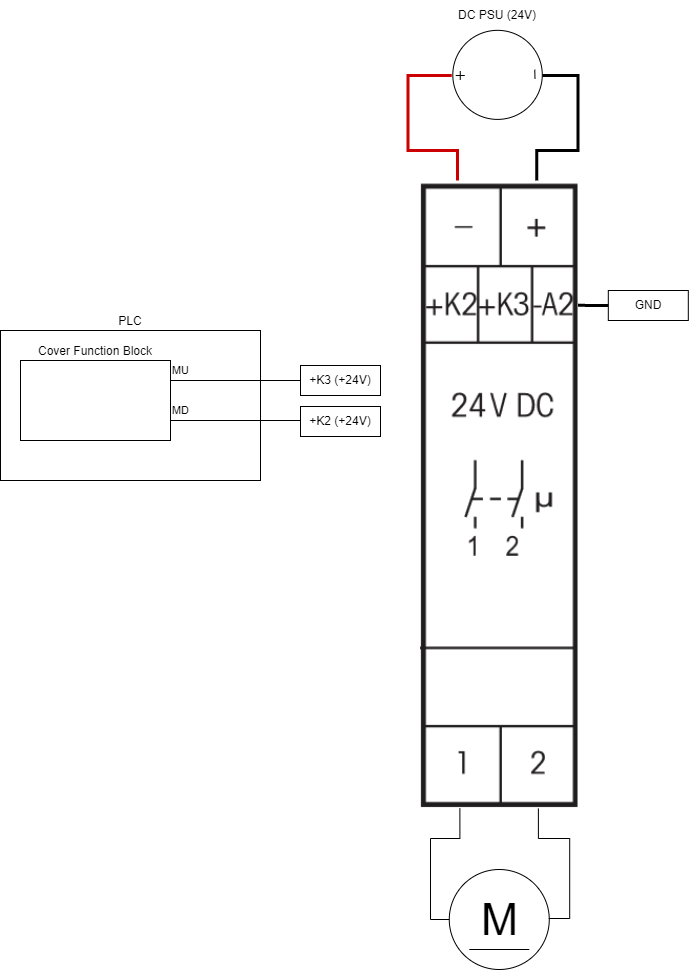

## FB_OUTPUT_COVER_MQTT
<!-- fb-badge:start -->

<!-- fb-badge:end -->

### **General**

The cover function block allows you to control covers such as a roller shutter or a garage door. A time variable (`T_UD`) is required that specifies the time to close/open a cover completely; it is passed to `FB_init` where the instance is declared. The cover can be controlled via MQTT using 'OPEN/STOP/CLOSE' commands or via a digital 'TOGGLE' input that will switch between 'OPEN/STOP/CLOSE' states.

---

:rotating_light: Do not use this function block if the mechanical safety on your electric roller shutters hasn't been configured properly!

---

<!-- fb-interface:start -->
### **Block diagram**

```text
       ┌──────────────────────┐
       │ FB_OUTPUT_COVER_MQTT │
       ├──────────────────────┤
BOOL ──┤ TOGGLE            MU ├── BOOL
BOOL ──┤ PRIO_LOCK         MD ├── BOOL
BOOL ──┤ PRIO_UP              │
BOOL ──┤ PRIO_DN              │
       └──────────────────────┘
```

### **Interface**

**Inputs**

| Pin | Type | Description |
|:--|:--|:--|
| `TOGGLE` | BOOL | Toggles the direction of the cover. |
| `PRIO_LOCK` | BOOL | Bool input, when high the cover will be locked in its current position ignoring all other inputs. (\*) |
| `PRIO_UP` | BOOL | Bool input, when high the cover will receive a constant signal to move up with a maximum time of twice `T_UD`. (\*) |
| `PRIO_DN` | BOOL | Bool input, when high the cover will receive a constant signal to move down with a maximum time of twice `T_UD`. (\*) |

**Outputs**

| Pin | Type | Description |
|:--|:--|:--|
| `MU` | BOOL | Bool output, motor up signal. |
| `MD` | BOOL | Bool output, motor down signal. |

### **Methods**

**`FB_init`** — Sets the cover timings, once, where the instance is declared. Both arguments are mandatory: CODESYS requires every `FB_init` argument at the declaration site.

| Parameter | Type | Default | Description |
|:--|:--|:--|:--|
| `T_LOCKOUT` | TIME |  | Delay between change of direction. |
| `T_UD` | TIME |  | Run time to move the cover completely up/down. |

**`InitMqtt`** — Enables MQTT on the function block. Call once at startup.

| Parameter | Type | Default | Description |
|:--|:--|:--|:--|
| `MQTTPublishPrefix` | POINTER TO STRING |  | Pointer to the MQTT publish prefix used for this block. The function block name is appended automatically. |
| `MQTTSubscribePrefix` | POINTER TO STRING |  | Pointer to the MQTT subscribe prefix used for this block. The function block name is appended automatically. |
| `pMqttPublishQueue` | POINTER TO FB_MqttPublishQueue |  | Pointer to the shared MQTT queue that carries messages to the broker. |
| `pMqttCallbackCollector` | POINTER TO MQTT.CallbackCollector |  | Pointer to the callback collector this block registers with to receive subscription messages. |

**`InitMqttDiscovery`** — Publishes a Home Assistant MQTT discovery config so the entity is created automatically. Call once at startup, after `InitMqtt`.

| Parameter | Type | Default | Description |
|:--|:--|:--|:--|
| `Device` | POINTER TO FB_PLC_MQTT_DISCOVERY_DEVICE |  | Pointer to the discovery device this entity belongs to, normally `MqttVariables.PLC_Device`. |
| `Name` | STRING(255) |  | Name shown in the Home Assistant front-end. |
| `overruleId` | STRING(255) | `''` | Overrides the generated entity id. Leave empty to derive it from the function block name. |
| `meta` | STRING(255) | `''` | Extra JSON merged into the discovery config. Leave empty for none. |
| `DeviceClass` | STRING(50) | `'shutter'` | Home Assistant device class for the entity. Leave empty for the default. |

**`PublishReceived`** — Callback method called by the callback collector when a message is received on the subscribed topic by the callback collector.

| Parameter | Type | Default | Description |
|:--|:--|:--|:--|
| `Data` | MQTT.CALLBACK_DATA |  | Received message, supplied by the callback collector. |
<!-- fb-interface:end -->

### **MQTT publish behavior**

Requires method call `InitMQTT` to enable MQTT capabilities.

| Event                   | Description                           | MQTT payload | QoS                                  | Retain flag | Published on startup |
| :---------------------- | :------------------------------------ | :----------- | :----------------------------------- | :---------- | :------------------- |
| **Cover reaches position** | Cover reaches an open or closed position | `OPEN` or `CLOSED` | 2 | `TRUE`      | no                  |
| **Cover moves** | Cover moves | `OPENING` or `CLOSING` | 2 | `TRUE`      | no                  |
| **Cover stops** | Cover stopped moving without reaching fully open or closed position | `STOPPED` | 2 | `TRUE`      | no                  |
| **Boot** | Published once on the first cycle, so the entity has a value before the cover is ever moved | `STOPPED` | 2 | `TRUE`      | yes                 |

The boot message is deliberately `STOPPED` rather than a restored `OPEN`/`CLOSED`.
The last direction *is* retained (`internalDir` is PERSISTENT), but nothing records
the actual position, so `STOPPED` — "position unknown" — is the honest value. A
confidently wrong `OPEN` or `CLOSED` would mislead automations more than no
position does.

MQTT publish topic is a concatenation of the publish prefix and the function block name.

### **MQTT subscribe behavior**

Requires method call `InitMQTT` to enable MQTT capabilities.
Commands are executed by the FB if the topic `MQTTSubscribeTopic` matches the MQTT topic and the payload exists in the table below.

| Command                    | Description                                                                 | expected payload | Additional notes                                                   |
| :------------------------- | :-------------------------------------------------------------------------- | :--------------- | :----------------------------------------------------------------- |
| **Open cover**             | Request to open the cover.                                                  | `OPEN`           | Command only executed when `PRIO_UP` and `PRIO_DN` inputs are low. |
| **Close cover**            | Request to close the cover.                                                 | `CLOSE`          | Command only executed when `PRIO_UP` and `PRIO_DN` inputs are low. |
| **Stop cover**             | Request to stop the cover from moving.                                      | `STOP`           | Command only executed when `PRIO_UP` and `PRIO_DN` inputs are low. |

MQTT subscription topic is a concatenation of the subscribe prefix variable and the function block name.

### **Code example**

- variables initiation:
```
MqttPubCoverPrefix			:STRING(100) := 'Devices/PLC/Lab/Out/Covers/';
MqttSubCoverPrefix			:STRING(100) := 'Devices/PLC/Lab/In/Covers/';
(* FB_init arguments are (T_LOCKOUT, T_UD): 1s between direction changes, 20s to
   travel fully up or down. Both are required. *)
FB_DO_COVER_001				:FB_OUTPUT_COVER_MQTT(T#1S, T#20S);
```

- Init MQTT method call (called once during startup):
```
FB_DO_COVER_001.InitMqtt(MQTTPublishPrefix:= ADR(MqttPubCoverPrefix),               (* pointer to string prefix for the mqtt publish topic *)
    MQTTSubscribePrefix:= ADR(MqttSubCoverPrefix),                                  (* pointer to string prefix for the mqtt subscribe topic *)
    pMqttPublishQueue := ADR(MqttVariables.fbMqttPublishQueue),                     (* pointer to MqttPublishQueue to send a new Mqtt event *)
    pMqttCallbackCollector := ADR(MqttVariables.collector_FB_OUTPUT_COVER_MQTT)     (* pointer to CallbackCollector to receive Mqtt subscription events *)
);
```

The timings need no init call: they are `FB_init` arguments on the declaration
above. There is no `ConfigureFunctionBlock` on this block — a cover's lockout
delay and full-travel time are properties of the hardware, not values to drive at
runtime.

- checking for events to move the cover (cyclic):
```
FB_DO_COVER_001(
    TOGGLE:=DI_002,                                                                 (* digital input to receive signal to toggle cover direction *)
    MU=>DO_001,                                                                     (* digital output to couple to cover motor up wire *)
    MD=>DO_002                                                                      (* digital output to couple to cover motor down wire *)
    );
```

- integration with `FB_INPUT_PUSHBUTTON_MQTT`:
```
FB_DO_COVER_001(
    TOGGLE:=FB_DI_PB_001.P_LONG,                                                    (* move cover during a longpush on input pushbutton 1 *)
    MU=>DO_001,                                                                     (* digital output to couple to cover motor up wire *)
    MD=>DO_002                                                                      (* digital output to couple to cover motor down wire *)
    );
```

- MQTT discovery:
```
FB_DO_COVER_001.InitMqttDiscovery(
	Name := 'Cover 001',			        (* The name shown in the Home Assistant front-end *)
	Device := ADR(PLC_DEVICE),				(* The device shown in Home Assistant *)
);
```

### **Wiring**

#### **Using SPDT relays**

Using two SPDT relays it's possible to wire an AC or DC motor so that short-circuiting the motor is impossible.

|                        AC Wiring                         |                        DC Wiring                         |
| :------------------------------------------------------: | :------------------------------------------------------: |
|  |  |

#### **Using ELTAKOs**

If two SPDT relays for each cover from the approach above take up too much space in your electrical installation you can opt for (more costly) ELTAKOs.

|                       AC Wiring (uses MTR12-UC)                        |                       DC Wiring (uses DCM12-UC)                        |
| :--------------------------------------------------------------------: | :--------------------------------------------------------------------: |
|  |  |
