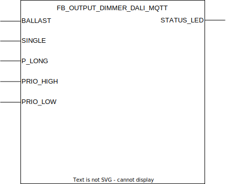

## FB_OUTPUT_DIMMER_DALI_MQTT


### **General**

Can be controlled using pulses from [FB_INPUT_PUSHBUTTON_MQTT](./FB_INPUT_PUSHBUTTON_MQTT.md), maintains output state through powercycles. Sets the driver fade time and fade rate setting. Allows dimming via a long persistent push on a pushbutton. Performs periodic writes to the DALI address to avoid state issues. 

DALI configuration via the Wago DALI tool and creation of the `typBallast` is explained pretty well in [this video](https://www.youtube.com/watch?v=FaoOY2-VFVk).

### **Block diagram**



INPUT(S)

- BALLAST: input to configure the `typBallast` that should be linked to this function block.
- TOGGLE: input to connect to one or multiple `SINGLE` from one or multiple [FB_INPUT_PUSHBUTTON_MQTT](./FB_INPUT_PUSHBUTTON_MQTT.md).
- P_LONG: input to connect to one or multiple `P_LONG` from one or multiple [FB_INPUT_PUSHBUTTON_MQTT](./FB_INPUT_PUSHBUTTON_MQTT.md).
- PRIO_HIGH: when high the output `Q` is set to high with a maximum brightness, has priority over the other inputs.
- PRIO_LOW: when high the output `Q` is set to low, has priority over the other inputs.


OUTPUT(S)

- STATUS_LED: high when light intensity > 0, off otherwise.

METHOD(S)

- InitMQTT: enables MQTT events on the FB, an overview of the parameters:
  - `MQTTPublishPrefix`: datatype _POINTER TO STRING_, pointer to the MQTT publish prefix that should be used for publishing any messages/events for this FB. Suffix is automatically set to FB name.
  - `MQTTSubscribePrefix`: datatype _POINTER TO STRING_, pointer to the MQTT subscribe prefix that should be used for publishing any messages/events to this FB. Suffix is automatically set to FB name.
  - `pMqttPublishQueue`: datatype _POINTER TO FB_MqttPublishQueue_, pointer to the MQTT queue to publish messages.
  - `pMqttPublishQueue`: datatype _POINTER TO FB_MqttPublishQueue_, pointer to the MQTT queue to publish messages.
  - `pMqttCallbackCollector`: datatype _POINTER TO MQTT.CallbackCollector, pointer to the MQTT callback collector to receive subscribe messages.

- ConfigureFunctionBlock: configures the dimmer with your preferred configurations, an overview of the parameters and their default values.
  - `FadeTime`: _BYTE_ value setting the fade time.
  - `FadeRate`: _BYTE_ value setting the fade rate.
- PublishReceived: callback method called by the callbackcollector when a message is received on the subscribed topic by the callbackcollector.

### Fade Time and Fade Rate 

Can be configured using `ConfigureFunctionBlock` method call.

| Value    | Fade time [s]  | Fade rate [fades/s] | 
| :--------| :--------------| :-------------------|
| 0 | Extended fade | not applicable
| 1 | 0.707 | 357.796
| 2 | 1.0 | 253.0
| 3 | 1.414 | 178.898
| 4 | 2.0 | 126.5
| 5 | 2.828 | 89.449
| 6 | 4.0 | 63.25
| 7 | 5.657 | 44.725
| 8 | 8.0 | 31.625
| 9 | 11.314 | 22.362
| 10 | 16.0 | 15.813
| 11 | 22.627 | 11.181
| 12 | 32.0 | 7.906
| 13 | 45.255 | 5.591
| 14 | 64.0 | 3.953
| 15 | 90.51 | 2.795

Note: table has been extracted from WagoAppDALI library documentation.

### **MQTT publish behavior**

Requires method call `InitMQTT` to enable MQTT capabilities.

| Event                   | Description                                | MQTT payload | QoS                                  | Retain flag | Published on startup |
| :---------------------- | :----------------------------------------- | :----------- | :----------------------------------- | :---------- | :------------------- |
| **Light intensity value changes**   | Light intensity value changes | `0-100` | 2                                    | `TRUE`      | yes                   |
| **light intensity values changes to 0 or 100** | Light intensity value changes to minimum or maximum value, published on `BRIGHTNESS` subtopic. | `ON/OFF`      | 2` | `TRUE`      | yes, if light intensity value > 0                   |

(\*): MQTT publish topic is a concatenation of the publish prefix variable, the function block name and the name of the output.

### **MQTT subscribe behavior**

Requires method call `InitMQTT` to enable MQTT capabilities.
Commands are executed by the FB if the topic `MQTTSubscribeTopic` matches the MQTT topic and the payload exists in the table below.

| Command                     | Description                                          | expected payload | Additional notes                                                 |
| :-------------------------- | :--------------------------------------------------- | :--------------- | :--------------------------------------------------------------- |
| **Turn on** | Turns the dimmer on to maximum brightness   | `ON`           | Command executed when `PRIO_HIGH` and `PRIO_LOW` inputs are low. |
| **Turn off** | Turns the dimmer off                | `OFF`           | Command executed when `PRIO_HIGH` and `PRIO_LOW` inputs are low. |
| **Set brightness value**  | Request to set specific brightness value. value expected on  `BRIGHTNESS` subtopic.                   | `0-100`          | Command executed when `PRIO_HIGH` and `PRIO_LOW` inputs are low. |

MQTT subscription topic is a concatenation of the subscribe prefix variable and the function block name.
Note that the function block also accepts float values for setting the dimmer output value, the float value will get rounded to the nearest integer value.

### **Code example**

- DALI global variable initiation:
```
VAR_GLOBAL
	M1_Light1: typBallast:=(bAddress:=0,xIsGroup:=FALSE,bPortDALI:=1);
END_VAR
```

- variables initiation:
```
MqttPubDimmerPrefix			:STRING(100) := 'Devices/PLC/House/Out/Dimmers/';
MqttSubDimmerPrefix			:STRING(100) := 'Devices/PLC/House/In/Dimmers/';
M1_DALIMASTER				    :FbDaliMaster;
FB_DALI_1_ADR0				  :FB_OUTPUT_DIMMER_DALI_MQTT;
```

- Init MQTT method call (called once during startup):
```
FB_DALI_1_ADR0.InitMqtt(MQTTPublishPrefix:= ADR(MqttVariables.MqttPubDimmerPrefix),				
	MQTTSubscribePrefix:= ADR(MqttVariables.MqttSubDimmerPrefix),									
	pMqttPublishQueue := ADR(MqttVariables.fbMqttPublishQueue),						
	pMqttCallbackCollector := ADR(MqttVariables.collector_FB_DIMMER_MQTT)						
);
```

The MQTT publish topic in this code example will be `Devices/PLC/House/Out/Dimmers/FB_DALI_1_ADR0` (MQTTPubSwitchPrefix variable + function block name). The subscription topic will be `Devices/PLC/House/In/Dimmers/FB_DALI_1_ADR0` (MQTTSubSwitchPrefix variable + function block name).


- checking for events to switch the DALI output (cyclic):
```
// Run the master before anything else
M1_DALIMASTER(
	bPortDALI:=1,
	I_Port:=IoConfig_Globals.DALI_MULTI_MASTER_MODULE);
	
// Run individual DALI FB
FB_DALI_1_ADR0(
	BALLAST := DALIVariables.M1_Light1,
	TOGGLE := FB_DI_PB_002.SINGLE,
	P_LONG := FB_DI_PB_002.P_LONG,
	STATUS_LED => DO_002);
```

The above illustrates an integration with [FB_INPUT_PUSHBUTTON_MQTT](./FB_INPUT_PUSHBUTTON_MQTT.md).


- MQTT discovery:
```
FB_DALI_1_ADR0.InitMqttDiscovery(
    name := '001. Office strip cold',				(* The name show in Home Assistant frond-end*)
    Device := ADR(PLC_Device),							(* The device show in Home Assistant *)
);
```

### **Home Assistant YAML**
If [MQTT discovery](../AdditionalFunctionality/MQTT_Discovery.md) is not working for you, you can use the YAML code below in your [MQTT lights](https://www.home-assistant.io/components/light.mqtt/) config:

```YAML
mqtt:
  light:
  - name: "Kitchen"
    state_topic: "Devices/PLC/House/Out/Dimmers/FB_DALI_1_ADR0"
    command_topic: "Devices/PLC/House/In/Dimmers/FB_DALI_1_ADR0"
    brightness_command_topic: "Devices/PLC/House/In/Dimmers/FB_DALI_1_ADR0/BRIGHTNESS"
    brightness_state_topic: "Devices/PLC/House/Out/Dimmers/FB_DALI_1_ADR0/BRIGHTNESS"
    on_command_type: "brightness"
    payload_on: "ON"
    payload_off: "OFF"
    optimistic: false
    brightness_scale: 100
    qos: 2
    availability: "Devices/PLC/House/availability"
    payload_not_available: "offline"
    payload_available: "online"
```
