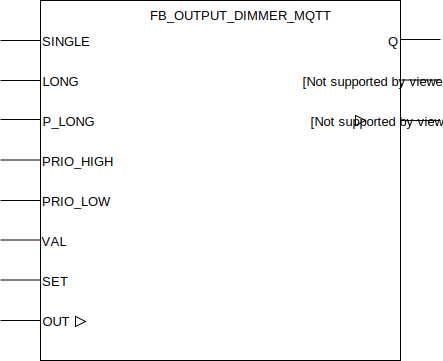

## FB_OUTPUT_DIMMER_MQTT

### **General**

Can be controlled using pulses from [FB_INPUT_PUSHBUTTON_MQTT](./FB_INPUT_PUSHBUTTON_MQTT.md), maintains output state through powercycles. Takes a 0-255 byte value as input -as FB input or MQTT value-. Byte input value is linearly scaled to a word datatype value with a range from 0-32767. Output linear scaled range can be configured to be different from 0-32767 if desired.

### **Block diagram**



INPUT(S)

- SINGLE: input to connect to one or multiple `SINGLE` from one or multiple [FB_INPUT_PUSHBUTTON_MQTT](./FB_INPUT_PUSHBUTTON_MQTT.md).
- LONG: input to connect to one or multiple `LONG` from one or multiple [FB_INPUT_PUSHBUTTON_MQTT](./FB_INPUT_PUSHBUTTON_MQTT.md).
- P_LONG: input to connect to one or multiple `P_LONG` from one or multiple [FB_INPUT_PUSHBUTTON_MQTT](./FB_INPUT_PUSHBUTTON_MQTT.md).
- PRIO_HIGH: when high the output `Q` is set to high with a maximum brightness, has priority over the other inputs.
- PRIO_LOW: when high the output `Q` is set to low, has priority over the other inputs.
- VAL: byte value for SET operation.
- SET: input for switching output DIM to input VAL value.
- RST: input to switch of the output.

OUTPUT(S)

- Q: output, bool datatype.
- OUT: dimmer value, word datatype.
- Q_OUT: follows 'OUT' when Q is high. Equal to 0 when Q is low.

METHOD(S)

- InitMQTT: enables MQTT events on the FB, an overview of the parameters:

  - `MQTTPublishPrefix`: datatype _POINTER TO STRING_, pointer to the MQTT publish prefix that should be used for publishing any messages/events for this FB. Suffix is automatically set to FB name.
  - `MQTTSubscribePrefix`: datatype _POINTER TO STRING_, pointer to the MQTT subscribe prefix that should be used for publishing any messages/events to this FB. Suffix is automatically set to FB name.
  - `pMqttPublishQueue`: datatype _POINTER TO FB_MqttPublishQueue_, pointer to the MQTT queue to publish messages.
  - `OutputDimmer`: datatype _BOOL_, specify whether the DIM values (0-255) should be outputted as MQTT events.
  - `Qos_Dimm`: datatype _SD_MQTT.QoS_, MQTT QoS of the DIM MQTT events.
  - `Delta_Dimm`: datatype _INT_, resolution of the MQTT OUT events. For example: specifying value _5_ will configure the FB to only emit an MQTT event when the OUT output differs _5_ or more than its previous value. Note that the last value of output OUT (when input `P_LONG` becomes low again) is always published. Even if the resolution delta hasn't been reached yet. This way the last OUT value published through MQTT is always synchronized with the OUT output of the FB.

- ConfigureFunctionBlock: configures the dimmer with your prefered configurations, an overview of the parameters and their default values.
  - `T_Debounce`: debounce time for input PB, defaults to 10ms.
  - `T_Reconfig`: reconfiguration time, defaults to 10S.
  - `T_On_Max`: start limitation, defaults to 0ms.
  - `T_Dimm_Start`: reaction time to dim, defaults to 400ms.
  - `T_Dimm`: time for a dimming ramps, defaults to 3s.
  - `Min_On`: minimum value of output OUT at startup, defaults to 50.
  - `Max_On`: maximum value of output OUT at startup, defaults to 255.
  - `Soft_Dimm`: if TRUE dimming begins after ON and at 0, defaults to TRUE.
  - `Rst_Out`: if input Rst is TRUE, ouput OUT is set to 0, defaults to FALSE.
  - `OUT_LinearScaleMin`: Lower bound value used for linear scaleout output OUT from datatype byte to word. Defaults to 0.
  - `OUT_LinearScaleMax`: Upper bound value used for linear scaleout output OUT from datatype byte to word. Defaults to 32767.
- PublishReceived: callback method called by the callbackcollector when a message is received on the subscribed topic by the callbackcollector.

- initDMX: configures the dimmer with DMX configuration. For more info about Art-Net and DMX [read this](./../AdditionalFunctionality/DMX_artnet.md)
  - `DmxChannel`: Which channel 1-256. (not 0)
  - `DmxWidth`: Width of the channel, in channels. (often 1 or 2)
  - `pDmxValues`: datatype _POINTER TO oscat_network.NETWORK_BUFFER_SHORT_, pointer to a global buffer. There is now only one buffer, thus one universe
  - `dmxUniverse`: Integer value of the universe. Meta data for MQTT only.

  
- InitMqttDiscovery:  
    - See [MQTT Discovery](./../AdditionalFunctionality/MQTT_Discovery.md) for more info.

### **Function Block Behaviour**

The following table shows the operating status of the dimmer:

| SINGLE/LONG/P_LONG | SET | RST | Q     | DIR (\*)  | OUT                                                                                                                    | Q_OUT    |
| :----------------- | :-- | :-- | :---- | :-------- | :--------------------------------------------------------------------------------------------------------------------- | :------- |
| SINGLE             | 0   | 0   | NOT Q | OUT < 127 | LIMIT(MIN_ON,OUT,MAX_ON)                                                                                               | Q \* OUT |
| LONG/P_LONG        | 0   | 0   | ON    | NOT DIR   | Ramp up or down depending on DIR, start at 0 when soft_dimm = TRUE and Q = 0, reverse direction if 0 or 255 is reached | OUT      |
| 0                  | 1   | 0   | ON    | OUT < 127 | VAL                                                                                                                    | OUT      |
| 0                  | 0   | 1   | OFF   | UP        | 0 when RST_OUT = TRUE                                                                                                  | 0        |

(\*): DIR refers to the direction of the dimmer output `OUT`, indicating whether the dimmer output value changes up-or downwards.

This MQTT function block is a wrapper of the `DIMM_I` function block in the OSCAT building library enhanced with additional functionality in order to be able to emit MQTT events. To fully understand it's logic it's advised to give the documentation present in [the OSCAT building library docs](../_img/oscat_building100_en.pdf) a good read (page 52).

### **MQTT Event Behaviour**

Requires method call `InitMQTT` to enable MQTT capabilities.

| Event                   | Description                                | MQTT payload | QoS                                  | Retain flag | Published on startup |
| :---------------------- | :----------------------------------------- | :----------- | :----------------------------------- | :---------- | :------------------- |
| **Output changes: Q**   | A change is detected on output `Q`. (\*)   | `TRUE/FALSE` | 2                                    | `TRUE`      | no                   |
| **Output changes: OUT** | A change is detected on output `OUT`. (\*) | `0-255`      | configured in method call `InitMQTT` | `TRUE`      | no                   |

(\*): MQTT publish topic is a concatenation of the publish prefix variable, the function block name and the name of the output.

### **MQTT Subscription Behaviour**

Requires method call `InitMQTT` to enable MQTT capabilities.
Commands are executed by the FB if the topic `MQTTSubscribeTopic` matches the MQTT topic and the payload exists in the table below.

| Command                     | Description                                          | expected payload | Additional notes                                                 |
| :-------------------------- | :--------------------------------------------------- | :--------------- | :--------------------------------------------------------------- |
| **Change output Q to high** | Request to change output to high.                    | `TRUE`           | Command executed when `PRIO_HIGH` and `PRIO_LOW` inputs are low. |
| **Change output Q to low**  | Request to change output to low.                     | `FALSE`          | Command executed when `PRIO_HIGH` and `PRIO_LOW` inputs are low. |
| **Set OUT byte value**      | Request to set the byte value on input/output `OUT`. | `0-255`          | Command executed when `PRIO_HIGH` input is low.                  |

MQTT subscription topic is a concatenation of the subscribe prefix variable and the function block name.
Note that the function block also accepts float values for setting the dimmer output value, the float value will get rounded to the nearest integer value.

### **Code example**

- variables initiation:

```
MqttPubDimmerPrefix			:STRING(100) := 'Devices/PLC/House/Out/Dimmers/';
MqttSubDimmerPrefix			:STRING(100) := 'Devices/PLC/House/In/Dimmers/';
FB_AO_DIMMER_001			:FB_OUTPUT_DIMMER_MQTT;
```

- Init MQTT method call (called once during startup):

```
FB_AO_DIMMER_001.InitMQTT(MQTTPublishPrefix:= ADR(MqttPubDimmerPrefix),     (* pointer to string prefix for the MQTT publish topic *)
    MQTTSubscribePrefix:= ADR(MqttSubDimmerPrefix),                         (* pointer to string prefix for the MQTT subscribe topic *)
    pMQTTPublishQueue := ADR(MQTTVariables.fbMQTTPublishQueue),             (* pointer to MQTTPublishQueue to send a new MQTT event *)
    pMqttCallbackCollector := ADR(MqttVariables.collector_FB_DIMMER_MQTT),  (* pointer to CallbackCollector to receive Mqtt subscription events *)
    TRUE,                                                                   (* specify whether dimmer value should be outputted on MQTT topic *)
    SD_MQTT.QoS.ExactlyOnce,                                                (* specify the QoS for the dimmer mqtt events (values 0-255) *)
    5                                                                       (* specify the resolution for the dimmer mqtt events *)
);
```

The MQTT publish topic in this code example will be `Devices/PLC/House/Out/Dimmers/FB_AO_DIMMER_001` (MQTTPubSwitchPrefix variable + function block name). The subscription topic will be `Devices/PLC/House/In/Dimmers/FB_AO_DIMMER_001` (MQTTSubSwitchPrefix variable + function block name).

- ConfigureFunctionBlock (called once during startup):

```
FB_AO_DIMMER_001.ConfigureFunctionBlock(
	T_Debounce:=T#10MS,
	T_Reconfig:=T#10S,
	T_On_Max:=T#0S,
	T_Dimm_Start:=T#400MS,
	T_Dimm:=T#3S,
	Min_On:=50,
	Max_On:=255,
	Soft_Dimm:=TRUE,
	Rst_Out:=FALSE,
	OUT_LinearScaleMin:=11000,
	OUT_LinearScaleMax:=32767
);
```

The dimmer behavior in the example above is adjusted to start dimming from '11000' instead of the default '0' value. This can be important as different dimming devices will have different lower bound 'on' voltages. In addition, depending on your PLC device, the maximum out value will differ. Note that this method only requires a call when it's desired to change the default behavior characteristics.

- checking for events to switch the digital output (cyclic), example 1:

```
FB_AO_DIMMER_001(SINGLE:=   FB_DI_PB_041.SINGLE,    (* for toggling the output Q *)
    LONG:=                  FB_DI_PB_041.LONG,      (* for controlling the dimmer output OUT *)
    P_LONG:=                FB_DI_PB_041.P_LONG,    (* for controlling the dimmer output OUT *)
    Q=>                     DO_001,                 (* couple the function block to the physical digital output *)
    OUT:=                   AO_001,                 (* couple the function block to the physical anolog output *)
    VAL:=                   255,                    (* value to set on output OUT when input SET is high *)
    SET:=                   FB_DI_PB_041.DOUBLE     (* when high, VAL is set on output OUT *)
);
```

The above illustrates an integration with [FB_INPUT_PUSHBUTTON_MQTT](./FB_INPUT_PUSHBUTTON_MQTT.md). The dimmer module in this example has a 'on/off' digital input that is wired to the 'Q' output of the dimmer & a 0/1-10V analog input that is wired to the 'OUT' output of the dimmer.

- checking for events to switch the digital output (cyclic), example 2:

```
FB_AO_DIMMER_001(SINGLE:=   FB_DI_PB_041.SINGLE,    (* for toggling the output Q *)
    LONG:=                  FB_DI_PB_041.LONG,      (* for controlling the dimmer output OUT *)
    P_LONG:=                FB_DI_PB_041.P_LONG,    (* for controlling the dimmer output OUT *)
    Q_OUT:=                 AO_001,                 (* couple the function block to the physical anolog output *)
    VAL:=                   255,                    (* value to set on output OUT when input SET is high *)
    SET:=                   FB_DI_PB_041.DOUBLE     (* when high, VAL is set on output OUT *)
);
```

The above illustrates an integration with [FB_INPUT_PUSHBUTTON_MQTT](./FB_INPUT_PUSHBUTTON_MQTT.md). The dimmer module in this example has a 0/1-10V analog input that is wired to the 'Q_OUT' output of the dimmer.

```ST
FB_AO_DMX_DIMMER_001.InitDmx(
    DmxChannel := 1,
    DmxWidth:=1,
    pDmxValues := ADR(DMXVariables.DMX.BUFFER)
    dmxUniverse := 1,
);
```

The above illustrates how to initiate dmx capabilities. If `InitDmx` is before `InitMqttDiscovery`, the config json in MQTT also contains the dmx channel, width and universe.

## **Home Assistant Auto discovery**

See [MQTT Auto discovery](../MQTT_Auto_Discovery/README.md) for more information.

### __Home Assistant YAML__
If home asistant auto discovery is not working for you, you can use the YAML code below in your [MQTT lights](https://www.home-assistant.io/components/light.mqtt/) config:

```YAML
mqtt:
  light:
  - name: "FB_AO_DIM_001"
    state_topic: "Devices/PLC/House/Out/Dimmers/FB_AO_DIMMER_001/Q"
    command_topic: "Devices/PLC/House/In/Dimmers/FB_AO_DIMMER_001"
    brightness_command_topic: "Devices/PLC/House/In/Dimmers/FB_AO_DIMMER_001"
    brightness_scale: 255
    brightness_state_topic: "Devices/PLC/House/Out/Dimmers/FB_AO_DIMMER_001/OUT"
    on_command_type: "last"
    payload_on: "TRUE"
    payload_off: "FALSE"
    qos: 2
    optimistic: false
    availability_topic: "Devices/PLC/House/availability"
    payload_available: "online"
    payload_not_available: "offline"
```
