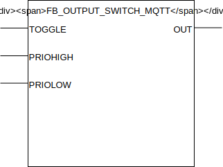

## FB_OUTPUT_SWITCH_MQTT

### __General__
Can be switched using pulses that are high for one clock cycle (for example from `FB_INPUT_PUSHBUTTON_MQTT`), maintains output state through powercycles.

### __Block diagram__



INPUT(S)
- TOGGLE: when high the output `OUT` gets toggled. input should one be high for one clockcycle.
- PRIOHIGH: when high the output `OUT` is set to high, has priority over the `TOGGLE` and `PRIOLOW` input.
- PRIOLOW: when high the output `OUT` is set to low, has priority over the `TOGGLE` input.

OUTPUT(S)
- OUT: output to switch digital output on and off. Can be connected to a relay for example. 

METHOD(S)
- InitMQTT: enables MQTT events on the FB: sets the topic to publish to, sets the topic to subscribe to, registers to the callbackcollector and sets the pointer to the `MQTTPublishQueue`.
- PublishRecived: callback method called by the callbackcollector when a message is received on the subscribed topic by the callbackcollector.

### __MQTT Event Behaviour__
Requires method call `InitMQTT` to enable MQTT capabilities.

| Event | Description | MQTT payload | QOS | Retain flag | Published on startup |
|:-------------|:------------------|:------------------|:------------------|:--------------------------|:--------------------------|
| **Output changes to high** | The digtal output changes state to high. | `TRUE` | 2 | `FALSE` | yes
| **Output changes to low** | The digtal output changes state to low. | `FALSE` | 2 | `FALSE` | yes

MQTT publish topic is a concatination of the publish prefix and the function block name. 

### __MQTT Subscription Behaviour__
Requires method call `InitMQTT` to enable MQTT capabilities.
Commands are executed by the FB if the topic `MQTTSubscribeTopic` matches the MQTT topic and the payload exists in the table below.

| Command | Description | expected payload | Additional notes | 
|:-------------|:------------------|:------------------|:------------------|
| **Change output to high** | Request to change output to high. | `TRUE` | Command executed when `PRIOHIGH` and `PRIOLOW` inputs are low.
| **Change output to low** | Request to change output to low. | `FALSE` | Command executed when `PRIOHIGH` and `PRIOLOW` inputs are low.

MQTT subscription topic is a concatination of the subscribe prefix and the function block name. 

### __Code example__

- variables initiation:
```
MQTTPubSwitchPrefix     :STRING(100) := 'WAGO-PFC200/Out/DigitalOutputs/';
MQTTSubSwitchPrefix     :STRING(100) := 'WAGO-PFC200/In/DigitalOutputs/';
FB_DO_SW_001            :FB_OUTPUT_SWITCH_MQTT;
```

- Init MQTT method call (called once during startup):
```
FB_DO_SW_001.InitMQTT(MQTTPublishPrefix:= ADR(MQTTPubSwitchPrefix),                 (* pointer to string prefix for the MQTT publish topic *)
    MQTTSubscribePrefix:= ADR(MQTTSubSwitchPrefix),                                 (* pointer to string prefix for the MQTT subscribe topic *)
    MQTTTopicSuffix := 'FB_DO_SW_001',                                              (* value to suffix the the MQTT topic, should be unique for each FB *)
    pMQTTPublishQueue := ADR(MQTTVariables.fbMQTTPublishQueue),                     (* pointer to MQTTPublishQueue to send a new MQTT event *)
    pMQTTCallbackCollector := ADR(MQTTVariables.collector_FB_OUTPUT_SWITCH_MQTT)    (* pointer to CallbackCollector to receive MQTT subscription events *)
);
```
The MQTT publish topic in this code example will be `WAGO-PFC200/Out/DigitalOutputs/FB_DO_SW_001`. The subscription topic will be `WAGO-PFC200/In/DigitalOutputs/FB_DO_SW_001`.


- checking for events to switch the digital output (cyclic):
```
FB_DO_SW_001(OUT=>  DO_001,                 (* couple the function block to the physical output *)
    PRIOHIGH:=      FALSE,                  (* brings the output high regardless of other input values *)
    PRIOLOW:=       FALSE                   (* brings the output low regardless of other input values. NOTE: Priohigh overrules Priolow input *)
    TOGGLE:=        FB_DI_PB_009.SINGLE     (* for toggling the output *)	
);
```

- integration with `FB_INPUT_PUSHBUTTON_MQTT`:
```
FB_DO_SW_001(OUT=>  DO_001,                 (* couple the function block to the physical output *)
    PRIOHIGH:=      FALSE,                  (* brings the output high regardless of other input values *)
    PRIOLOW:=       FALSE,                  (* brings the output low regardless of other input values. NOTE: Priohigh overrules Priolow input *)
    TOGGLE:=        FB_DI_PB_001.SINGLE     (* for toggling the output *)	
);
```

### __Home Assistant YAML__
To integrate with Home Assistant use the YAML code below in your [MQTT lights](https://www.home-assistant.io/components/light.mqtt/) config:

```YAML
- platform: MQTT
  name: "FB_DO_SW_001"
  state_topic: "WAGO-PFC200/Out/DigitalOutputs/FB_DO_SW_001"
  command_topic: "WAGO-PFC200/In/DigitalOutputs/FB_DO_SW_001"
  payload_on: "TRUE"
  payload_off: "FALSE"
  qos: 2
  optimistic: false
  availability_topic: "Devices/WAGO-PFC200/availability"
  payload_available: "online"
  payload_not_available: "offline"
```