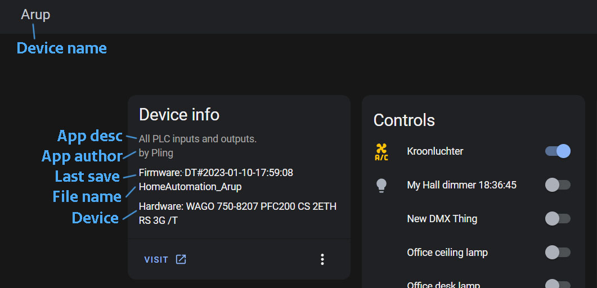

## FB_PLC_MQTT_DISCOVERY_DEVICE
<!-- fb-badge:start -->
<!-- fb-badge:end -->

<!-- fb-interface:start -->
### **Methods**

**`FB_init`** — CODESYS constructor. These parameters are supplied in the instance declaration, not by calling a method, and are applied once at startup.

| Parameter | Type | Default | Description |
|:--|:--|:--|:--|
| `friendlyName` | STRING |  | The device name shown in Home Assistant. |
| `id` | STRING |  | The unique identifier of the device. |
| `manufacturer` | STRING |  | The manufacturer shown in Home Assistant. |
| `availabilityTopic` | STRING(GVL_MQTT.MQTT_TOPIC_LEN) |  | Topic to publish availability on. |
| `availabilityOnline` | STRING |  | The word to publish when the PLC is online. |
| `availabilityOffline` | STRING |  | The word to publish when the PLC is offline. |
| `MqttDiscoveryPrefix` | STRING |  | The discovery prefix the home automation system listens on (`homeassistant/` by default). |
| `MqttDiagnosticTopic` | STRING(GVL_MQTT.MQTT_TOPIC_LEN) |  | Topic used to publish diagnostic entities for the device. |
| `pMqttPublishQueue` | POINTER TO FB_MQTT_PUBLISH_QUEUE |  | Pointer to the MQTT queue to publish messages. |
<!-- fb-interface:end -->

### **Code example**

- variables initiation, in the `GVL_MQTT` global variable list:
```
PLC_Device : FB_PLC_MQTT_DISCOVERY_DEVICE(
	friendlyName		:= 'PLC Lab',
	id					:= 'plc-lab',
	manufacturer		:= 'WAGO',
	availabilityTopic	:= MqttAvailabilityTopic,
	availabilityOnline	:= MqttAvailabilityOnlinePayload,
	availabilityOffline	:= MqttAvailabilityOfflinePayload,
	MqttDiscoveryPrefix	:= MqttHADiscoveryPrefix,
	MqttDiagnosticTopic	:= MqttDiagnosticTopic,
	pMqttPublishQueue	:= ADR(fbMqttPublishQueue)
);
```

Because the block is declared inside `GVL_MQTT`, the other variables in that list are referenced unqualified. Declared elsewhere, qualify them as `GVL_MQTT.MqttAvailabilityTopic` and so on.

No further call is needed at startup. Pass the instance to the function blocks that publish discovery config, for example:

```
FB_DO_SW_001.InitMqttDiscoveryAsLight(
	Device	:= ADR(GVL_MQTT.PLC_Device),
	Name	:= 'light 001'
);
```

## Device info in Home Assistant

Device name: 
- open device structure
- change controller

App desc/auth:
- edit application settings

Time last start:
- autogenerated from the last time the `.project` file was saved

Device:
- autogenerated from hardware


