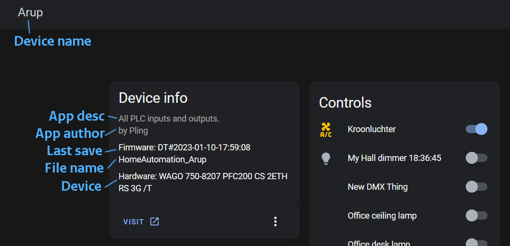

## FB_PLC_MQTT_DISCOVERY_DEVICE

INPUT(S)

OUTPUT(S)

METHOD(S)
- initDevice: collects all device info once
	- `url` this sets the url to your PLC. 
	- `availabilityTopic` : topic to publish availability;
	- `availabilityOnline`: the word to puslish when the plc is online;
	- `availabilityOffline`: the word to puslish when the plc is offline;


### **Code example**
- variables initiation:
```
	PLC_device					:FB_PLC_MQTT_DISCOVERY_DEVICE;
```

- Init MQTT method call (called once during startup):
```
PLC_Device.initPlcDevice(
	MqttDiscoveryPrefix := MqttVariables.MqttHADiscoveryPrefix,
	pMqttPublishQueue := ADR(MqttVariables.fbMqttPublishQueue),
	availabilityTopic := MqttVariables.MqttAvailabilityTopic,
	availabilityOnline := MqttVariables.MqttAvailabilityOnlinePayload,
	availabilityOffline := MqttVariables.MqttAvailabilityOfflinePayload
);
```


## Device info in Home Assistant

Device name: 
- open device structure
- change controller

App desc/auth:
- edit application settings

Time last start:
- autogenerated last time the `ecp` was saved

Device:
- autogenerated from hardware


  