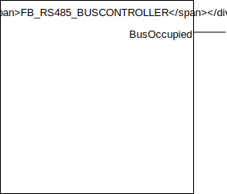

## FB_RS485_BUSCONTROLLER

### __General__
Used to control the RS485 bus in order to allow only one device with one Modbus RTU query at the time. In addition it manages the silence time on the bus between two requests and is capable of introducing a startup delay to allow devices on the bus to start up on power cycles.

### __Block diagram__



OUTPUT(S):
- BusOcupied: datatype bool, indicates whether the RS485 bus is occupied or not.

METHOD(S)
- Init: configures the buscontroller, an overview of the parameters: 
    - `StartupDelay`: datatype *TIME*, amount of time that should be waited on PLC startup before using the RS485 bus, can prevent errors due to RS485 devices not booted up yet.
    - `SilenceTime`: datatype *TIME*,  the silence time between two requests. Typically 10-20ms.
- SetBusOccupied: can be called by any RS485 to indicate that it is using the RS485 bus.
- ReleaseBus: can be called by any RS485 to indicate that it is done using the RS485 bus.

### __Code example__

- variables initiation:
```
RS485BusController 	: FB_RS485_BUSCONTROLLER;
```

- Init  method call (called once during startup):
```
RS485BusController.Init(
	StartupDelay := T#5S,   (* Time to wait after startup to start using the bus, prevents boot delay issues when RS485 devices are not ready yet on startup *)		
	SilenceTime := T#20MS   (* Silence time between two requests, important to not get faulty data on bus *)		
);
```

- Integration in é!COCKPIT RS485 statemachine:
```
IF FB_RS485_EASTRON_SDM220_1.RequestMaster(ADR(RS485BusController)) THEN
	IF FB_RS485_EASTRON_SDM220_1.ActiveRtuQuery = 0 THEN
		ActiveRtuQuery := FB_RS485_EASTRON_SDM220_1.GetRtuQuery();
		Trigger := TRUE; // Start the Modbus RTU query
	ELSIF Trigger = FALSE THEN // Modbus RTU query completed, process it
		(*FB_RS485_EASTRON_SDM220_1.ProcessDataArray(Error:=ModbusMaster.xError, Data:=ADR(RtuResponse.awData)); *)
		RS485BusController.ReleaseBus();
	END_IF	
ELSIF // next RS485 device

END_IF
```

- Integration in Codesys 3S RS485 statemachine:
```
IF(xComPortOpen) THEN
    IF FB_RS485_EASTRON_SDM220_1.RequestMaster(ADR(RS485BusController)) THEN
		IF FB_RS485_EASTRON_SDM220_1.ActiveRtuQuery = 0 THEN
			ActiveRtuQuery := FB_RS485_EASTRON_SDM220_1.GetRtuQuery();
			Trigger := TRUE; // Start the Modbus RTU query
		ELSIF fbModbusRequest.xDone OR fbModbusRequest.xError THEN // Modbus RTU query completed, process it
			FB_RS485_EASTRON_SDM220_1.ProcessDataArray(Error:=fbModbusRequest.xError, Data:=ADR(awReadBuffer));
			RS485BusController.ReleaseBus();
			TRIGGER := FALSE;
		END_IF	
	ELSIF // next RS485 device

    END_IF
END_IF

```

