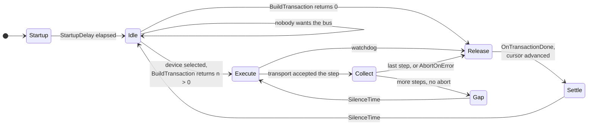

## FB_RS485_BUSCONTROLLER
<!-- fb-badge:start -->
<!-- fb-badge:end -->

### **General**
Shares one RS485 bus between the devices registered on it. It decides whose turn it is, runs
that device's Modbus exchanges, and keeps the required silence between frames — both between
transactions and between the steps inside one.

The unit of arbitration is a **transaction**: an ordered list of up to eight steps that a device
hands over in one go, executed back to back **with the bus held throughout**. Nothing else may
interleave, which is what allows a write and the read that confirms it to be one indivisible
operation. See [the I_RS485_DEVICE interface](../RS485/RS485Device_Interface.md) for the device
side of the contract.

The Modbus protocol itself lives behind `I_RS485_TRANSPORT`, so this block never sees a CRC, a
function code or a serial handle. [`FB_RS485_TRANSPORT_RTU`](FB_RS485_TRANSPORT_RTU.md) is the
implementation this project ships.

### **Turn-taking**

Selection resumes at a cursor and wraps, rather than restarting at device 0. Registration order
therefore does not decide service order: the device registered last is served as often as the
device registered first.

Each pass sweeps every device twice — once for `COMMAND` work, once for `POLL` — so something a
person or Home Assistant asked for goes ahead of routine polling, while commands are themselves
round-robin so a chatty device cannot monopolise the bus.

Watch `Cursor` and `Transactions` on a running PLC to see it working.


```mermaid
stateDiagram-v2
    direction LR
    [*] --> Startup
    Startup --> Idle : StartupDelay elapsed
    Idle --> Idle : nobody wants the bus
    Idle --> Execute : device selected,<br/>BuildTransaction returns n > 0
    Idle --> Release : BuildTransaction returns 0
    Execute --> Collect : transport accepted the step
    Execute --> Release : watchdog
    Collect --> Gap : more steps, no abort
    Gap --> Execute : SilenceTime
    Collect --> Release : last step, or AbortOnError
    Release --> Settle : OnTransactionDone,<br/>cursor advanced
    Settle --> Idle : SilenceTime
```

`Gap` is the inter-frame silence **inside** a transaction — the bus is not released there. That
is the difference that makes read-after-write meaningful.

Every one of those states costs at least one task cycle, which is why the `RS485` task's cycle
time and not the baud rate is what sets throughput. See
[How fast the bus goes](../RS485/UsingModbusRTU_CODESYS3S.md#how-fast-the-bus-goes-and-what-actually-decides-it).

<!-- fb-interface:start -->
### **Block diagram**

```text
   ┌────────────────────────┐
   │ FB_RS485_BUSCONTROLLER │
   ├────────────────────────┤
   │             BusOcupied ├── BOOL
   │           ActiveDevice ├── INT
   │                 Cursor ├── INT
   │           Transactions ├── UDINT
   │          StepsExecuted ├── UDINT
   │           StepFailures ├── UDINT
   │              Watchdogs ├── UDINT
   └────────────────────────┘
```

### **Interface**

**Outputs**

| Pin | Type | Description |
|:--|:--|:--|
| `BusOcupied` | BOOL | TRUE until the startup delay has passed, and then whenever a transaction is in flight. Spelling preserved from the original block, which installation projects read. |
| `ActiveDevice` | INT | Index of the device currently holding the bus, `-1` when the bus is free. |
| `Cursor` | INT | Where the next selection pass starts. Watching this move is how you see fairness working. |
| `Transactions` | UDINT | Completed transactions since boot. |
| `StepsExecuted` | UDINT | Steps attempted; always at least `Transactions`. Divided by `Transactions` it is the batching ratio - how many of a device's register blocks came due in the same grant. A **falling** ratio on a faster bus is the bus keeping up with demand, not batching breaking: 2.7 with a 200 ms task, 1.4 with a 50 ms one. |
| `StepFailures` | UDINT | How many of those failed. |
| `Watchdogs` | UDINT | Steps abandoned because the transport never answered. Should stay `0`. |

### **Methods**

**`DeviceCount`** — How many devices are registered on this bus. Exists so commissioning can walk the same list the scheduler serves, rather than being handed a second list to keep in step with this one.

**`GetDevice`** — The registered device at `Index`, counted from zero. Read-only access to the list, for anything that has to ask every device on the bus a question — commissioning is the one that does.

| Parameter | Type | Default | Description |
|:--|:--|:--|:--|
| `Index` | INT |  | Position in the registration list, from zero. Outside the registered range returns nothing rather than whatever is left in the array. |

**`Init`** — Configures the bus controller, an overview of the parameters:

| Parameter | Type | Default | Description |
|:--|:--|:--|:--|
| `Transport` | I_RS485_TRANSPORT |  | The protocol implementation to drive. |
| `StartupDelay` | TIME |  | Wait this long after a cold start before talking to anything, so slaves that boot slower than the PLC are not written off as missing. Zero keeps the default. |
| `SilenceTime` | TIME |  | Quiet line between frames, both between the steps of one transaction and between transactions. Zero keeps the default. |
| `StepTimeout` | TIME |  | How long one step may take before the controller stops waiting for the transport and moves on. A watchdog on the transport, not on the slave — the slave's own reply timeout is shorter and lives in the transport. Zero keeps the default. |

**`RegisterDevice`** — Registers an RS485 device function block with the bus controller. Call once at startup for each device on the bus. Returns FALSE if the bus already holds 32 devices.

| Parameter | Type | Default | Description |
|:--|:--|:--|:--|
| `device` | I_RS485_DEVICE |  | The RS485 device function block to register. |
<!-- fb-interface:end -->

### **Code example**

- variables initiation:
```
I_RS485_TRANSPORT		: FB_RS485_TRANSPORT_RTU;
RS485BusController	: FB_RS485_BUSCONTROLLER;
```

- Init calls (called once during startup, transport first):
```
I_RS485_TRANSPORT.Init(
	Port			:= SysCom.SYS_COM_PORTS.SYS_COMPORT1,
	Baudrate		:= 9600,
	Parity			:= SysCom.SYS_COM_PARITY.SYS_NOPARITY,
	StopBits		:= SysCom.SYS_COM_STOPBITS.SYS_ONESTOPBIT,
	ReplyTimeout	:= T#1S,
	GapTime			:= T#50MS
);

RS485BusController.Init(
	Transport		:= I_RS485_TRANSPORT,
	StartupDelay	:= T#5S,			(* let the slaves finish booting *)
	SilenceTime		:= T#50MS,			(* between frames, and between transactions *)
	StepTimeout		:= T#3S				(* watchdog on the transport *)
);
```

- Adding a device to the bus (called once during startup):
```
RS485BusController.RegisterDevice(device := GVL_RS485.FB_RS485_EASTRON_SDM220_1);
```

- Calling it cyclically. The controller drives the transport, so the transport instance itself
  needs no cyclic call:
```
RS485BusController();
```

### **Wiring note**

The PFC200's onboard serial port must be put into RS485 mode once per controller with
`serialmode RS485` from the CODESYS PLC shell. No IEC code can do it, it survives a reboot, and
until it is done the bus is silent with nothing to show for it. See
[Using Modbus RTU with the CODESYS 3S runtime](../RS485/UsingModbusRTU_CODESYS3S.md).
