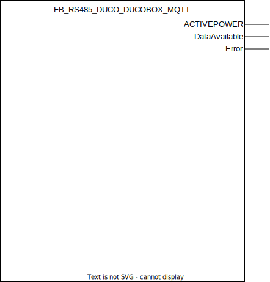

## FB_RS485_DUCO_DUCOBOX_MQTT

### **General**
Used to process Modbus RTU data through RS485 to human understandable values and publish data updates through MQTT if desired. Allows finegrained local control on your DucoBox.

----------------------------

:rotating_light: In order to leverage this modbus integration a communication print (partnumber 0000-4251) is required on the DucoBox.

----------------------------

DUCO DUCOBOX Focus data:
- [Productlink](https://www.duco.eu/uk/products/mechanical-ventilation/ventilation-units/ducobox-focus)
- [Modbus registers](../RS485/datasheets/DUCO_DUCOBOX_Modbus_Registers.pdf)

### **Block diagram**



METHOD(S)
- InitMQTT: enables MQTT events on the FB, an overview of the parameters:
    - `MQTTPublishPrefix`: datatype *POINTER TO STRING*, pointer to the MQTT publish prefix that should be used for publishing any messages/events for this FB. Suffix is automatically set to FB name.  
    - `pMqttPublishQueue`: datatype *POINTER TO FB_MqttPublishQueue*, pointer to the MQTT queue to publish messages.    
    - `pMqttCallbackCollector`: datatype _POINTER TO MQTT.CallbackCollector, pointer to the MQTT callback collector to receive subscribe messages.
- InitRS485: configures the Modbus RTU device address and the execution/polling interval for the multiple modbus read commands.
- RequestBusTime: method implemented by each RS485 device function block. More information in the [RS485Device interface docs](../RS485/RS485Device_Interface.md).
- GetRtuQuery: method implemented by each RS485 device function block. More information in the [RS485Device interface docs](../RS485/RS485Device_Interface.md).
- ProcessDataArray: method implemented by each RS485 device function block. More information in the [RS485Device interface docs](../RS485/RS485Device_Interface.md).

### **MQTT publish behavior**
Requires method call `InitMQTT` to enable MQTT capabilities.

| Event | Description | MQTT payload | QoS | Retain flag | Published on startup |
|:-------------|:------------------|:------------------|:------------------|:--------------------------|:--------------------------|
| **register is polled**   | a modbus register is polled | int value | 2 | `FALSE` | no

MQTT publish topic is a concatination of the publish prefix and the function block name, the node numer and a register number. For example:

`Devices/PLC/House/Out/RS485/FB_RS485_DUCO_DUCOBOX_MQTT/1/read/0`

Depending on the type of the node the published register value represents a certain parameter value. 

### **MQTT subscribe behavior**
Requires method call `InitMQTT` to enable MQTT capabilities.
Commands are executed by the FB if the topic `MQTTSubscribeTopic` matches the MQTT topic and the payload exists in the table below.

| Command | Description | expected payload | Additional notes | 
|:-------------|:------------------|:------------------|:------------------|
| **write holding** | Writes an integer value to a specific write register. | `INT` | Only integer values are processed further.

MQTT subscription topic is a concatenation of the subscribe prefix variable, function block name, node number and register number. For example, topic `Devices/PLC/House/In/RS485/FB_RS485_DUCO_DUCOBOX_MQTT/1/write/0` with payload `30` will set the 'Target value (%)' parameter for node 1 (which in this case represents the entire system). Go through the DUCO modbus register documentation linked above for a deeper understanding.

Upon a succesfull write operation the received payload will be published on the 'Out' topic. Continuing with the example above this will result in a payload `30` to be published on topic `Devices/PLC/House/Out/RS485/FB_RS485_DUCO_DUCOBOX_MQTT/1/write/0`.

### **Code example**

- variables initiation:
```
MQTTPubRS485Prefix                :STRING(100) := 'Devices/PLC/House/Out/RS485/';
FB_RS485_DUCO_DUCOBOX_MQTT_001    :FB_RS485_DUCO_DUCOBOX_MQTT;
```

- Init RS485 method call (called once during startup):
```
FB_RS485_DUCO_DUCOBOX_MQTT_001.InitRS485(
	DataPollingInterval := T#20S,       (* Polling interval *)		
	DeviceAddress := 1                  (* Device address of the modbus device *)			
);
```

- Init MQTT method call (called once during startup):
```
FB_RS485_DUCO_DUCOBOX_MQTT_001.InitMqtt(
	MQTTPublishPrefix:= ADR(MqttRS485Prefix),                       (* pointer to string prefix for the mqtt publish topic *)
	pMqttPublishQueue := ADR(MqttVariables.fbMqttPublishQueue)      (* pointer to MqttPublishQueue to send a new Mqtt event *)
);

```
The MQTT publish topic in this code example will be `Devices/PLC/House/Out/RS485/FB_RS485_DUCO_DUCOBOX_MQTT_001` (MQTTPubSwitchPrefix variable + function block name).

- Registering device to a buscontroller (called once during startup):
```
RS485BusController.RegisterDevice(device := FB_RS485_DUCO_DUCOBOX_MQTT_001);
```

### **Home Assistant YAML**
To integrate with Home Assistant use the YAML code below in your [MQTT sensors](https://www.home-assistant.io/components/sensor.mqtt/) config.

Main node:

```YAML
mqtt:
  sensor:
  - name: "Ventilation Status"
    object_id: "ventilation_1_1"
    state_topic: "Devices/PLC/House/Out/RS485/FB_RS485_DUCO_DUCOBOX_MQTT_001/1/read/1"
    value_template: >-
          
           Auto
           10 minutes high
           20 minutes high
           30 minutes high
           Manual low
           Manual medium
           Manual high
           Unoccupied
           Error
           Unknown
          
    icon: "mdi:state-machine"
    qos: 2
    availability:
      - topic: "Devices/PLC/House/Out/RS485/FB_RS485_DUCO_DUCOBOX_MQTT_001/availability"
      - topic: "Devices/PLC/House/availability"
    availability_mode : "all"
    payload_available: "online"
    payload_not_available: "offline"
  - name: "Ventilation Pos"
    object_id: "Ventilation_1_2"
    state_topic: "Devices/PLC/House/Out/RS485/FB_RS485_DUCO_DUCOBOX_MQTT_001/1/read/2"
    unit_of_measurement: "%"
    icon: "mdi:valve"
    qos: 2
    availability:
      - topic: "Devices/PLC/House/Out/RS485/FB_RS485_DUCO_DUCOBOX_MQTT_001/availability"
      - topic: "Devices/PLC/House/availability"
    availability_mode : "all"
    payload_available: "online"
    payload_not_available: "offline"
  - name: "Ventilation Power"
    object_id: "ventilation_1_3"
    state_topic: "Devices/PLC/House/Out/RS485/FB_RS485_DUCO_DUCOBOX_MQTT_001/1/read/3"
    unit_of_measurement: "W"
    device_class: "power"
    state_class: "measurement"
    qos: 2
    availability:
      - topic: "Devices/PLC/House/Out/RS485/FB_RS485_DUCO_DUCOBOX_MQTT_001/availability"
      - topic: "Devices/PLC/House/availability"
    availability_mode : "all"
    payload_available: "online"
    payload_not_available: "offline"
```

Additional nodes (for example valves):


```YAML
mqtt:
  sensor:
  - name: "Ventilation Node 2 Status"
    object_id: "ventilation_2_1"
    state_topic: "Devices/PLC/House/Out/RS485/FB_RS485_DUCO_DUCOBOX_MQTT_001/2/read/1"
    value_template: >-
          
           Auto
           10 minutes high
           20 minutes high
           30 minutes high
           Manual low
           Manual medium
           Manual high
           Unoccupied
           Error
           Unknown
          
    icon: "mdi:state-machine"
    qos: 2
    availability:
      - topic: "Devices/PLC/House/Out/RS485/FB_RS485_DUCO_DUCOBOX_MQTT_001/availability"
      - topic: "Devices/PLC/House/availability"
    availability_mode : "all"
    payload_available: "online"
    payload_not_available: "offline"
  - name: "Ventilation Node 2 Pos"
    object_id: "ventilation_2_2"
    state_topic: "Devices/PLC/House/Out/RS485/FB_RS485_DUCO_DUCOBOX_MQTT_001/2/read/2"
    unit_of_measurement: "%"
    icon: "mdi:valve"
    qos: 2
    availability:
      - topic: "Devices/PLC/House/Out/RS485/FB_RS485_DUCO_DUCOBOX_MQTT_001/availability"
      - topic: "Devices/PLC/House/availability"
    availability_mode : "all"
    payload_available: "online"
    payload_not_available: "offline"
  - name: "Ventilation Node 2 Temp"
    object_id: "ventilation_2_3"
    state_topic: "Devices/PLC/House/Out/RS485/FB_RS485_DUCO_DUCOBOX_MQTT_001/2/read/3"
    value_template: "{{ value | multiply(0.10) | round(2) }}" 
    unit_of_measurement: "°C"
    device_class: "temperature"
    state_class: "measurement"
    qos: 2
    availability:
      - topic: "Devices/PLC/House/Out/RS485/FB_RS485_DUCO_DUCOBOX_MQTT_001/availability"
      - topic: "Devices/PLC/House/availability"
    availability_mode : "all"
    payload_available: "online"
    payload_not_available: "offline"
  - name: "Ventilation Node 2 CO2"
    object_id: "Ventilation_2_4"
    state_topic: "Devices/PLC/House/Out/RS485/FB_RS485_DUCO_DUCOBOX_MQTT_001/2/read/4"
    unit_of_measurement: "µg/m³"
    device_class: "PM25"
    state_class: "measurement"
    qos: 2
    availability:
      - topic: "Devices/PLC/House/Out/RS485/FB_RS485_DUCO_DUCOBOX_MQTT_001/availability"
      - topic: "Devices/PLC/House/availability"
    availability_mode : "all"
    payload_available: "online"
    payload_not_available: "offline"
```

Writing registers (for example action on valves):


```YAML
mqtt:
  button:
  - object_id: "ventilation_2_write_9_15high"
	name: "Ventilation Kitchen 15 min high"
	command_topic: "Devices/PLC/House/In/RS485/FB_RS485_DUCO_DUCOBOX_MQTT_001/2/write/9"
	payload_press: "4"
	availability:
	- topic: "Devices/PLC/House/Out/RS485/FB_RS485_DUCO_DUCOBOX_MQTT_001/availability"
	- topic: "Devices/PLC/House/availability"
	availability_mode : "all"
	payload_available: "online"
	payload_not_available: "offline"
	entity_category: "config"
  - object_id: "ventilation_2_write_9_Auto"
	name: "Ventilation Kitchen auto"
	command_topic: "Devices/PLC/House/In/RS485/FB_RS485_DUCO_DUCOBOX_MQTT_001/2/write/9"
	payload_press: "5"
	availability:
	- topic: "Devices/PLC/House/Out/RS485/FB_RS485_DUCO_DUCOBOX_MQTT_001/availability"
	- topic: "Devices/PLC/House/availability"
	availability_mode : "all"
	payload_available: "online"
	payload_not_available: "offline"
	entity_category: "config"
```