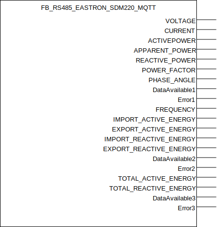
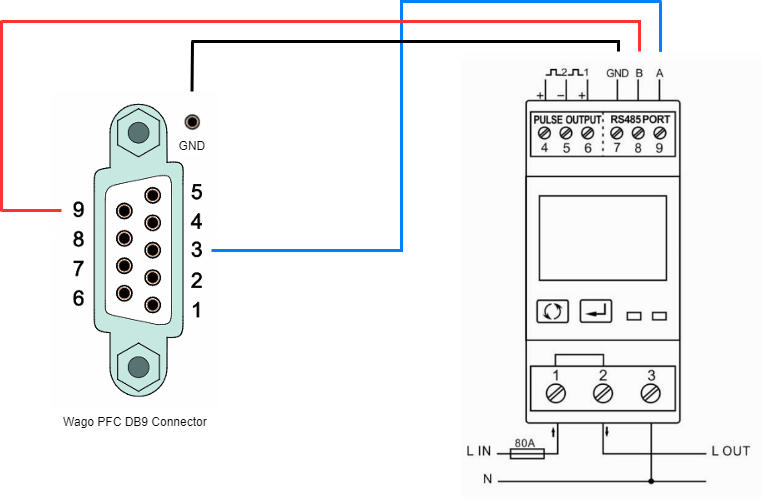

## FB_RS485_EASTRON_SDM220_MQTT

### **General**
Used to process Modbus RTU data through RS485 to human understandable values and publish data updates through MQTT if desired.
Due to the large amount of modbus registers exposed and the Eastron SDM220 limitation to read at maximum 40 registers at once the function block requires three modbus read commands to read out all the available data. Each of these three modbus read command reads out multiple registers at once which guarantees a consistent data readout as datapoints are extracted at a single point in time.

----------------------------

:rotating_light: Several users have reported that the 'Kwh' measurements readings of the Eastron SDM meters is unreliable. Specifically there are huge spikes containing faulty values in the data retrieved.

----------------------------

Eastron SDM220 datasheets:
- [Manual](../RS485/datasheets/SDM220_Manual.pdf)
- [Modbus registers](../RS485/datasheets/SDM220_Modbus_Registers.pdf)

### **Block diagram**



OUTPUT(S):
- VOLTAGE: datatype real, part of modbus read commando 1.
- CURRENT: datatype real, part of modbus read commando 1.
- ACTIVEPOWER: datatype real, part of modbus read commando 1.
- APPARENT_POWER: datatype real, part of modbus read commando 1.
- REACTIVE_POWER: datatype real, part of modbus read commando 1.
- POWER_FACTOR: datatype real, part of modbus read commando 1.
- PHASE_ANGLE: datatype real, part of modbus read commando 1.
- DataAvailable1: datatype bool, high when data is available read by modbus read commando 1. This means the output is only low on startup until modbus read commando 1 has been executed successfully.
- Error1: datatype bool, high when an error occured while executing modbus read commando 1.
- FREQUENCY: datatype real, part of modbus read commando 2.
- IMPORT_ACTIVE_ENERGY: datatype real, part of modbus read commando 2.
- EXPORT_ACTIVE_ENERGY: datatype real, part of modbus read commando 2.
- IMPORT_REACTIVE_ENERGY: datatype real, part of modbus read commando 2.
- EXPORT_REACTIVE_ENERGY: datatype real, part of modbus read commando 2.
- DataAvailable2: datatype bool, high when data is available read by modbus read commando 2. This means the output is only low on startup until modbus read commando 2 has been executed successfully.
- Error2: datatype bool, high when an error occured while executing modbus read commando 2.
- TOTAL_ACTIVE_ENERGY: datatype real, part of modbus read commando 3.
- TOTAL_REACTIVE_ENERGY: datatype real, part of modbus read commando 3.
- DataAvailable3: datatype bool, high when data is available read by modbus read commando 3. This means the output is only low on startup until modbus read commando 3 has been executed successfully.
- Error3: datatype bool, high when an error occured while executing modbus read commando 3.

Outputs sharing the same modbus read commando are read from the device at a single point in time. 

METHOD(S)
- InitMQTT: enables MQTT events on the FB, an overview of the parameters:
    - `MQTTPublishPrefix`: datatype *POINTER TO STRING*, pointer to the MQTT publish prefix that should be used for publishing any messages/events for this FB. Suffix is automatically set to FB name.  
    - `pMqttPublishQueue`: datatype *POINTER TO FB_MqttPublishQueue*, pointer to the MQTT queue to publish messages.   
    - `pMqttCallbackCollector`: datatype _POINTER TO MQTT.CallbackCollector, pointer to the MQTT callback collector to receive subscribe messages.
- InitRS485: configures the Modbus RTU device address and the execution/polling interval for the multiple modbus read commands.
- RequestBusTime: method implemented by each RS485 device function block. More information in the [RS485Device interface docs](../RS485/RS485Device_Interface.md).
- GetRtuQuery: method implemented by each RS485 device function block. More information in the [RS485Device interface docs](../RS485/RS485Device_Interface.md).
- ProcessDataArray: method implemented by each RS485 device function block. More information in the [RS485Device interface docs](../RS485/RS485Device_Interface.md).

### **MQTT publish behavior**
Requires method call `InitMQTT` to enable MQTT capabilities.

| Event | Description | MQTT payload | QoS | Retain flag | Published on startup |
|:-------------|:------------------|:------------------|:------------------|:--------------------------|:--------------------------|
| **output is updated**   | the output is updated. | real value | 2 | `FALSE` | no

MQTT publish topic is a concatination of the publish prefix and the function block name and a unique value: 
| output       | MQTT topc suffic | Unit         | 
|:-------------|:------------------|:------------------|
| VOLTAGE | `/VOLT` | Volts 
| CURRENT | `/CURR` | Amps 
| ACTIVEPOWER |  `/ACTP` | Watts 
| APPARENT_POWER | `/APPP` | VoltAmps 
| REACTIVE_POWER | `/REAP` | VAr 
| POWER_FACTOR | `/POWF` | None 
| PHASE_ANGLE | `/PHAA` | Degree 
| FREQUENCY | `/FREQ` | Hz 
| IMPORT_ACTIVE_ENERGY | `/IMAE` | kwh 
| EXPORT_ACTIVE_ENERGY | `/EXAE` | kwh 
| IMPORT_REACTIVE_ENERGY | `/IMRE` | kvarh 
| EXPORT_REACTIVE_ENERGY | `/EXRE` | kvarh 
| TOTAL_ACTIVE_ENERGY | `/TOTAE` | kwh 
| TOTAL_REACTIVE_ENERGY | `/TOTRE` | kvarh 

### **Code example**

- variables initiation:
```
MQTTPubRS485Prefix              :STRING(100) := 'Devices/PLC/House/Out/RS485/';
FB_RS485_EASTRON_SDM220_001     :FB_RS485_EASTRON_SDM220_MQTT;
```

- Init RS485 method call (called once during startup):
```
FB_RS485_EASTRON_SDM220_001.InitRS485(
	Data1PollingInterval := T#1S,       (* Polling interval for data array 1 *)				
	Data2PollingInterval := T#20S,      (* Polling interval for data array 2 *)			
	Data3PollingInterval := T#30S,      (* Polling interval for data array 3 *)			
	DeviceAddress := 1                  (* Device address of the modbus device *)			
);
```

- Init MQTT method call (called once during startup):
```
FB_RS485_EASTRON_SDM220_001.InitMqtt(
	MQTTPublishPrefix:= ADR(MqttRS485Prefix),                       (* pointer to string prefix for the mqtt publish topic *)
	pMqttPublishQueue := ADR(MqttVariables.fbMqttPublishQueue)      (* pointer to MqttPublishQueue to send a new Mqtt event *)
);

```
The MQTT publish topic in this code example will be `Devices/PLC/House/Out/RS485/FB_RS485_EASTRON_SDM220_001` (MQTTPubSwitchPrefix variable + function block name).

- Registering device to a buscontroller (called once during startup):
```
RS485BusController.RegisterDevice(device := FB_RS485_EASTRON_SDM220_1);
```

### **Wago PFC wiring diagram**
Wire the device as below in order to establish communication between a Wago PFC device and a Eastron SDM220:



Note: RS485 terminator resistors not present on image but nevertheless required.
### **Home Assistant YAML**
To integrate with Home Assistant use the YAML code below in your [MQTT sensors](https://www.home-assistant.io/components/sensor.mqtt/) config:

```YAML
mqtt:
  sensor:
  - name: "FB_RS485_EASTRON_SDM220_001_VOLT"
    state_topic: "Devices/PLC/House/Out/RS485/FB_RS485_EASTRON_SDM220_001/VOLT"
    unit_of_measurement: "Volts"
    qos: 2
    availability:
      - topic: "Devices/PLC/House/Out/RS485/FB_RS485_EASTRON_SDM220_001/availability"
      - topic: "Devices/PLC/House/availability"
    availability_mode : "all"
    payload_available: "online"
    payload_not_available: "offline"
  - name: "FB_RS485_EASTRON_SDM220_001_CURR"
    state_topic: "Devices/PLC/House/Out/RS485/FB_RS485_EASTRON_SDM220_001/CURR"
    unit_of_measurement: "Amps"
    qos: 2
    availability:
      - topic: "Devices/PLC/House/Out/RS485/FB_RS485_EASTRON_SDM220_001/availability"
      - topic: "Devices/PLC/House/availability"
    availability_mode : "all"
    payload_available: "online"
    payload_not_available: "offline"
  - name: "FB_RS485_EASTRON_SDM220_001_ACTP"
    state_topic: "Devices/PLC/House/Out/RS485/FB_RS485_EASTRON_SDM220_001/ACTP"
    unit_of_measurement: "Watts"
    qos: 2
    availability:
      - topic: "Devices/PLC/House/Out/RS485/FB_RS485_EASTRON_SDM220_001/availability"
      - topic: "Devices/PLC/House/availability"
    availability_mode : "all"
    payload_available: "online"
    payload_not_available: "offline"
  - name: "FB_RS485_EASTRON_SDM220_001_APPP"
    state_topic: "Devices/PLC/House/Out/RS485/FB_RS485_EASTRON_SDM220_001/APPP"
    unit_of_measurement: "VoltAmps"
    qos: 2
    availability:
      - topic: "Devices/PLC/House/Out/RS485/FB_RS485_EASTRON_SDM220_001/availability"
      - topic: "Devices/PLC/House/availability"
    availability_mode : "all"
    payload_available: "online"
    payload_not_available: "offline"
  - name: "FB_RS485_EASTRON_SDM220_001_REAP"
    state_topic: "Devices/PLC/House/Out/RS485/FB_RS485_EASTRON_SDM220_001/REAP"
    unit_of_measurement: "VAr"
    qos: 2
    availability:
      - topic: "Devices/PLC/House/Out/RS485/FB_RS485_EASTRON_SDM220_001/availability"
      - topic: "Devices/PLC/House/availability"
    availability_mode : "all"
    payload_available: "online"
    payload_not_available: "offline"
  - name: "FB_RS485_EASTRON_SDM220_001_POWF"
    state_topic: "Devices/PLC/House/Out/RS485/FB_RS485_EASTRON_SDM220_001/POWF"
    qos: 2
    availability:
      - topic: "Devices/PLC/House/Out/RS485/FB_RS485_EASTRON_SDM220_001/availability"
      - topic: "Devices/PLC/House/availability"
    payload_available: "online"
    payload_not_available: "offline"
  - name: "FB_RS485_EASTRON_SDM220_001_PHAA"
    state_topic: "Devices/PLC/House/Out/RS485/FB_RS485_EASTRON_SDM220_001/PHAA"
    unit_of_measurement: "Degree"
    qos: 2
    availability:
      - topic: "Devices/PLC/House/Out/RS485/FB_RS485_EASTRON_SDM220_001/availability"
      - topic: "Devices/PLC/House/availability"
    availability_mode : "all"
    payload_available: "online"
    payload_not_available: "offline"
  - name: "FB_RS485_EASTRON_SDM220_001_FREQ"
    state_topic: "Devices/PLC/House/Out/RS485/FB_RS485_EASTRON_SDM220_001/FREQ"
    unit_of_measurement: "Hz"
    qos: 2
    availability:
      - topic: "Devices/PLC/House/Out/RS485/FB_RS485_EASTRON_SDM220_001/availability"
      - topic: "Devices/PLC/House/availability"
    availability_mode : "all"
    payload_available: "online"
    payload_not_available: "offline"
  - name: "FB_RS485_EASTRON_SDM220_001_IMAE"
    state_topic: "Devices/PLC/House/Out/RS485/FB_RS485_EASTRON_SDM220_001/IMAE"
    unit_of_measurement: "kwh"
    qos: 2
    availability:
      - topic: "Devices/PLC/House/Out/RS485/FB_RS485_EASTRON_SDM220_001/availability"
      - topic: "Devices/PLC/House/availability"
    availability_mode : "all"
    payload_available: "online"
    payload_not_available: "offline"
  - name: "FB_RS485_EASTRON_SDM220_001_EXAE"
    state_topic: "Devices/PLC/House/Out/RS485/FB_RS485_EASTRON_SDM220_001/EXAE"
    unit_of_measurement: "kwh"
    qos: 2
    availability:
      - topic: "Devices/PLC/House/Out/RS485/FB_RS485_EASTRON_SDM220_001/availability"
      - topic: "Devices/PLC/House/availability"
    availability_mode : "all"
    payload_available: "online"
    payload_not_available: "offline"
  - name: "FB_RS485_EASTRON_SDM220_001_IMRE"
    state_topic: "Devices/PLC/House/Out/RS485/FB_RS485_EASTRON_SDM220_001/IMRE"
    unit_of_measurement: "kvarh"
    qos: 2
    availability:
      - topic: "Devices/PLC/House/Out/RS485/FB_RS485_EASTRON_SDM220_001/availability"
      - topic: "Devices/PLC/House/availability"
    availability_mode : "all"
    payload_available: "online"
    payload_not_available: "offline"
  - name: "FB_RS485_EASTRON_SDM220_001_EXRE"
    state_topic: "Devices/PLC/House/Out/RS485/FB_RS485_EASTRON_SDM220_001/EXRE"
    unit_of_measurement: "kvarh"
    qos: 2
    availability:
      - topic: "Devices/PLC/House/Out/RS485/FB_RS485_EASTRON_SDM220_001/availability"
      - topic: "Devices/PLC/House/availability"
    availability_mode : "all"
    payload_available: "online"
    payload_not_available: "offline"
  - name: "FB_RS485_EASTRON_SDM220_001_TOTAE"
    state_topic: "Devices/PLC/House/Out/RS485/FB_RS485_EASTRON_SDM220_001/TOTAE"
    unit_of_measurement: "kwh"
    qos: 2
    availability:
      - topic: "Devices/PLC/House/Out/RS485/FB_RS485_EASTRON_SDM220_001/availability"
      - topic: "Devices/PLC/House/availability"
    availability_mode : "all"
    payload_available: "online"
    payload_not_available: "offline"
  - name: "FB_RS485_EASTRON_SDM220_001_TOTRE"
    state_topic: "Devices/PLC/House/Out/RS485/FB_RS485_EASTRON_SDM220_001/TOTRE"
    unit_of_measurement: "kvarh"
    qos: 2
    availability:
      - topic: "Devices/PLC/House/Out/RS485/FB_RS485_EASTRON_SDM220_001/availability"
      - topic: "Devices/PLC/House/availability"
    availability_mode : "all"
    payload_available: "online"
    payload_not_available: "offline"
```