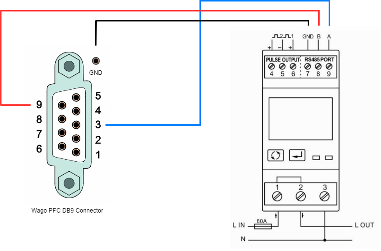

## FB_RS485_EASTRON_SDM220_MQTT
<!-- fb-badge:start -->
<!-- fb-badge:end -->

### **General**
Used to process Modbus RTU data received over RS485 into human-understandable values and publish data updates through MQTT if desired.
Due to the large number of Modbus registers exposed and the Eastron SDM220 limitation of reading at most 40 registers at once, the function block requires three Modbus read commands to read out all the available data. Each of these three Modbus read commands reads out multiple registers at once, which guarantees a consistent data readout as datapoints are extracted at a single point in time.

----------------------------

:rotating_light: Several users have reported that the 'kWh' measurement readings of the Eastron SDM meters are unreliable. Specifically, there are huge spikes containing faulty values in the data retrieved.

----------------------------

Eastron SDM220 datasheets:
- [Manual](../RS485/datasheets/SDM220_Manual.pdf)
- [Modbus registers](../RS485/datasheets/SDM220_Modbus_Registers.pdf)

<!-- fb-interface:start -->
### **Block diagram**

```text
   ┌──────────────────────────────┐
   │ FB_RS485_EASTRON_SDM220_MQTT │
   ├──────────────────────────────┤
   │                      VOLTAGE ├── REAL
   │                      CURRENT ├── REAL
   │                  ACTIVEPOWER ├── REAL
   │               APPARENT_POWER ├── REAL
   │               REACTIVE_POWER ├── REAL
   │                 POWER_FACTOR ├── REAL
   │                  PHASE_ANGLE ├── REAL
   │               DataAvailable1 ├── BOOL
   │                       Error1 ├── BOOL
   │                    FREQUENCY ├── REAL
   │         IMPORT_ACTIVE_ENERGY ├── REAL
   │         EXPORT_ACTIVE_ENERGY ├── REAL
   │       IMPORT_REACTIVE_ENERGY ├── REAL
   │       EXPORT_REACTIVE_ENERGY ├── REAL
   │               DataAvailable2 ├── BOOL
   │                       Error2 ├── BOOL
   │          TOTAL_ACTIVE_ENERGY ├── REAL
   │        TOTAL_REACTIVE_ENERGY ├── REAL
   │               DataAvailable3 ├── BOOL
   │                       Error3 ├── BOOL
   └──────────────────────────────┘
```

### **Interface**

**Outputs**

| Pin | Type | Description |
|:--|:--|:--|
| `VOLTAGE` | REAL | Datatype real, part of Modbus read command 1. |
| `CURRENT` | REAL | Datatype real, part of Modbus read command 1. |
| `ACTIVEPOWER` | REAL | Datatype real, part of Modbus read command 1. |
| `APPARENT_POWER` | REAL | Datatype real, part of Modbus read command 1. |
| `REACTIVE_POWER` | REAL | Datatype real, part of Modbus read command 1. |
| `POWER_FACTOR` | REAL | Datatype real, part of Modbus read command 1. |
| `PHASE_ANGLE` | REAL | Datatype real, part of Modbus read command 1. |
| `DataAvailable1` | BOOL | Datatype bool, high when data is available read by Modbus read command 1. This means the output is only low on startup until Modbus read command 1 has been executed successfully. |
| `Error1` | BOOL | Datatype bool, high when an error occurred while executing Modbus read command 1. |
| `FREQUENCY` | REAL | Datatype real, part of Modbus read command 2. |
| `IMPORT_ACTIVE_ENERGY` | REAL | Datatype real, part of Modbus read command 2. |
| `EXPORT_ACTIVE_ENERGY` | REAL | Datatype real, part of Modbus read command 2. |
| `IMPORT_REACTIVE_ENERGY` | REAL | Datatype real, part of Modbus read command 2. |
| `EXPORT_REACTIVE_ENERGY` | REAL | Datatype real, part of Modbus read command 2. |
| `DataAvailable2` | BOOL | Datatype bool, high when data is available read by Modbus read command 2. This means the output is only low on startup until Modbus read command 2 has been executed successfully. |
| `Error2` | BOOL | Datatype bool, high when an error occurred while executing Modbus read command 2. |
| `TOTAL_ACTIVE_ENERGY` | REAL | Datatype real, part of Modbus read command 3. |
| `TOTAL_REACTIVE_ENERGY` | REAL | Datatype real, part of Modbus read command 3. |
| `DataAvailable3` | BOOL | Datatype bool, high when data is available read by Modbus read command 3. This means the output is only low on startup until Modbus read command 3 has been executed successfully. |
| `Error3` | BOOL | Datatype bool, high when an error occurred while executing Modbus read command 3. |

### **Methods**

**`GetRtuQuery`** — Method implemented by each RS485 device function block. More information in the [RS485Device interface docs](../RS485/RS485Device_Interface.md).

**`InitMqtt`** — Enables MQTT on the function block. Call once at startup.

| Parameter | Type | Default | Description |
|:--|:--|:--|:--|
| `MQTTPublishPrefix` | POINTER TO STRING |  | Pointer to the MQTT publish prefix used for this block. The function block name is appended automatically. |
| `pMqttPublishQueue` | POINTER TO FB_MqttPublishQueue |  | Pointer to the shared MQTT queue that carries messages to the broker. |

**`InitRS485`** — Configures the Modbus RTU device address and the execution/polling interval for the multiple Modbus read commands.

| Parameter | Type | Default | Description |
|:--|:--|:--|:--|
| `Data1PollingInterval` | TIME |  | How often Modbus read command 1 runs (voltage, current, power, power factor, phase angle). |
| `Data2PollingInterval` | TIME |  | How often Modbus read command 2 runs (frequency, import/export energy). |
| `Data3PollingInterval` | TIME |  | How often Modbus read command 3 runs (total active and reactive energy). |
| `DeviceAddress` | BYTE |  | Modbus RTU address of the device on the RS485 bus. |

**`ProcessDataArray`** — Method implemented by each RS485 device function block. More information in the [RS485Device interface docs](../RS485/RS485Device_Interface.md).

| Parameter | Type | Default | Description |
|:--|:--|:--|:--|
| `Error` | POINTER TO BOOL |  | Pointer to the bus error flag for the RTU query. |
| `Data` | POINTER TO ARRAY [0..124] OF WORD |  | Pointer to the response data returned by the RTU query. |

**`RequestBusTime`** — Method implemented by each RS485 device function block. More information in the [RS485Device interface docs](../RS485/RS485Device_Interface.md).
<!-- fb-interface:end -->

### **MQTT publish behavior**
Requires method call `InitMQTT` to enable MQTT capabilities.

| Event | Description | MQTT payload | QoS | Retain flag | Published on startup |
|:-------------|:------------------|:------------------|:------------------|:--------------------------|:--------------------------|
| **output is updated**   | the output is updated. | real value | 2 | `FALSE` | no

MQTT publish topic is a concatenation of the publish prefix, the function block name and a unique value:

| output       | MQTT topic suffix | Unit         |
|:-------------|:------------------|:------------------|
| VOLTAGE | `/VOLT` | Volts 
| CURRENT | `/CURR` | Amps 
| ACTIVEPOWER |  `/ACTP` | Watts 
| APPARENT_POWER | `/APPP` | VoltAmps 
| REACTIVE_POWER | `/REAP` | VAr 
| POWER_FACTOR | `/POWF` | None 
| PHASE_ANGLE | `/PHAA` | Degree 
| FREQUENCY | `/FREQ` | Hz 
| IMPORT_ACTIVE_ENERGY | `/IMAE` | kwh 
| EXPORT_ACTIVE_ENERGY | `/EXAE` | kwh 
| IMPORT_REACTIVE_ENERGY | `/IMRE` | kvarh 
| EXPORT_REACTIVE_ENERGY | `/EXRE` | kvarh 
| TOTAL_ACTIVE_ENERGY | `/TOTAE` | kwh 
| TOTAL_REACTIVE_ENERGY | `/TOTRE` | kvarh 

### **Code example**

- variables initiation:
```
MQTTPubRS485Prefix              :STRING(100) := 'Devices/PLC/Lab/Out/RS485/';
FB_RS485_EASTRON_SDM220_001     :FB_RS485_EASTRON_SDM220_MQTT;
```

- Init RS485 method call (called once during startup):
```
FB_RS485_EASTRON_SDM220_001.InitRS485(
	Data1PollingInterval := T#1S,       (* Polling interval for data array 1 *)				
	Data2PollingInterval := T#20S,      (* Polling interval for data array 2 *)			
	Data3PollingInterval := T#30S,      (* Polling interval for data array 3 *)			
	DeviceAddress := 1                  (* Device address of the modbus device *)			
);
```

- Init MQTT method call (called once during startup):
```
FB_RS485_EASTRON_SDM220_001.InitMqtt(
	MQTTPublishPrefix:= ADR(MqttRS485Prefix),                       (* pointer to string prefix for the mqtt publish topic *)
	pMqttPublishQueue := ADR(MqttVariables.fbMqttPublishQueue)      (* pointer to MqttPublishQueue to send a new Mqtt event *)
);

```
The MQTT publish topic in this code example will be `Devices/PLC/Lab/Out/RS485/FB_RS485_EASTRON_SDM220_001` (MQTTPubSwitchPrefix variable + function block name).

- Registering device to a bus controller (called once during startup):
```
RS485BusController.RegisterDevice(device := FB_RS485_EASTRON_SDM220_1);
```

### **Wago PFC wiring diagram**
Wire the device as below in order to establish communication between a Wago PFC device and an Eastron SDM220:



Note: RS485 terminator resistors are not shown in the image but are nevertheless required.

### **Home Assistant YAML**
To integrate with Home Assistant use the YAML code below in your [MQTT sensors](https://www.home-assistant.io/components/sensor.mqtt/) config:

```YAML
mqtt:
  sensor:
  - name: "FB_RS485_EASTRON_SDM220_001_VOLT"
    state_topic: "Devices/PLC/Lab/Out/RS485/FB_RS485_EASTRON_SDM220_001/VOLT"
    unit_of_measurement: "Volts"
    qos: 2
    availability:
      - topic: "Devices/PLC/Lab/Out/RS485/FB_RS485_EASTRON_SDM220_001/availability"
      - topic: "Devices/PLC/Lab/availability"
    availability_mode : "all"
    payload_available: "online"
    payload_not_available: "offline"
  - name: "FB_RS485_EASTRON_SDM220_001_CURR"
    state_topic: "Devices/PLC/Lab/Out/RS485/FB_RS485_EASTRON_SDM220_001/CURR"
    unit_of_measurement: "Amps"
    qos: 2
    availability:
      - topic: "Devices/PLC/Lab/Out/RS485/FB_RS485_EASTRON_SDM220_001/availability"
      - topic: "Devices/PLC/Lab/availability"
    availability_mode : "all"
    payload_available: "online"
    payload_not_available: "offline"
  - name: "FB_RS485_EASTRON_SDM220_001_ACTP"
    state_topic: "Devices/PLC/Lab/Out/RS485/FB_RS485_EASTRON_SDM220_001/ACTP"
    unit_of_measurement: "Watts"
    qos: 2
    availability:
      - topic: "Devices/PLC/Lab/Out/RS485/FB_RS485_EASTRON_SDM220_001/availability"
      - topic: "Devices/PLC/Lab/availability"
    availability_mode : "all"
    payload_available: "online"
    payload_not_available: "offline"
  - name: "FB_RS485_EASTRON_SDM220_001_APPP"
    state_topic: "Devices/PLC/Lab/Out/RS485/FB_RS485_EASTRON_SDM220_001/APPP"
    unit_of_measurement: "VoltAmps"
    qos: 2
    availability:
      - topic: "Devices/PLC/Lab/Out/RS485/FB_RS485_EASTRON_SDM220_001/availability"
      - topic: "Devices/PLC/Lab/availability"
    availability_mode : "all"
    payload_available: "online"
    payload_not_available: "offline"
  - name: "FB_RS485_EASTRON_SDM220_001_REAP"
    state_topic: "Devices/PLC/Lab/Out/RS485/FB_RS485_EASTRON_SDM220_001/REAP"
    unit_of_measurement: "VAr"
    qos: 2
    availability:
      - topic: "Devices/PLC/Lab/Out/RS485/FB_RS485_EASTRON_SDM220_001/availability"
      - topic: "Devices/PLC/Lab/availability"
    availability_mode : "all"
    payload_available: "online"
    payload_not_available: "offline"
  - name: "FB_RS485_EASTRON_SDM220_001_POWF"
    state_topic: "Devices/PLC/Lab/Out/RS485/FB_RS485_EASTRON_SDM220_001/POWF"
    qos: 2
    availability:
      - topic: "Devices/PLC/Lab/Out/RS485/FB_RS485_EASTRON_SDM220_001/availability"
      - topic: "Devices/PLC/Lab/availability"
    payload_available: "online"
    payload_not_available: "offline"
  - name: "FB_RS485_EASTRON_SDM220_001_PHAA"
    state_topic: "Devices/PLC/Lab/Out/RS485/FB_RS485_EASTRON_SDM220_001/PHAA"
    unit_of_measurement: "Degree"
    qos: 2
    availability:
      - topic: "Devices/PLC/Lab/Out/RS485/FB_RS485_EASTRON_SDM220_001/availability"
      - topic: "Devices/PLC/Lab/availability"
    availability_mode : "all"
    payload_available: "online"
    payload_not_available: "offline"
  - name: "FB_RS485_EASTRON_SDM220_001_FREQ"
    state_topic: "Devices/PLC/Lab/Out/RS485/FB_RS485_EASTRON_SDM220_001/FREQ"
    unit_of_measurement: "Hz"
    qos: 2
    availability:
      - topic: "Devices/PLC/Lab/Out/RS485/FB_RS485_EASTRON_SDM220_001/availability"
      - topic: "Devices/PLC/Lab/availability"
    availability_mode : "all"
    payload_available: "online"
    payload_not_available: "offline"
  - name: "FB_RS485_EASTRON_SDM220_001_IMAE"
    state_topic: "Devices/PLC/Lab/Out/RS485/FB_RS485_EASTRON_SDM220_001/IMAE"
    unit_of_measurement: "kwh"
    qos: 2
    availability:
      - topic: "Devices/PLC/Lab/Out/RS485/FB_RS485_EASTRON_SDM220_001/availability"
      - topic: "Devices/PLC/Lab/availability"
    availability_mode : "all"
    payload_available: "online"
    payload_not_available: "offline"
  - name: "FB_RS485_EASTRON_SDM220_001_EXAE"
    state_topic: "Devices/PLC/Lab/Out/RS485/FB_RS485_EASTRON_SDM220_001/EXAE"
    unit_of_measurement: "kwh"
    qos: 2
    availability:
      - topic: "Devices/PLC/Lab/Out/RS485/FB_RS485_EASTRON_SDM220_001/availability"
      - topic: "Devices/PLC/Lab/availability"
    availability_mode : "all"
    payload_available: "online"
    payload_not_available: "offline"
  - name: "FB_RS485_EASTRON_SDM220_001_IMRE"
    state_topic: "Devices/PLC/Lab/Out/RS485/FB_RS485_EASTRON_SDM220_001/IMRE"
    unit_of_measurement: "kvarh"
    qos: 2
    availability:
      - topic: "Devices/PLC/Lab/Out/RS485/FB_RS485_EASTRON_SDM220_001/availability"
      - topic: "Devices/PLC/Lab/availability"
    availability_mode : "all"
    payload_available: "online"
    payload_not_available: "offline"
  - name: "FB_RS485_EASTRON_SDM220_001_EXRE"
    state_topic: "Devices/PLC/Lab/Out/RS485/FB_RS485_EASTRON_SDM220_001/EXRE"
    unit_of_measurement: "kvarh"
    qos: 2
    availability:
      - topic: "Devices/PLC/Lab/Out/RS485/FB_RS485_EASTRON_SDM220_001/availability"
      - topic: "Devices/PLC/Lab/availability"
    availability_mode : "all"
    payload_available: "online"
    payload_not_available: "offline"
  - name: "FB_RS485_EASTRON_SDM220_001_TOTAE"
    state_topic: "Devices/PLC/Lab/Out/RS485/FB_RS485_EASTRON_SDM220_001/TOTAE"
    unit_of_measurement: "kwh"
    qos: 2
    availability:
      - topic: "Devices/PLC/Lab/Out/RS485/FB_RS485_EASTRON_SDM220_001/availability"
      - topic: "Devices/PLC/Lab/availability"
    availability_mode : "all"
    payload_available: "online"
    payload_not_available: "offline"
  - name: "FB_RS485_EASTRON_SDM220_001_TOTRE"
    state_topic: "Devices/PLC/Lab/Out/RS485/FB_RS485_EASTRON_SDM220_001/TOTRE"
    unit_of_measurement: "kvarh"
    qos: 2
    availability:
      - topic: "Devices/PLC/Lab/Out/RS485/FB_RS485_EASTRON_SDM220_001/availability"
      - topic: "Devices/PLC/Lab/availability"
    availability_mode : "all"
    payload_available: "online"
    payload_not_available: "offline"
```
