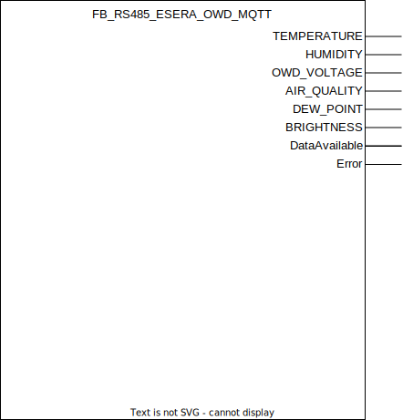

## FB_RS485_ESERA_OWD_MQTT

### __General__
Represents a single One Wire Device (OWD) on the 1-Wire bus network.
The following 1-Wire devices are currently supported:

| Device | Devicecode | exports | link |
|:-------------|:------------------|:------------------|:------------------|
| Maxim integrated DS1820 & DS18B20  | 1820 | temperature | [link](https://www.analog.com/media/en/technical-documentation/data-sheets/ds18b20.pdf)
| Esera multisensor Pro 1 | 11151 | air quality, humidity, temperature | [link](https://esera.de/en/Products/1-Wire-Bus-Smart-Home/Air-quality-humidity-temperature-sensor/428/1-Wire-Multisensor-Air-Quality-Humidity-and-Temperature-Pro-I)
| Esera multisensor Pro 2  | 11152 | air quality, humidity, temperature | [link](https://esera.de/en/Products/1-Wire-Smart-Home-and-Commercial/1-Wire-air-quality-sensor-air-quality/461/1-Wire-Multisensor-Air-Quality-Humidity-and-Temperature-Sensor-Pro-II)
| Esera temperature sensor living space Pro | 11148 | humidity, temperature | [link](https://esera.de/en/Products/1-Wire-Bus-Smart-Home/1-Wire-Temperature-Sensor/1-Wire-Temperatur-Sensor-Wall-Mount/382/1-Wire-temperature-sensor-living-space-Pro)
| Esera MSP 105 multisensor Pro Air Humidity and Temperature Sensor   | 11150 | humidity, temperature | [link](https://esera.de/en/Products/1-Wire-Smart-Home-and-Commercial/1-Wire-Multisensors-Humidity-Temperature-Brightness-Sensor/469/1-Wire-Multisensor-Pro-Air-Humidity-and-Temperature-Sensor)
| Esera multisensor Pro temperature, humidity living room flush-mounted for Berker, Jung, Merten | 11160 | humidity, temperature | [link](https://esera.de/en/11160.3/1-wire-multisensor-pro-temperature-humidity-living-room-flush-mounted-for-berker-jung-merten)
| Esera MS105 multisensor temperature, humidity living room flush-mounted for Berker, Jung, Merten | 11132 | humidity, temperature, brightness | [link](https://esera.de/en/11132.4/ms105-1-wire-multisensor-temperature-humidity-living-room-flush-mounted-for-berker-jung-merten-kopie)
| Esera multisensor for temperature, humidity, brightness, indoor, surface  | 11134 | humidity, temperature, brightness | [link](https://esera.de/en/Products/1-Wire-Smart-Home-and-Commercial/1-Wire-Multisensors-Humidity-Temperature-Brightness-Sensor/511/1-Wire-multi-sensor-for-temperature-humidity-brightness-indoor-surface)


Note that the Esera documents the full list of supported devices over here: [link](https://esera.de/en/Service-Support/1-Wire-Basics/1-Wire-building-blocks/414/1-Wire-Gateway-10-Modbus-RTU). Yet, only the devices are above are supported in the software due to lack of actual testing devices.
Nevertheless, adding a new device is a simple job.

### __Block diagram__



### __MQTT Event Behaviour__
Requires method call `InitMQTT` to enable MQTT capabilities.

| Event | Description | MQTT payload | QoS | Retain flag | Published on startup |
|:-------------|:------------------|:------------------|:------------------|:--------------------------|:--------------------------|
| **sensor data is received**   | temperature, humidity, etc readings received. | real value | 2 | `FALSE` | no

MQTT publish topic is a concatination of the publish prefix and the function block name, the OWD numer and a unique sensor value. For example:

`Devices/PLC/House/Out/RS485/FB_RS485_ESERA_1WIRE_GATEWAY_MQTT_HOME/OWD/1/TEMP`

Naturally `/TEMP` will only be ommited by the OWD is the physical sensor exposes it.

| output       | MQTT topc suffic | Unit         | 
|:-------------|:------------------|:------------------|
| TEMPERATURE | `/TEMP` | °C 
| HUMIDITY | `/HUM` | % 
| OWD_VOLTAGE |  `/OWDV` | V 
| AIR_QUALITY | `/AIRQ` | ppm 
| DEW_POINT | `/DEWP` | °C 
| BRIGHTNESS | `/BNESS` | Lux

### __Code example__

- Enabling the OWD & configuring the OWD polling interval (called once during startup using the managing gateway function block):
```
FB_RS485_ESERA_1WIRE_GATEWAY_MQTT_HOME.EnableOwd(
	OwdNumber := 1,
	DataPollingInterval := T#2M
);
```

### __Home Assistant YAML__
To integrate with Home Assistant use the YAML code below in your [MQTT sensors](https://www.home-assistant.io/components/sensor.mqtt/) config. Adopt where necessary depending on the exposed values of your OWD.

```YAML

mqtt:
  sensor:
  - name: "temperature kitchen"
    object_id: "kitchen_temp"
    state_topic: "Devices/PLC/House/Out/RS485/FB_RS485_ESERA_1WIRE_GATEWAY_MQTT_HOME/OWD/1/TEMP"
    unit_of_measurement: "°C"
    qos: 2
    availability:
      - topic: "Devices/PLC/House/Out/RS485/FB_RS485_ESERA_1WIRE_GATEWAY_MQTT_HOME/OWD/1/availability"
      - topic: "Devices/PLC/House/availability"
    availability_mode : "all"
    payload_available: "online"
    payload_not_available: "offline"
```