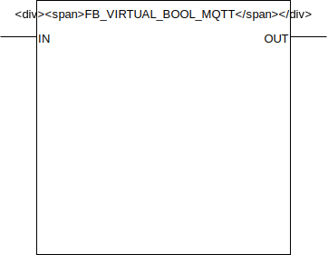

## FB_VIRTUAL_BOOL_MQTT

### __General__
A virtual function block can be used in one of two modes:
- input: inputs a value in the PLC processing logic through MQTT.
- output: outputs a value from the PLC processing logic through MQTT.

### __Block diagram__



INPUT(S)
- InputValue: datatype *BOOL*, input for the value that should be published through MQTT, provision this input when using the virtual function block in output mode.

OUTPUT(S)
- OutputValue: datatype *BOOL*, output for the value that is received through the MQTT subscription. provision this output in other processing logic when using the virtual function block in input mode.

METHOD(S)
- ConfigureFunctionBlockAsVirtualInput: configures the behaviour of the virtual function block using the parameters below:
    - `DefaultValue`: datatype *BOOL*, value to set 
    - `SetDefaultValueStartup`: datatype *POINTER TO STRING*, pointer to the MQTT subscribe prefix that should be used for publishing any messages/events to this FB. Suffix is automatically set to FB name. 
    - `PublishAtStartup`: datatype *POINTER TO FB_MqttPublishQueue*, pointer to the MQTT queue to publish messages.
    - `UsePersistentAtStartup`: datatype *SD_MQTT.CallbackCollector*, pointer to the MQTT callback collector, required to register FB for subscriptions on a certain topic.
    - `TriggerMqttUponUpdate`:
    - `VirtualMode`:

- InitMQTT: enables MQTT events on the FB, an overview of the parameters:
    - `MQTTPublishPrefix`: datatype *POINTER TO STRING*, pointer to the MQTT publish prefix that should be used for publishing any messages/events for this FB. Suffix is automatically set to FB name. 
    - `MQTTSubscribePrefix`: datatype *POINTER TO STRING*, pointer to the MQTT subscribe prefix that should be used for publishing any messages/events to this FB. Suffix is automatically set to FB name. 
    - `pMqttPublishQueue`: datatype *POINTER TO FB_MqttPublishQueue*, pointer to the MQTT queue to publish messages.
    - `pMqttCallbackCollector`: datatype *SD_MQTT.CallbackCollector*, pointer to the MQTT callback collector, required to register FB for subscriptions on a certain topic.
    - `MqttQos`:
    - `MqttRetain`:
    
- PublishReceived: callback method called by the callbackcollector when a message is received on the subscribed topic by the callbackcollector.

- SetValue: method to set the function block virtual value, only works if the function block is in output mode.


### __MQTT Event Behaviour__
Requires method call `InitMQTT` to enable MQTT capabilities.

| Event | Description | MQTT payload | QoS | Retain flag | Published on startup |
|:-------------|:------------------|:------------------|:------------------|:--------------------------|:--------------------------|
| **Output changes: OUT**   | A change is detected on output `OUT`. (*) | `TRUE/FALSE` | 2 | `TRUE` | yes

MQTT publish topic is a concatination of the publish prefix and the function block name. 

### __MQTT Subscription Behaviour__
Requires method call `InitMQTT` to enable MQTT capabilities.
Commands are executed by the FB if the topic `MQTTSubscribeTopic` matches the MQTT topic and the payload exists in the table below.

| Command | Description | expected payload | Additional notes | 
|:-------------|:------------------|:------------------|:------------------|
| **Change output to high** | Request to change output to high. | `TRUE` | Command executed when `PRIO_HIGH` and `PRIO_LOW` inputs are low.
| **Change output to low** | Request to change output to low. | `FALSE` | Command executed when `PRIO_HIGH` and `PRIO_LOW` inputs are low.

MQTT subscription topic is a concatenation of the subscribe prefix variable and the function block name. 

### __Code example__

- variables initiation:
```
MQTTPubSwitchPrefix     :STRING(100) := 'WAGO-PFC200/Out/DigitalOutputs/';
MQTTSubSwitchPrefix     :STRING(100) := 'WAGO-PFC200/In/DigitalOutputs/';
FB_DO_SW_001            :FB_OUTPUT_SWITCH_MQTT;
```

- Init MQTT method call (called once during startup):
```
FB_DO_SW_001.InitMQTT(MQTTPublishPrefix:= ADR(MQTTPubSwitchPrefix),                 (* pointer to string prefix for the MQTT publish topic *)
    MQTTSubscribePrefix:= ADR(MQTTSubSwitchPrefix),                                 (* pointer to string prefix for the MQTT subscribe topic *)
    MQTTTopicSuffix := 'FB_DO_SW_001',                                              (* value to suffix the the MQTT topic, should be unique for each FB *)
    pMQTTPublishQueue := ADR(MQTTVariables.fbMQTTPublishQueue),                     (* pointer to MQTTPublishQueue to send a new MQTT event *)
    pMQTTCallbackCollector := ADR(MQTTVariables.collector_FB_OUTPUT_SWITCH_MQTT)    (* pointer to CallbackCollector to receive MQTT subscription events *)
);
```
The MQTT publish topic in this code example will be `WAGO-PFC200/Out/DigitalOutputs/FB_DO_SW_001` (MQTTPubSwitchPrefix variable + function block name). The subscription topic will be `WAGO-PFC200/In/DigitalOutputs/FB_DO_SW_001` (MQTTSubSwitchPrefix variable + function block name).


- checking for events to switch the digital output (cyclic):
```
FB_DO_SW_001(OUT=>  DO_001,                 (* couple the function block to the physical output *)
    PRIO_HIGH:=     FALSE,                  (* brings the output high regardless of other input values *)
    PRIO_LOW:=      FALSE                   (* brings the output low regardless of other input values. NOTE: Priohigh overrules Priolow input *)
    TOGGLE:=        FB_DI_PB_009.SINGLE     (* for toggling the output *)	
);
```

- integration with `FB_INPUT_PUSHBUTTON_MQTT`:
```
FB_DO_SW_001(OUT=>  DO_001,                 (* couple the function block to the physical output *)
    PRIO_HIGH:=     FALSE,                  (* brings the output high regardless of other input values *)
    PRIO_LOW:=      FALSE,                  (* brings the output low regardless of other input values. NOTE: Priohigh overrules Priolow input *)
    TOGGLE:=        FB_DI_PB_001.SINGLE     (* for toggling the output *)	
);
```

### __Home Assistant YAML__
To integrate with Home Assistant use the YAML code below in your [MQTT lights](https://www.home-assistant.io/components/light.mqtt/) config:

```YAML
- platform: MQTT
  name: "FB_DO_SW_001"
  state_topic: "WAGO-PFC200/Out/DigitalOutputs/FB_DO_SW_001"
  command_topic: "WAGO-PFC200/In/DigitalOutputs/FB_DO_SW_001"
  payload_on: "TRUE"
  payload_off: "FALSE"
  qos: 2
  optimistic: false
  availability_topic: "Devices/WAGO-PFC200/availability"
  payload_available: "online"
  payload_not_available: "offline"
```