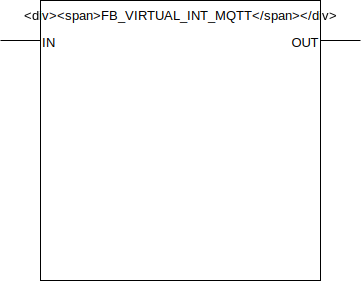

## FB_VIRTUAL_INT_MQTT

### __General__
A virtual function block can be used in one of two modes:
- input: inputs a value in the PLC processing logic through MQTT.
- output: outputs a value from the PLC processing logic through MQTT.

### __Block diagram__



INPUT(S)
- IN: datatype *INT*, input for the value that should be published through MQTT, provision this input when using the virtual function block in output mode.

OUTPUT(S)
- OUT: datatype *INT*, output for the value that is received through the MQTT subscription. provision this output in other processing logic when using the virtual function block in input mode.

METHOD(S)
- ConfigureFunctionBlockAsVirtualInput: configures the behaviour of the function block as a virtual input using the parameters below:
    - `DefaultValue`: datatype *INT*, value to set at startup if default value at startup behavior is configured.
    - `SetDefaultValueStartup`: datatype *BOOL*, set to TRUE to set the DefaultValue at PLC startup. 
    - `PublishAtStartup`: datatype *BOOL*, set to TRUE to get an MQTT publish message of the virtual input value at PLC startup.
    - `UsePersistentAtStartup`: datatype *BOOL*, set to TRUE to use persistence to maintain the virtual input value through power cycles. 
    - `ConfirmReceival`: datatype *BOOL*, set to TRUE to get an MQTT publish message when the value is updated. 

- ConfigureFunctionBlockAsVirtualOutput: configures the behaviour of the function block as a virtual output using the parameters below:
    - `PublishAtStartup`: datatype *BOOL*, set to TRUE to get an MQTT publish message of the virtual output value at PLC startup.

- InitMQTT: enables MQTT events on the FB, an overview of the parameters:
    - `MQTTPublishPrefix`: datatype *POINTER TO STRING*, pointer to the MQTT publish prefix that should be used for publishing any messages/events for this FB. Suffix is automatically set to FB name. 
    - `MQTTSubscribePrefix`: datatype *POINTER TO STRING*, pointer to the MQTT subscribe prefix that should be used for publishing any messages/events to this FB. Suffix is automatically set to FB name. 
    - `pMqttPublishQueue`: datatype *POINTER TO FB_MqttPublishQueue*, pointer to the MQTT queue to publish messages.
    - `pMqttCallbackCollector`: datatype *SD_MQTT.CallbackCollector*, pointer to the MQTT callback collector, required to register FB for subscriptions on a certain topic.
    - `MqttQos`: datatype *SD_MQTT.QoS*, configures the MQTT Qos for the function block published messages.  
    - `MqttRetain`: datatype *BOOL*, configures the MQTT retain flag for the function block published messages.
    
- PublishReceived: callback method called by the callbackcollector when a message is received on the subscribed topic by the callbackcollector.

- SetValue: method to set the function block virtual value, only works if the function block is in output mode.


### __MQTT Event Behaviour__
Requires method call `InitMQTT` to enable MQTT capabilities. Only applicable if the function block is configured in output mode, outputting the value on input `IN` or set using the SetValue method through MQTT.  

| Event | Description | MQTT payload | QoS | Retain flag | Published on startup |
|:-------------|:------------------|:------------------|:------------------|:--------------------------|:--------------------------|
| **input changes: IN**   | A change is detected on input `IN`. | `TRUE/FALSE` | configured in method call `InitMQTT` | configured in method call `InitMQTT` | configured in method call `InitMQTT`

MQTT publish topic is a concatination of the publish prefix and the function block name. 

### __MQTT Subscription Behaviour__
Requires method call `InitMQTT` to enable MQTT capabilities. Only applicable is the function block is configured in input mode which will allow the input of a value to the PLC through MQTT which will be exposed on the function block `OUT` output.
Commands are executed by the FB if the topic `MQTTSubscribeTopic` matches the MQTT topic and the payload exists in the table below.

| Command | Description | expected payload | Additional notes | 
|:-------------|:------------------|:------------------|:------------------|
| **Change output to integer value** | Request to change output to a specific integer value. | an integer value | 

MQTT subscription topic is a concatenation of the subscribe prefix variable and the function block name. 

### __Code example__

- variables initiation:
```
MqttPubVirtualPrefix            :STRING(100) := 'Devices/PLC/House/Out/Virtuals/';
MqttSubVirtualPrefix            :STRING(100) := 'Devices/PLC/House/In/Virtuals/';
FB_VIRTUAL_INT_001              :FB_VIRTUAL_INT_MQTT;
```

- Init MQTT method call (called once during startup):
```
FB_VIRTUAL_INT_001.InitMqtt(MQTTPublishPrefix:= ADR(MqttPubVirtualPrefix),				
	MQTTSubscribePrefix:= ADR(MqttSubVirtualPrefix),									
	pMqttPublishQueue := ADR(MqttVariables.fbMqttPublishQueue),						
	pMqttCallbackCollector := ADR(MqttVariables.collector_FB_VIRTUAL_MQTT),
	MqttQos:=SD_MQTT.QoS.ExactlyOnce, 
	MqttRetain:=FALSE											
);
```
The MQTT publish topic in this code example will be `Devices/PLC/House/Out/Virtuals/FB_VIRTUAL_INT_001` (MQTTPubSwitchPrefix variable + function block name). The subscription topic will be `Devices/PLC/House/In/Virtuals/FB_VIRTUAL_INT_001` (MQTTSubSwitchPrefix variable + function block name).


- Configuring the function block as a virtual input (called once during startup):
```
FB_VIRTUAL_INT_001.ConfigureFunctionBlockAsVirtualInput(DefaultValue:=12,
    SetDefaultValueStartup:=TRUE,
    PublishAtStartup:=TRUE,
    UsePersistentAtStartup:=FALSE,
    ConfirmReceival:=TRUE
);
```

- Calling the virtual function block to allow processing (cyclic):
```
FB_VIRTUAL_INT_001();
```

- Using the virtual function block value when using input mode (cyclic):
```
X:=FB_VIRTUAL_INT_001.OUT;
```
A value X in the PLC is set to the OUT value of the virtual function block, the OUT value being controlled through MQTT.

- Using the virtual function block value when using output mode (cyclic):
```
FB_VIRTUAL_INT_001.IN:=X;
```
A value X in the PLC is set to the IN value of the virtual function block, the IN value being published through MQTT.

### __Home Assistant YAML__
When using the function block as a virtual output use the YAML code below in your [MQTT Sensor](https://www.home-assistant.io/integrations/sensor.mqtt/) config to integrate with Home Assistant:

```YAML
- platform: mqtt
  name: "FB_VIRTUAL_INT_001"
  state_topic: "Devices/PLC/House/Out/Virtuals/FB_VIRTUAL_INT_001"
  qos: 2  
  availability_topic: "Devices/PLC/House/availability"
  payload_available: "online"
  payload_not_available: "offline"
```

When using the function block as a virtual input use the YAML code below in your [Input Number](https://www.home-assistant.io/integrations/input_number/) config to integrate with Home Assistant: 

```YAML
input_number:
  fb_virtual_int_001:
    name: friendly name
    min: 1
    max: 30
    step: 1
    unit_of_measurement: degrees
    icon: mdi:target
```

Configure the automation below in your automations.yaml file to publish any changes on the Input Number slider on a MQTT topic:

```YAML
- id: fb_virtual_int_001-to-mqtt
  alias: FB_VIRTUAL_INT_001 slider moved
  trigger:
    platform: state
    entity_id: input_number.fb_virtual_int_001
  action:
    service: mqtt.publish
    data_template:
      topic: 'Devices/PLC/House/In/Virtuals/FB_VIRTUAL_INT_001'
      retain: true
      payload: "{{ states('input_number.fb_virtual_int_001') | int }}"
```