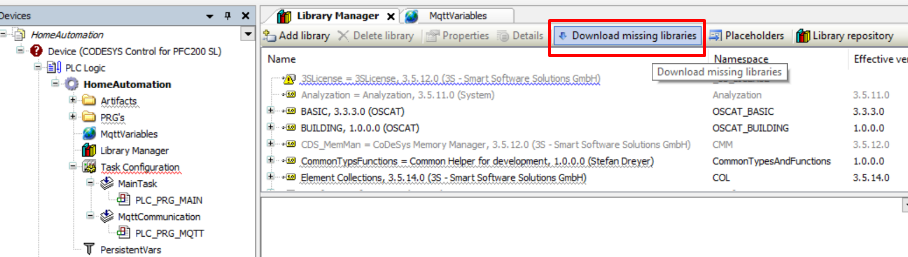
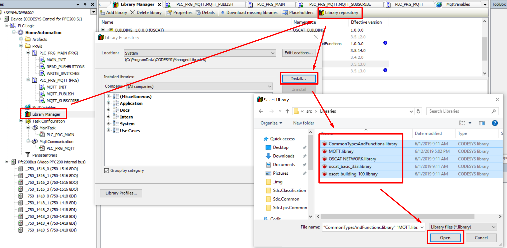
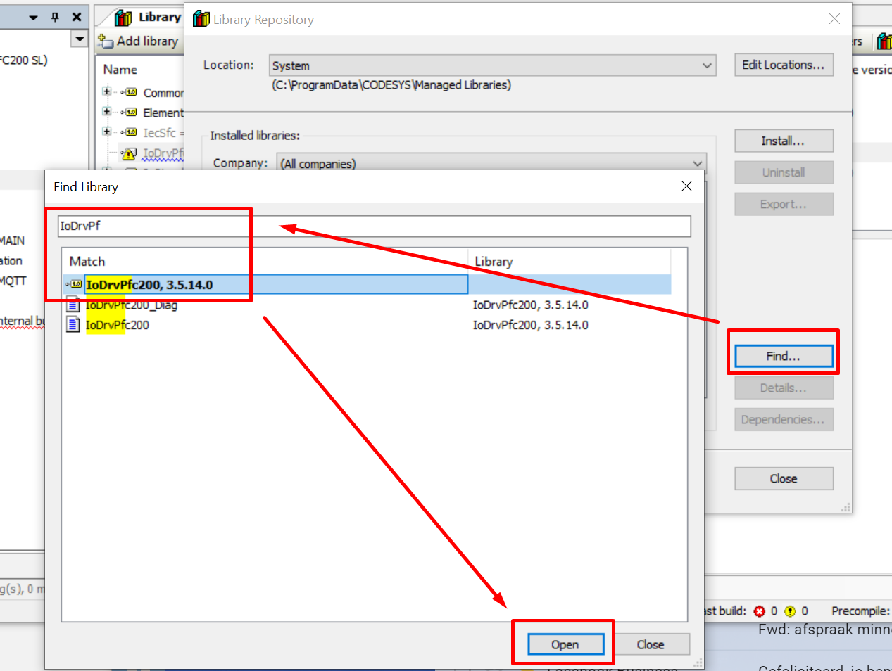
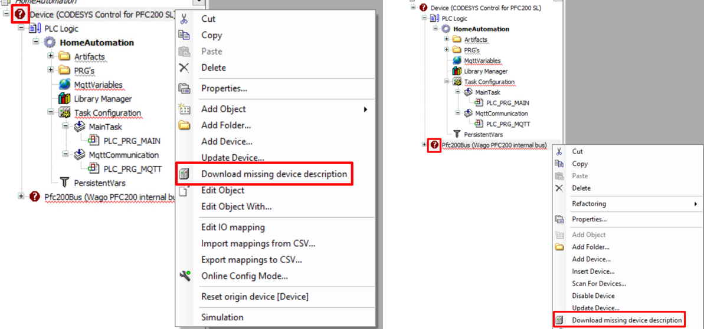
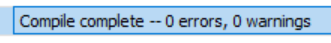

## Getting started guide

### __Getting to know CoDeSys3__
If you have experience with programming in CodeSys3 you can skip this part. Otherwise, it's adviced to gain some experience by checking the sources below:

- Setup environment and creation first project: [YouTube video](https://www.youtube.com/watch?v=hI8t9UHPV8s&t=135s)
- CoDeSys start guide (uses CoDeSys 2.3 but principles still applicable): [YouTube playlist](https://www.youtube.com/watch?v=WP9pUfBi6Pw&list=PL08CDB741463CA7B4&index=1)
- CoDeSys Sequential Function Charts Explained: [YouTube video](https://www.youtube.com/watch?v=eP42t9O5drk)

### __Setup CoDeSys3__

1. Download CoDeSys3 from the [CoDeSys store](https://store.codesys.com/). Note that you need to create an account in order to be able to download the installer.
2. Install your device target package. Steps explained in this [YouTube video](https://www.youtube.com/watch?v=hI8t9UHPV8s&t=135s), steps might differ slightly depending on your device target.
    - Common device target package: [WAGO-PFC100](https://store.codesys.com/codesys-control-for-pfc100-sl.html)
    - Common device target package: [WAGO-PFC200](https://store.codesys.com/codesys-control-for-pfc200-sl.html)

Both the WAGO-PFC100 and WAGO-PFC200 target package can be downloaded for free. Using the free version the PLC is able to run the CodeSys runtime for 2 hours after which the program stops running. A license is required to remove this limitation.

### __Building the project__

1. Clone the repository and open the *HomeAutomation.project* file in CoDeSys. Ignore the warnings about missing libraries (will be fixed in next steps) and don't update any existing libraries.

2. Go to the *Libraries* menu, press *Download missing libraries* and install all missing libraries:

3. Go to the *Libraries* menu and install all libraries from the [src/Libraries](https://github.com/MichielVanwelsenaere/HomeAutomation.CoDeSys3/tree/feature/GettingStartedGuide/src/Libaries) folder.

4. In case the `IoDrvPfc200` library gives issues. Remove it and reinstall it from the Library Repository:

5. If there is still an *Download missing libraries* button in the Library manager: press it untill all missing libraries are downloaded.

6. Download the missing device description:

7. Build the project (F11)!

### __Updating the project to your PLC configuration__
As the IO modules installed on your PLC will most likely differ from the ones configured in the project an update is required.

WIP

### __Adjusting the home automation logic to your needs__

WIP

