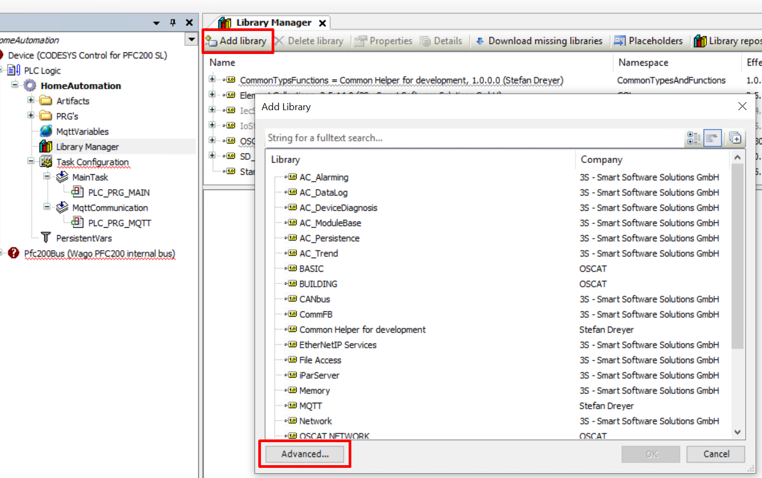
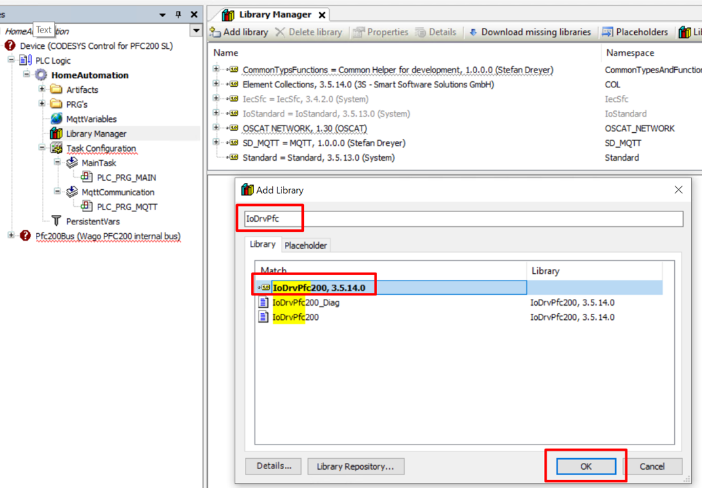
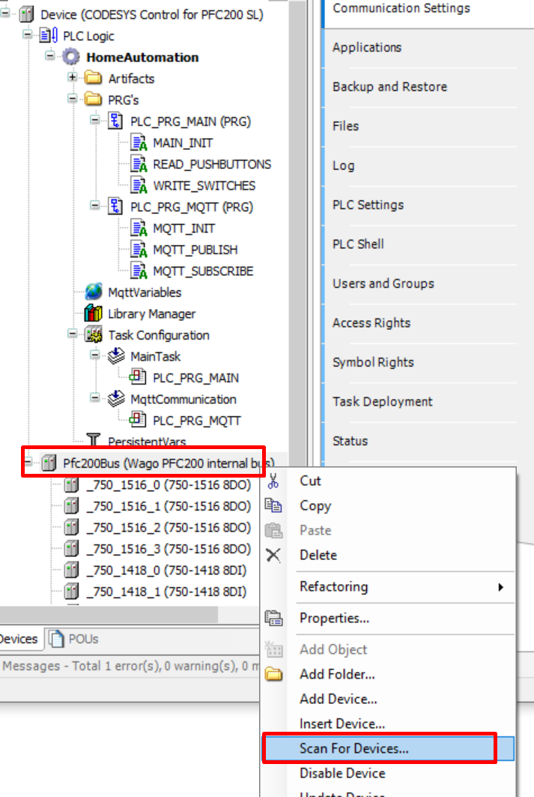
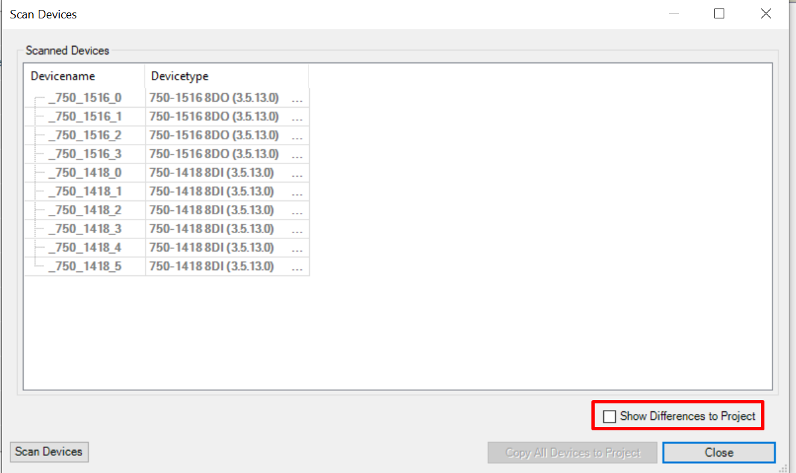
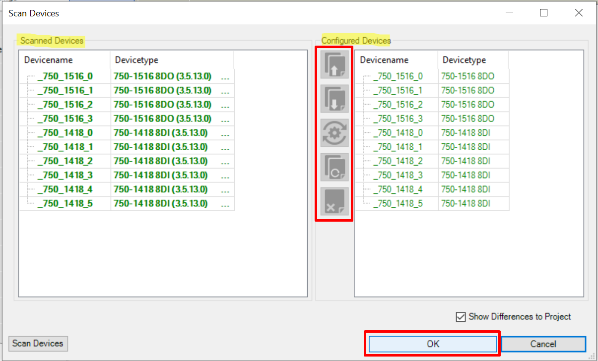
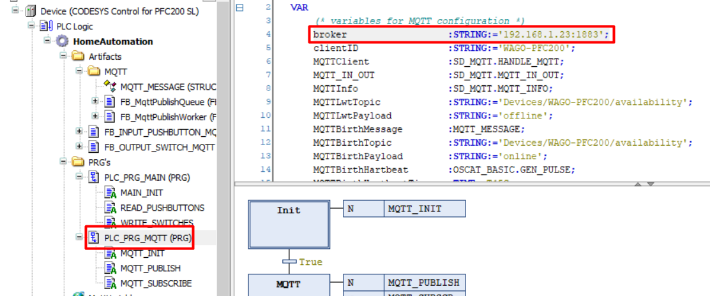
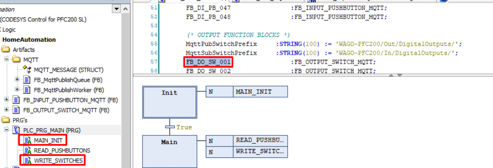
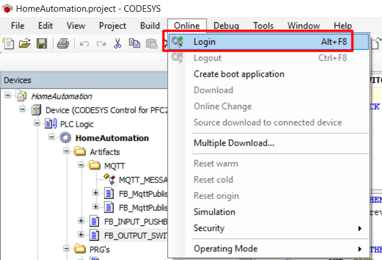
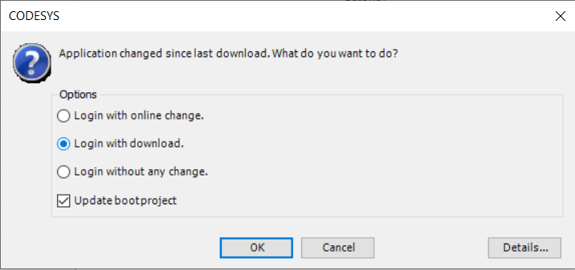

## Getting started guide

### __Getting to know CoDeSys3__
If you have experience with programming in CodeSys3 you can skip this part. Otherwise, it's advised to gain some experience by checking the sources below:

- Setup environment and creation first project: [YouTube video](https://www.youtube.com/watch?v=hI8t9UHPV8s)
- CoDeSys start guide (uses CoDeSys 2.3 but principles still applicable): [YouTube playlist](https://www.youtube.com/watch?v=WP9pUfBi6Pw&list=PL08CDB741463CA7B4&index=1)
- CoDeSys Sequential Function Charts Explained: [YouTube video](https://www.youtube.com/watch?v=eP42t9O5drk)

### __Setup CoDeSys3__

1. Download CoDeSys3 from the [CoDeSys store](https://store.codesys.com/). Note that you need to create an account to be able to download the installer.
2. Install your device target package. Steps explained in this [YouTube video](https://www.youtube.com/watch?v=hI8t9UHPV8s), steps might differ slightly depending on your device target.
    - Common device target package: [WAGO-PFC100](https://store.codesys.com/codesys-control-for-pfc100-sl.html)
    - Common device target package: [WAGO-PFC200](https://store.codesys.com/codesys-control-for-pfc200-sl.html)

Both the WAGO-PFC100 and WAGO-PFC200 target package can be downloaded for free. Using the free version the PLC is able to run the CodeSys runtime for 2 hours after which the program stops running. A license is required to remove this limitation.

### __Building the project__

1. Clone the repository and open the *HomeAutomation.project* file in CoDeSys. Ignore the warnings about missing libraries (will be fixed in the next steps) and don't update any existing libraries.

2. Go to the *Library Manager* menu, press *Download missing libraries* and install all missing libraries:

3. Go to the *Library Manager* menu and install all libraries from the [src/Libraries](https://github.com/MichielVanwelsenaere/HomeAutomation.CoDeSys3/tree/feature/GettingStartedGuide/src/Libraries) folder.

4. In case the `IoDrvPfc200` library gives issues. Remove it and reinstall it from the Library Repository:
    - Remove the existing Library 
    

    - Select *Add library* and then *Advanced...* 
    

    - Seach for the *IoDrvPfc200* and add it (step might vary depending on your Device target) 
    

5. If there is still an *Download missing libraries* button in the Library manager. This should fix the last missing libraries.

6. Download the missing device description:

7. Build the project (F11)!

### __Updating the configured devices to your PLC device configuration__
As the IO modules installed on your PLC will most likely differ from the ones configured in the project an update is required.

1. Turn on your PLC with a network cable plugged in. Make sure that the device you are using to follow this steps is on the same network.

2. From the *Device* section in the project select *Scan network..* and Select your PLC: 

3. From the module configuration section in the project, perform *Scan for Devices..* 

4. Set the *Show Differences to Project* checkbox. 

5. Using to the tools in the middle of the screen, update the project *Configured Devices* to the *Scanned Devices*. 

Executing the steps above will most likely introduce build errors, this is normal! The current program uses every input and output of the configured device modules. By adjusting/removing them this naturally causes build issues. These build issues will be fixed in the next topic where the program logic is adjusted to your PLC configuration.

### __Adjusting the home automation logic to your needs__

#### MQTT config
Update the configured MQTT broker IP and port to connect to your broker:

#### Naming modules

Select you input and output modules and create a variable for each input and output. Adviced approach *DO_{Digital Outputnumer}* and *DI_{Digital Inputnumber}*:

#### Pushbutton Input Logic

For each input linked to a pushbutton a function block needs to be created:

To get started:
1. Remove all existing *FB_DI_PB_XXX* function blocks except the first one.
1. In the *MAIN_INIT* action remove all references to *FB_DI_PB_XXX* function blocks except the first one.
1. In the *READ_PUSHBUTTONS* action remove all references to *FB_DI_PB_XXX* function blocks except the first one.
1. In the *READ_PUSHBUTTONS* action update *FB_DI_PB_001* to read the physical input variable created in the previous step *"Naming modules"*.

For more information on the *FB_INPUT_PUSHBUTTON_MQTT* function block, check the [dedicated docs](./FunctionBlocks/FB_INPUT_PUSHBUTTON_MQTT).

#### Output Switch Logic

For each input linked to a pushbutton a function block needs to be created:

To get started:
1. Remove all existing *FB_DO_SW_XXX* function blocks except the first one.
1. In the *MAIN_INIT* action remove all references to *FB_DO_SW_XXX* function blocks except the first one.
1. In the *WRITE_SWITCHES* action remove all references to *FB_DO_SW_XXX* function blocks except the first one.
1. In the *WRITE_SWITCHES* action update *FB_DO_SW_001* to write the physical output variable created in the previous step *"Naming modules"*.
1. Link the input pushbutton from previous step to switch the *FB_DO_SW_001* output to toggle the output when the pushbutton receives a single press: `TOGGLE	:=FB_DI_PB_001.SINGLE`

For more information on the *FB_OUTPUT_SWITCH_MQTT* function block, check the [dedicated docs](./FunctionBlocks/FB_OUTPUT_SWITCH_MQTT).

#### Persistant Variables

In order to be able to maintain the state of the outputs through power cycles *Persistent Variables* are used.
To update the *Persistent Variables* if you created or removed Function Blocks perform the following steps:
1. Go the *Persistent Variables* and remove everything:

1. Go to *Declarations* and select *Add all instance paths*

This will add all *PERSIST* variables form the project. Note that the project needs to be built before being able to perform this step.

### __Uploading and running the project__
To upload and run the project on your PLC perform the following steps:
1. From the menu, select *online* and then *login*: 

1. Select *Login with download* and press *OK*: 

1. *Start* the application on your PLC: 

Note that you might need to rescan your network from the *Device Communications* tab to execute these steps successfully. 