## Getting started guide (CODESYS 3S runtime)

### __Getting to know CoDeSys3__
If you have experience with programming in CodeSys3 you can skip this part. Otherwise, it's advised to gain some experience by checking the sources below:

- Setup environment and creation first project: [YouTube video](https://www.youtube.com/watch?v=hI8t9UHPV8s)
- CoDeSys start guide (uses CoDeSys 2.3 but principles still applicable): [YouTube playlist](https://www.youtube.com/watch?v=WP9pUfBi6Pw&list=PL08CDB741463CA7B4&index=1)
- CoDeSys Sequential Function Charts Explained: [YouTube video](https://www.youtube.com/watch?v=eP42t9O5drk)
- Getting to know the IEC 61131-3 standard: [iec 61131-3 reference](https://bitbucket.org/ntphx/iec-61131)

### __Setup CoDeSys 3S__

1. Download CoDeSys3 from the [CoDeSys store](https://store.codesys.com/). Note that you need to create an account to be able to download the installer.
2. Install your device target package. Steps explained in this [YouTube video](https://www.youtube.com/watch?v=hI8t9UHPV8s), steps might differ slightly depending on your device target.
    - Common device target package: [WAGO-PFC100](https://store.codesys.com/codesys-control-for-pfc100-sl.html)
    - Common device target package: [WAGO-PFC200](https://store.codesys.com/codesys-control-for-pfc200-sl.html)

Both the WAGO-PFC100 and WAGO-PFC200 target package can be downloaded for free. Using the free version the PLC is able to run the CodeSys runtime for 2 hours after which the program stops running. A license is required to remove this limitation.

### __Creating a project__

1. Create a new project in CODESYS 3S.

### __Restoring the project POUs__
This will restore the basic POUs (building blocks) of the project, note that you can reuse this step to update or import new POUs in the future.
1. Go to the POUs section of the project and select the top level item:

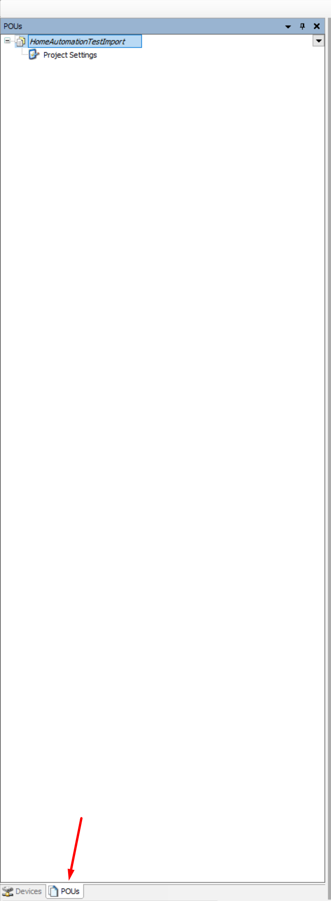

2. Select *Project* &rarr; *Import* and browse to the CODESYS3Export folder and open the *.export* file:

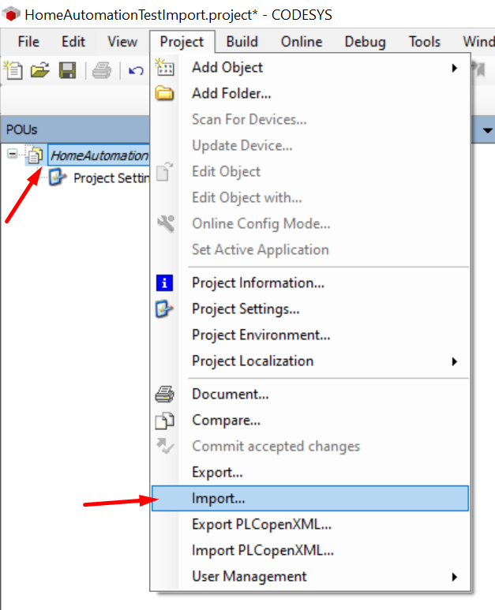

3. Import all items:

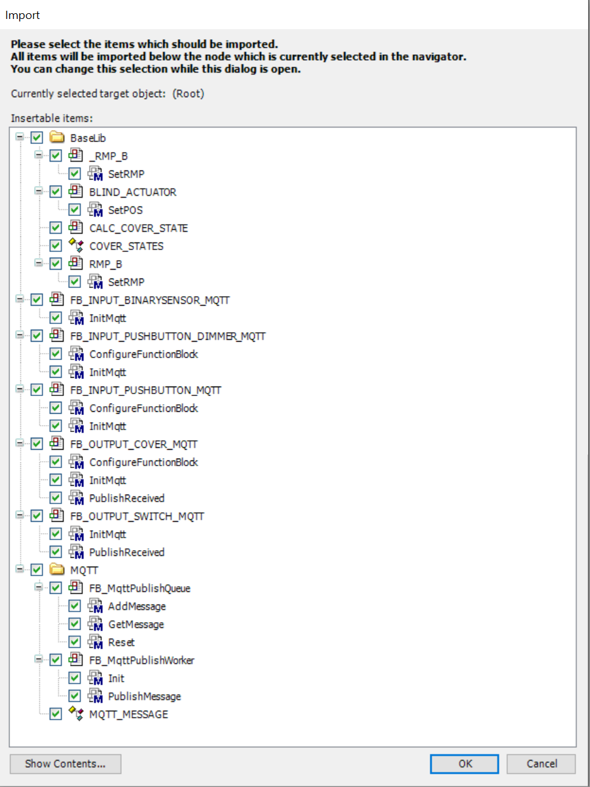

### __Adding a device__
This will add a device to the project, in this example a PFC200 is used. Adopt to your needs if necessary. 

1. Return to the 'Devices' tab of the project, right click on the root item and 'Add Device':

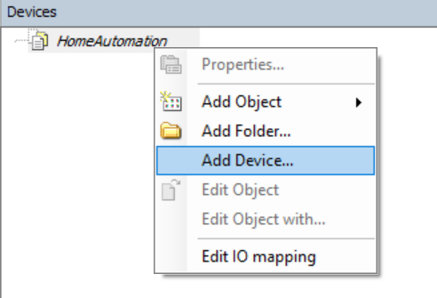

2. Add your device, in this example a WAGO PFC200 is used: 

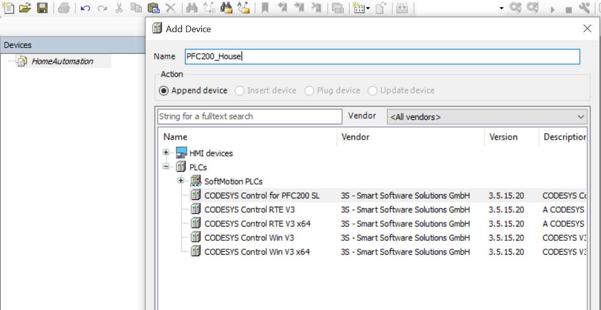

3. Remove the default application from the device:

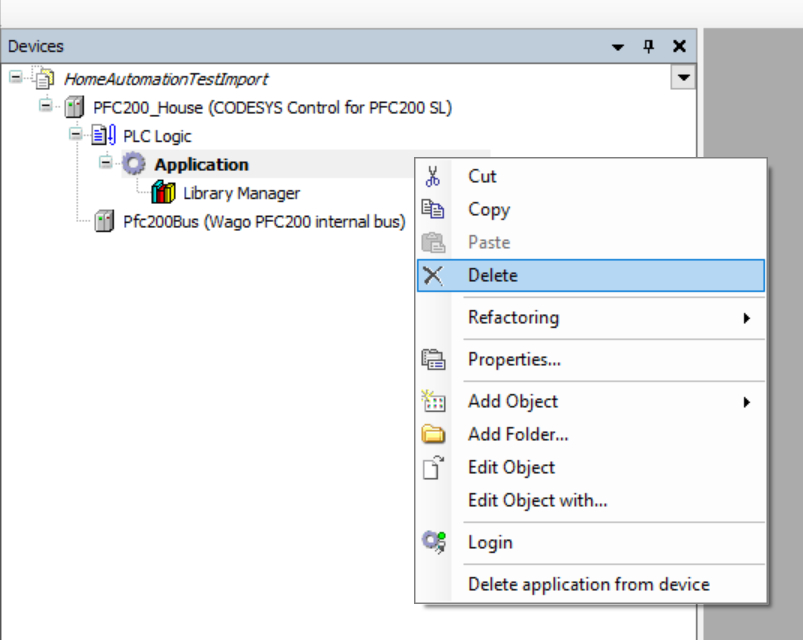

### __Restoring the PLC logic__

1. select the *PlcLogic* item and go to *Project* &rarr; *Import* and browse to the CODESYS3Export folder and open the *.export* file:

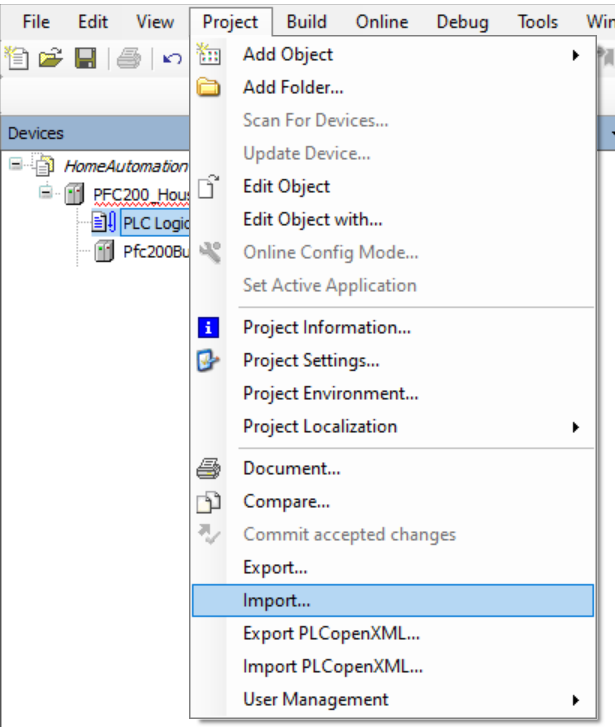

2. Import all items.

### __Libraries__

1. Go to the *Library Manager* menu and remove all Wago libraries:

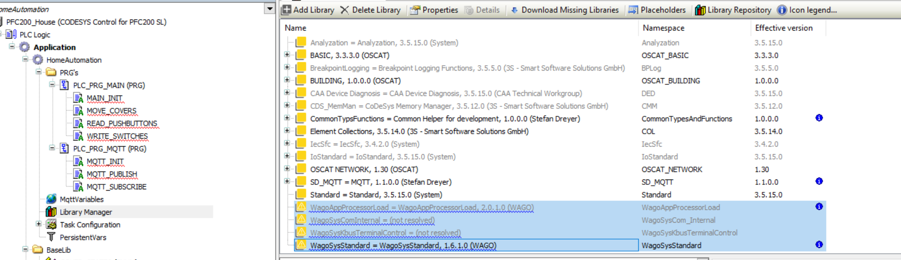

2. Go to the *Library Manager* menu, press *Download missing libraries* and install all missing libraries:

3. Go to the *Library Manager* menu and install all libraries from the [src/Libraries](https://github.com/MichielVanwelsenaere/HomeAutomation.CoDeSys3/tree/master/src/Libraries) folder.

4. In case the `IoDrvPfc200` library gives issues. Remove it and reinstall it from the Library Repository:
    - Remove the existing Library 
    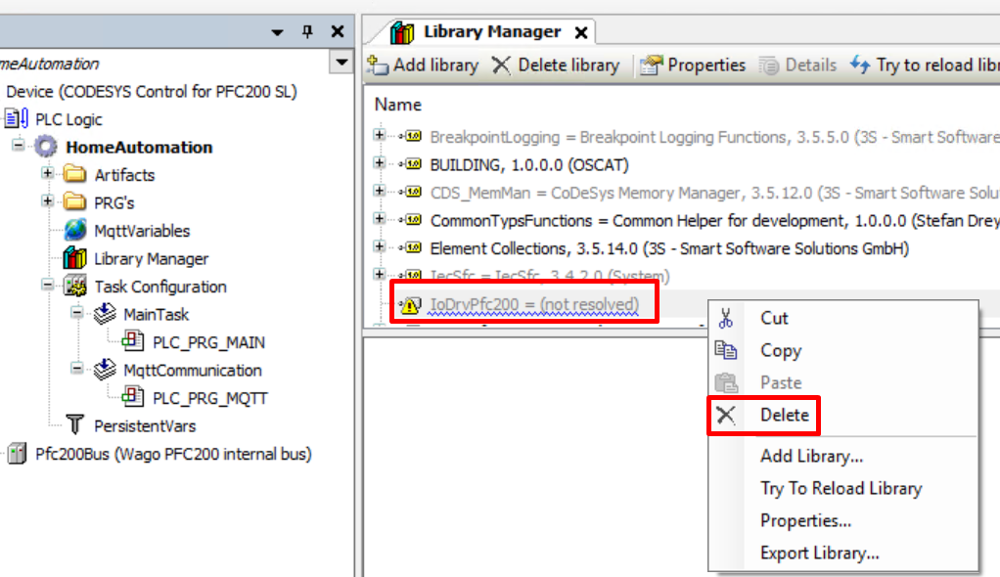

    - Select *Add library* and then *Advanced...* 
    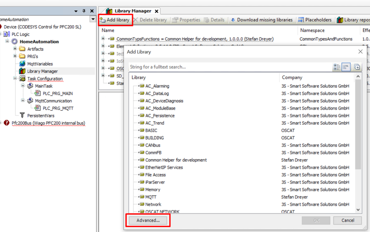

    - Seach for the *IoDrvPfc200* and add it (step might vary depending on your Device target) 
    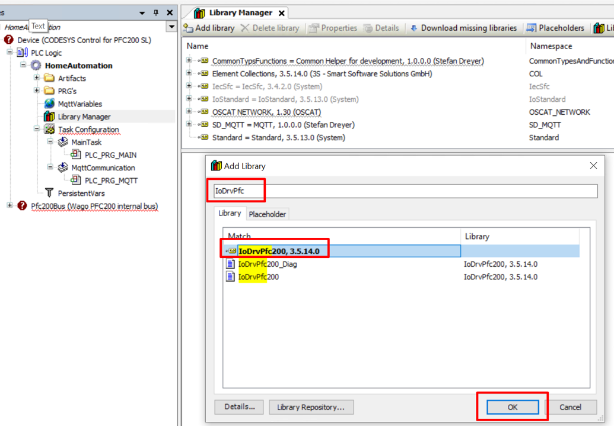

5. In case some libraries references are not resolved because they are pointing to and older/newer version that is not installed on the system, update the placeholder:

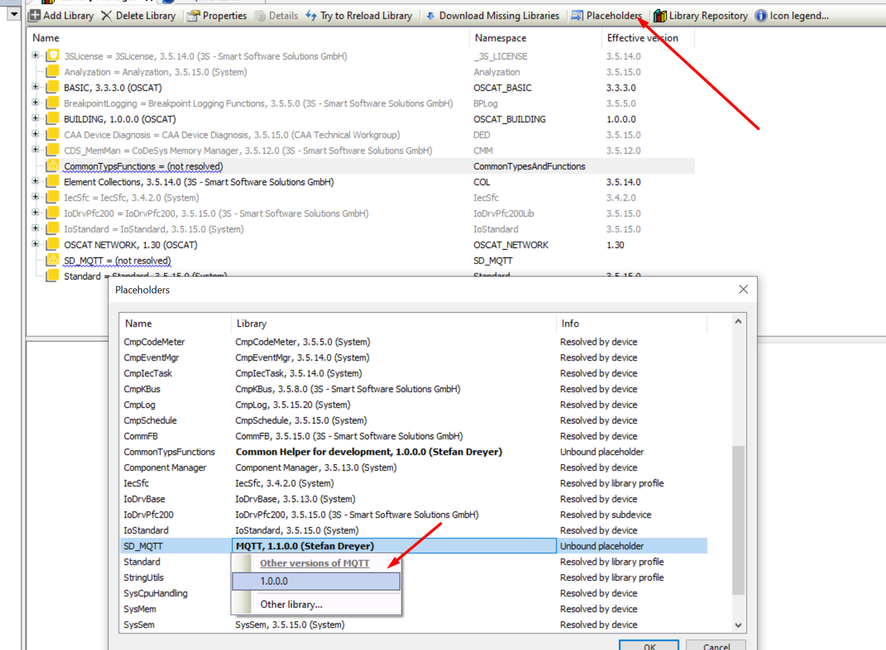

6. If there is still an *Download missing libraries* button in the Library manager. This should fix the last missing libraries.

Although all libraries are restored now, it's still not possible to build the project. Reason for this is that the IO configured in the project doesn't exist yet in the device in the project tree.

### __Updating the configured devices to your PLC device configuration__
As the IO modules installed on your PLC will most likely differ from the ones configured in the project an update is required.

1. Turn on your PLC with a network cable plugged in. Make sure that the device you are using to follow this steps is on the same network.

2. From the *Device* section in the project select *Scan network..* and Select your PLC: 
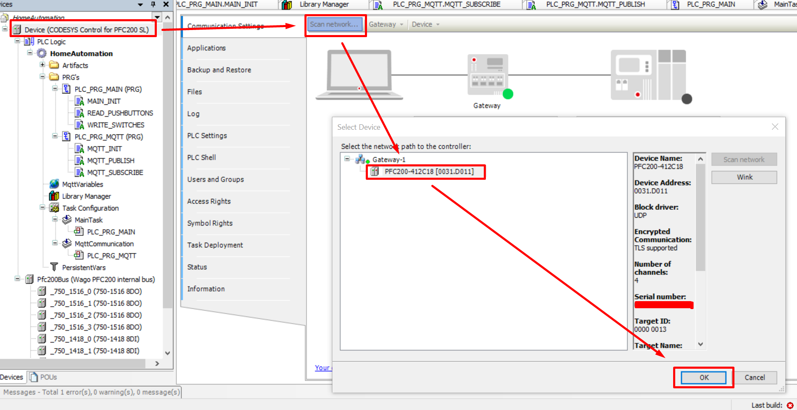

3. From the module configuration section in the project, perform *Scan for Devices..* 
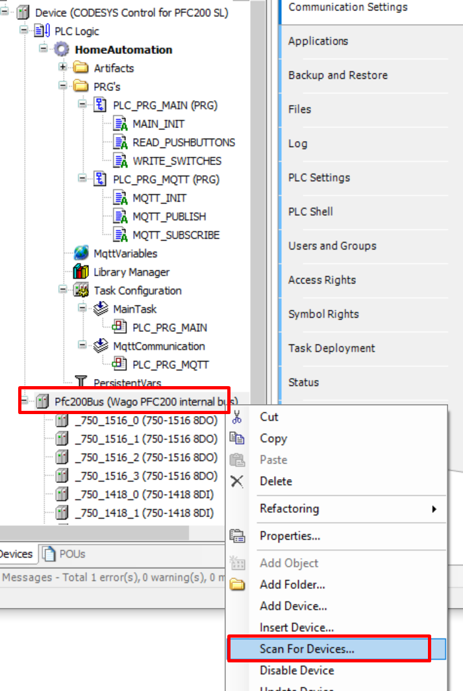

4. Set the *Show Differences to Project* checkbox. 
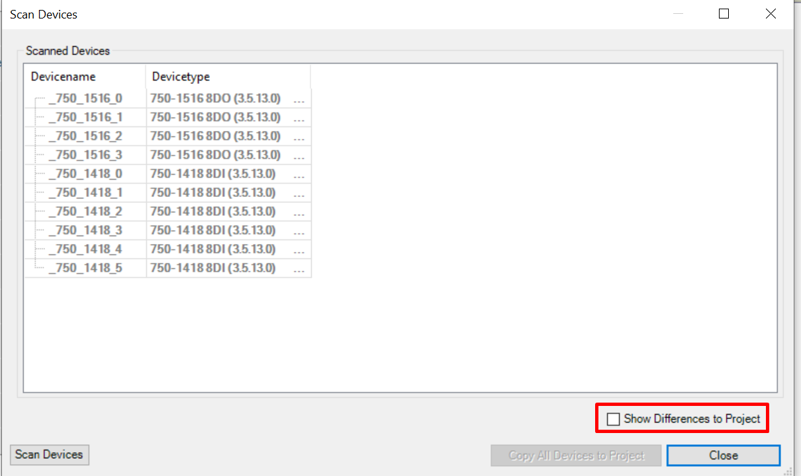

5. Using to the tools in the middle of the screen, update the project *Configured Devices* to the *Scanned Devices*. 
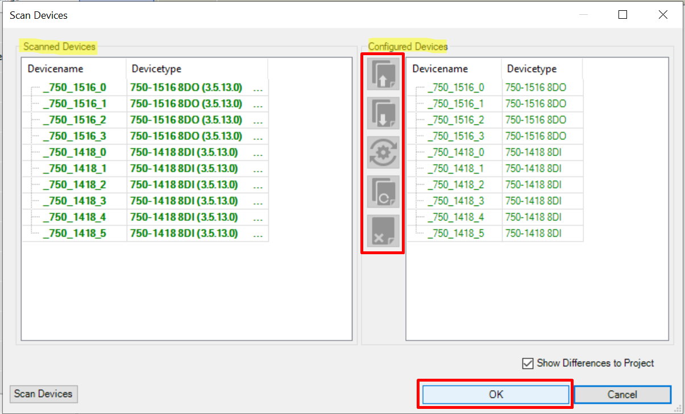

Executing the steps above will most likely introduce build errors, this is normal! The current program uses every input and output of the configured device modules. By adjusting/removing them this naturally causes build issues. These build issues will be fixed in the next topic where the program logic is adjusted to your PLC configuration.

Make sure to update the PLC device configuration to your exact PLC device setup in order to avoid issues. 

### __Adjusting the home automation logic to your needs__

#### MQTT config
Update the configured MQTT broker IP and port to connect to your broker:
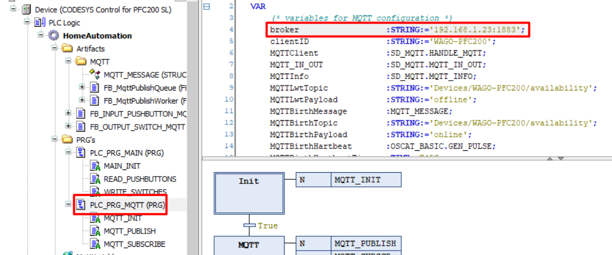

#### Naming modules

Select you input and output modules and create a variable for each input and output. Adviced approach *DO_{Digital Outputnumer}* and *DI_{Digital Inputnumber}*:

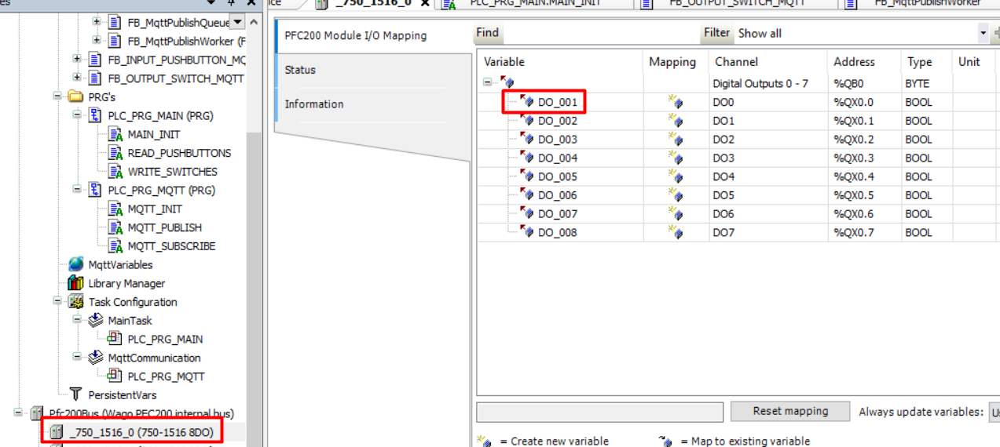

#### Pushbutton Input Logic

For each input linked to a pushbutton a function block needs to be created:
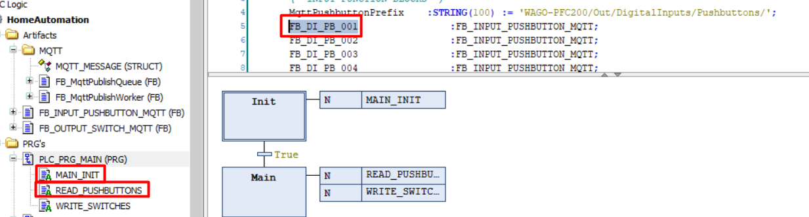

To get started:
1. Remove all existing *FB_DI_PB_XXX* function blocks except the first one.
1. In the *MAIN_INIT* action remove all references to *FB_DI_PB_XXX* function blocks except the first one.
1. In the *READ_PUSHBUTTONS* action remove all references to *FB_DI_PB_XXX* function blocks except the first one.
1. In the *READ_PUSHBUTTONS* action update *FB_DI_PB_001* to read the physical input variable created in the previous step *"Naming modules"*.

For more information on the *FB_INPUT_PUSHBUTTON_MQTT* function block, check the [dedicated docs](./FunctionBlocks/FB_INPUT_PUSHBUTTON_MQTT.md).

#### Output Switch Logic

For each input linked to a pushbutton a function block needs to be created:
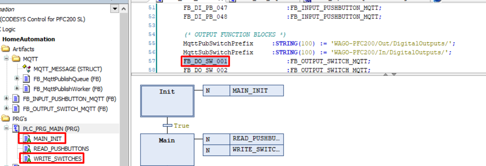

To get started:
1. Remove all existing *FB_DO_SW_XXX* function blocks except the first one.
1. In the *MAIN_INIT* action remove all references to *FB_DO_SW_XXX* function blocks except the first one.
1. In the *WRITE_SWITCHES* action remove all references to *FB_DO_SW_XXX* function blocks except the first one.
1. In the *WRITE_SWITCHES* action update *FB_DO_SW_001* to write the physical output variable created in the previous step *"Naming modules"*.
1. Link the input pushbutton from previous step to switch the *FB_DO_SW_001* output to toggle the output when the pushbutton receives a single press: `TOGGLE	:=FB_DI_PB_001.SINGLE`

For more information on the *FB_OUTPUT_SWITCH_MQTT* function block, check the [dedicated docs](./FunctionBlocks/FB_OUTPUT_SWITCH_MQTT.md).

#### Persistant Variables

In order to be able to maintain the state of the outputs through power cycles *Persistent Variables* are used.
To update the *Persistent Variables* if you created or removed Function Blocks perform the following steps:
1. Go the *Persistent Variables* and remove everything:
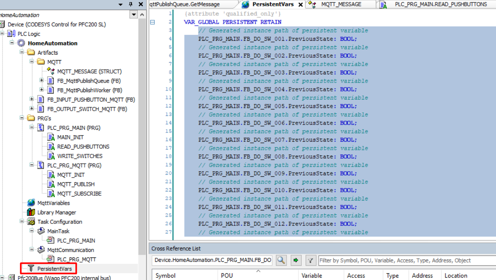

1. Go to *Declarations* and select *Add all instance paths*
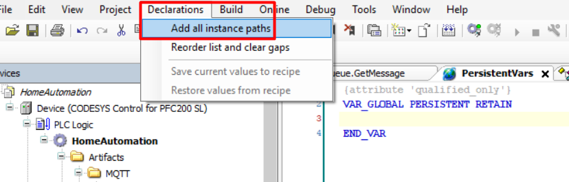

This will add all *PERSIST* variables form the project. Note that the project needs to be built before being able to perform this step.

### __Building the project__
Once all IO references in the project actually exist on the device as well you should be able to build the project:
1. Build the project (F11)!

### __Uploading and running the project__
To upload and run the project on your PLC perform the following steps:
1. From the menu, select *online* and then *login*: 

1. Select *Login with download* and press *OK*: 

1. *Start* the application on your PLC: 

Note that you might need to rescan your network from the *Device Communications* tab to execute these steps successfully. In addition make sure that the physical switch on your PLC is in _'RUN'_ mode (if applicable).
