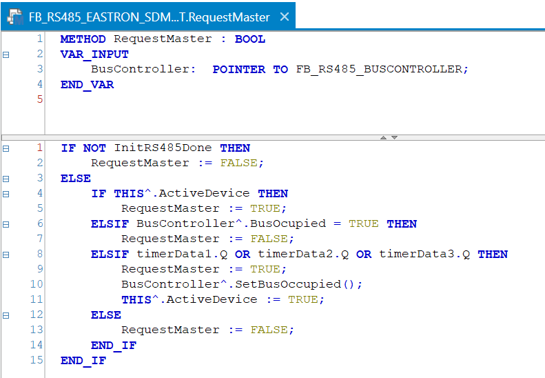
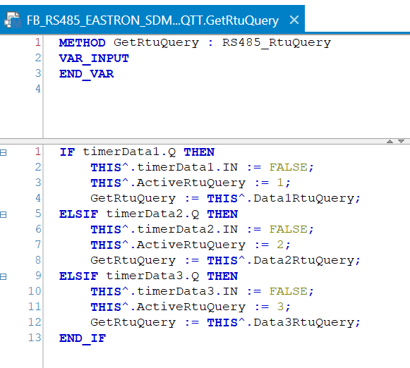
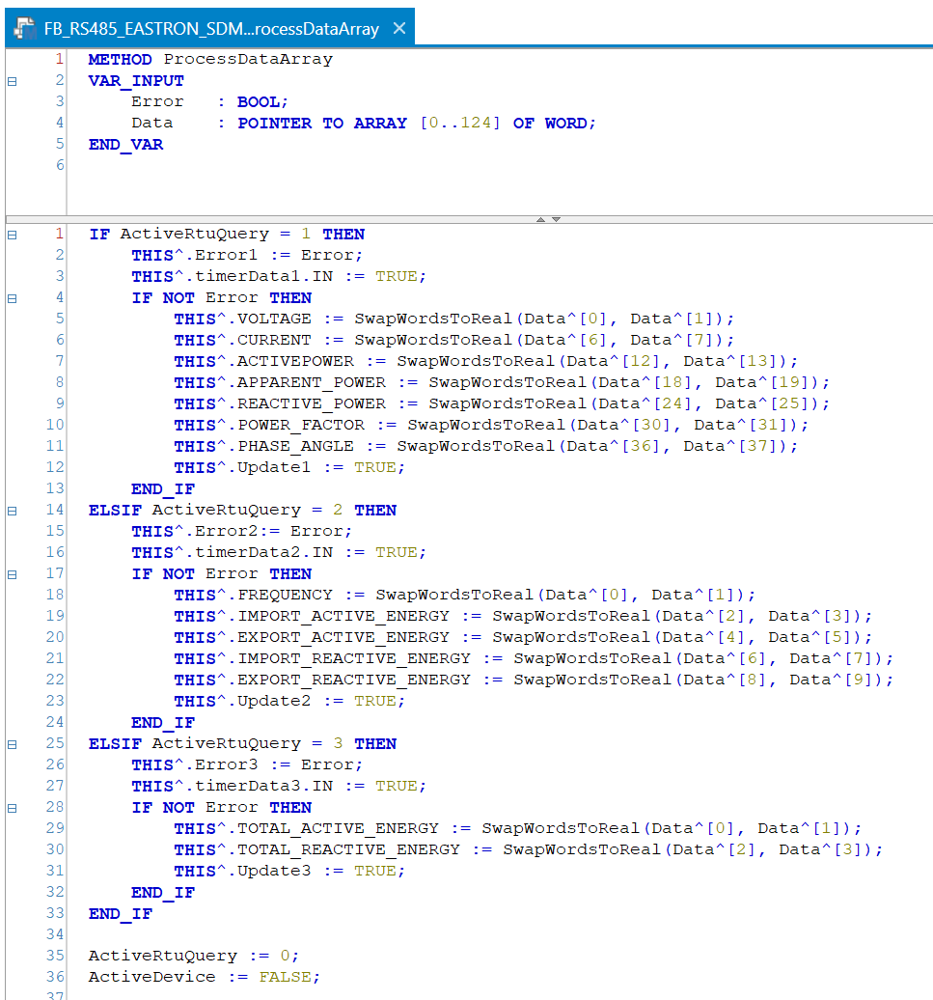

## RS485 Device Interface

The RS485Device interface is a simple interface designed to guarantee the presence of several methods with a correct input and output type so the RS485 Function block can be used in both é!COCKPIT and Codesys 3S.

The interface implements three methods:
- RequestMaster: Should check whether RS485 is initialized, the current FB is the actvice device on the bus, whether the bus is already occupied and if any timer indicates that the interval for executing a modbus command for the function block has passed (which would mean that the FB requires the bus). An example below:

- GetRtuQuery: Should return an RTU query to execute depending on the state of the interval timer(s). In case there are multiple Modbus RTU queries to be executed for a device the FB should keep track of the active RTU query. An example below:

- ProcessDataArray: Should process the result returned by the RTU query returned by method 'GetRtuQuery'. In case there are multiple Modbus RTU queries to be executed for a device the correct one should be processed. An example below:

