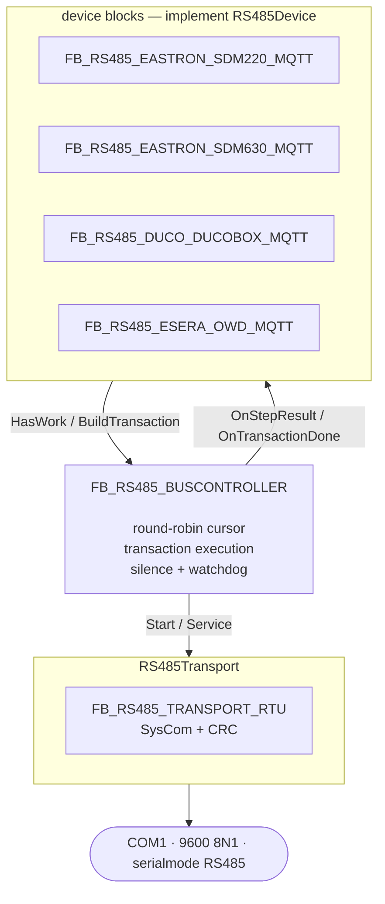
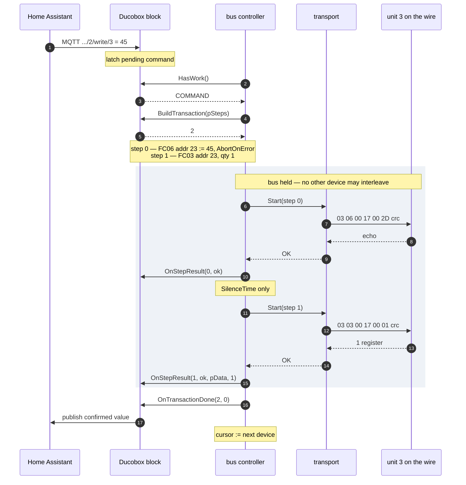

## RS485 Device Interface

`RS485Device` is what a Modbus slave function block owes the bus controller. It exists so the
controller can share one RS485 line between many devices without knowing anything about any of
them, and so a device block can be written once and reused across installations.

### **The unit of arbitration is a transaction**

A device does not ask for one Modbus frame at a time. It hands over a **transaction**: an
ordered list of one to eight steps, which the controller executes back to back **with the bus
held for the whole run**.

That single decision is what makes three things work:

| | |
|:--|:--|
| **One grant, all the work** | A meter with three register blocks is served once per poll round, not three times with other devices' traffic in between. |
| **Read-after-write** | A write and the read that confirms it cannot be separated, so what Home Assistant is told is what the device actually holds. |
| **No bookkeeping in the device** | The controller passes the step index back, so a block no longer has to remember which of its queries is in flight. |

### **Where it sits**


```mermaid
flowchart TB
  subgraph DEVS["device blocks — implement RS485Device"]
    direction LR
    A["FB_RS485_EASTRON_SDM220_MQTT"]
    B["FB_RS485_EASTRON_SDM630_MQTT"]
    C["FB_RS485_DUCO_DUCOBOX_MQTT"]
    D["FB_RS485_ESERA_OWD_MQTT"]
  end

  SCH["FB_RS485_BUSCONTROLLER<br/><br/>round-robin cursor<br/>transaction execution<br/>silence + watchdog"]

  subgraph TRS["RS485Transport"]
    T1["FB_RS485_TRANSPORT_RTU<br/>SysCom + CRC"]
  end

  PORT(["COM1 · 9600 8N1 · serialmode RS485"])

  DEVS -- "HasWork / BuildTransaction" --> SCH
  SCH -- "OnStepResult / OnTransactionDone" --> DEVS
  SCH -- "Start / Service" --> TRS
  TRS --> PORT
```

The protocol lives behind a second interface, [`RS485Transport`](#the-rs485transport-interface),
so the controller never sees a CRC, a function code or a serial handle — and so a different
Modbus implementation can be substituted without touching a single device block.

### **The four methods**

#### `HasWork : RS485_WorkLevel`

Does this device want the bus, and how badly?

| Value | Meaning |
|:--|:--|
| `NONE` | Nothing to do. |
| `POLL` | A routine read whose interval timer has elapsed. |
| `COMMAND` | Something a person or Home Assistant asked for, so latency is visible. |

**This method must be free of side effects.** The controller calls it on every registered device,
and up to twice per device per cycle — once looking for `COMMAND` work and again for `POLL`.
Anything that mutates state belongs in `BuildTransaction`.

#### `BuildTransaction(pSteps : POINTER TO RS485_StepList) : INT`

Called once, immediately after this device has been granted the bus. Fill in every step the
device wants executed and return how many. Returning `0` withdraws: the controller releases the
bus and moves the cursor on.

`pSteps` points at scratch memory the controller reuses for the next device, so it is only valid
for the duration of the call.

#### `OnStepResult(StepIndex, Failed, pData, Count)`

Called once per executed step, in order, while the bus is still held.

- `StepIndex` indexes the steps as `BuildTransaction` filled them.
- `Count` is how many registers actually came back. Trust it rather than the quantity requested —
  that is what stops a short reply being read past the end of.
- A step skipped by an `AbortOnError` predecessor is never reported.

#### `OnTransactionDone(StepsRun, Failures)`

Called once, after the last `OnStepResult`, as the bus is released. The one place to publish
`/availability` and to clear a pending command.

### **The step**

```iecst
TYPE RS485_Step :
STRUCT
    DeviceId     : BYTE;                 (* Modbus unit id *)
    FunctionCode : BYTE;                 (* 3, 4, 6, 16 *)
    Address      : UINT;                 (* first register, read or write *)
    Quantity     : UINT;                 (* registers to read, or to write *)
    Data         : ARRAY[0..7] OF WORD;  (* payload, write steps only *)
    AbortOnError : BOOL;                 (* skip the rest of the transaction if this fails *)
END_STRUCT
END_TYPE
```

A step is either a read or a write, never both, which is why there is one `Address` rather than
a separate read and write pair. That is also what makes a read-after-write two ordinary steps
instead of one overloaded structure.

**Fill steps in `FB_init` as code, never as a declaration initialiser.** CODESYS
stores a structured initialiser beside the declaration text and reads *that*, so a value inside
one cannot be changed by a script afterwards — the declaration will say one thing and the PLC
will run another. [CLAUDE.md](../../CLAUDE.md) has the full account.

### **`AbortOnError`, and why the default is `FALSE`**

A batch of independent reads should not lose the second and third because the first failed, so
the default is to continue.

Set it `TRUE` on the write step of a read-after-write. Publishing a read-back that never
happened, after a write that failed, is precisely the inaccuracy the pairing exists to remove.

### **A transaction, end to end**

This is the Ducobox case: Home Assistant sets a node register, and the value published back is
the one read out of the device, not the one we hoped we sent.


```mermaid
sequenceDiagram
    autonumber
    participant HA as Home Assistant
    participant DEV as Ducobox block
    participant SCH as bus controller
    participant TR as transport
    participant BUS as unit 3 on the wire

    HA->>DEV: MQTT .../2/write/3 = 45
    Note over DEV: latch pending command

    SCH->>DEV: HasWork()
    DEV-->>SCH: COMMAND
    SCH->>DEV: BuildTransaction(pSteps)
    DEV-->>SCH: 2
    Note over SCH,DEV: step 0 — FC06 addr 23 := 45, AbortOnError<br/>step 1 — FC03 addr 23, qty 1

    rect rgb(238,242,247)
    Note over SCH,BUS: bus held — no other device may interleave
    SCH->>TR: Start(step 0)
    TR->>BUS: 03 06 00 17 00 2D crc
    BUS-->>TR: echo
    TR-->>SCH: OK
    SCH->>DEV: OnStepResult(0, ok)
    Note over SCH: SilenceTime only
    SCH->>TR: Start(step 1)
    TR->>BUS: 03 03 00 17 00 01 crc
    BUS-->>TR: 1 register
    TR-->>SCH: OK
    SCH->>DEV: OnStepResult(1, ok, pData, 1)
    end

    SCH->>DEV: OnTransactionDone(2, 0)
    DEV->>HA: publish confirmed value
    Note over SCH: cursor := next device
```

If step 0 fails, `AbortOnError` skips step 1 and nothing is published as confirmed.

An SDM220 poll is the same machinery with three read steps and no aborts.

### **The RS485Transport interface**

The bus controller talks to the wire through four methods, so the Modbus implementation is
replaceable:

| Method | |
|:--|:--|
| `Start(pStep) : BOOL` | Begin one exchange. `FALSE` if the port is down, a step is already in flight, or the function code is not one this transport implements — an unsupported code is refused rather than framed as a guess. |
| `Service() : RS485_StepState` | Call every cycle. Drives the transport's state machine and reports `IDLE` / `BUSY` / `OK` / `FAILED`. `OK` and `FAILED` are each reported for exactly one cycle. |
| `ReadBuffer() : POINTER TO RS485_ReadBuffer` | Where a read step's registers landed. |
| `Registers() : INT` | How many words of it the last `OK` step filled. |

[`FB_RS485_TRANSPORT_RTU`](../FunctionBlocks/FB_RS485_TRANSPORT_RTU.md) is the implementation
this project ships. A WAGO `FbMbMasterSerial` or a CODESYS `ModbusFB.ClientSerial` adapter would
be another; see [#181](https://github.com/MichielVanwelsenaere/HomeAutomation.CoDeSys3/issues/181).

### **Writing a new device block**

1. `IMPLEMENTS RS485Device` on the function block.
2. Declare an `RS485_Step` per register block, and a `StepMap : ARRAY[0..n] OF INT` if the block
   has more than one — the controller gives you a step index, and only your block knows what
   step 0 of *this* transaction was for.
3. Fill the steps in `FB_init`. Modbus address, register map and poll rate describe the
   wiring rather than a mode, so they are fixed for the life of the instance and belong in the
   constructor — which also means the caller cannot forget to configure the block. Reserve a
   runtime setter for something that genuinely changes while running.
4. Implement the four methods. [`FB_RS485_EASTRON_SDM220_MQTT`](../FunctionBlocks/FB_RS485_EASTRON_SDM220_MQTT.md)
   is the worked example for several register blocks;
   [`FB_RS485_EASTRON_SDM630_MQTT`](../FunctionBlocks/FB_RS485_EASTRON_SDM630_MQTT.md) for a
   single one.
5. Register it in `RS485_INIT` with `RegisterDevice`.

Registration order does not affect service order — see
[`FB_RS485_BUSCONTROLLER`](../FunctionBlocks/FB_RS485_BUSCONTROLLER.md).
