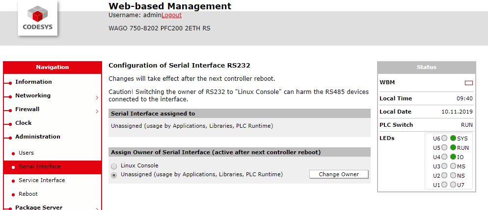
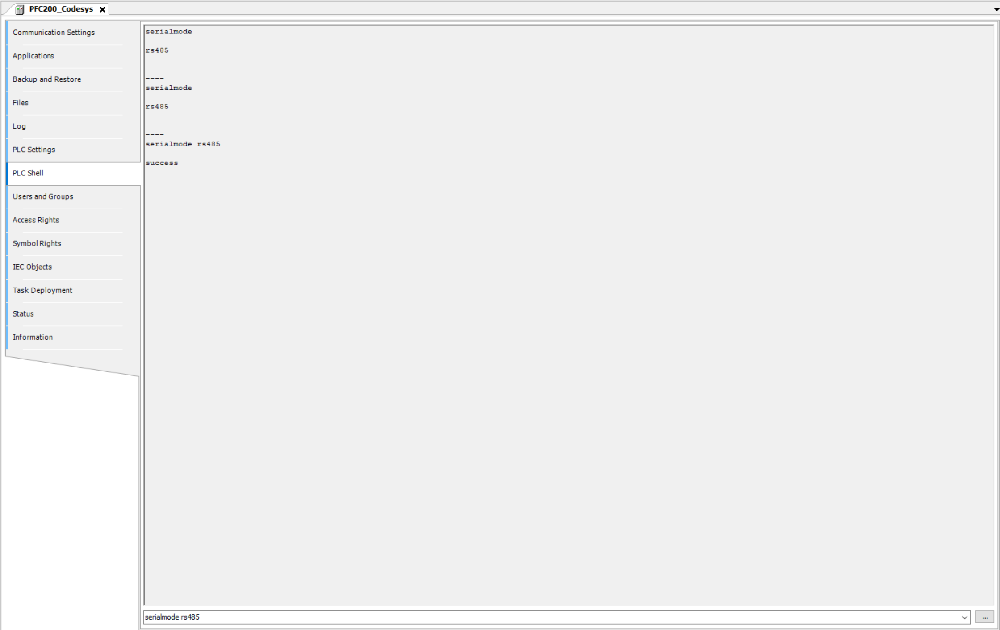
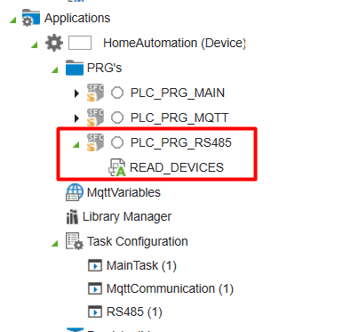

## Using Modbus RTU with the CODESYS 3S runtime

### **Content**
This page describes adding a modbus RTU device using the CODESYS 3S runtime. 
In case a function block for your specific device is not present yet in this project. Please consider reading the [RS485 tips and tricks](../FAQ/RS485_tips_and_tricks.md) page if this is your first time connecting a RS485 device.

### **Assign the PLC serial port to the PLC runtime**
In order use the onboard PLC serial port from the PLC runtime this needs to be configured from the web based management tool:



Note that it's necessary to reboot the controller after a change to this setting.

### **Required libraries**
Make sure the following libraries are present in the project:
```
IoDrvModbus
SysCom
SysTypes2 Interfaces
```

### **Setting the serial mode on the PLC**
Although the PLC serial port is already assigned to the PLC runtime it isn't configured yet in RS485 mode.
To do so:
1. Open Codesys 
1. Connect to your PLC
1. Use the PLC shell to set the serialmode to RS485:



Note that even when the serialmode is already set to RS485 it is adviced to explicitly do so again. This has proven to fix connectivity issues when first using RS485 on a controller.

### **Using code to access the RS485 serial port**
The device configurator overview can be used to add modbus RTU slave devices but it doesn't allow for troubleshooting. Therefore it's preferable to use code to read out the Modbus RTU devices.

A specific implementation example can be found inside the project:



As this project uses a 'é!COCKPIT first' approach the code that needs to be used withing a controller using the Codesys 3S runtime has been commented out.
There are minor differences to the é!COCKPIT and Codesys 3S Modbus RTU implementation. Main reason for this is that both systems have different libraries containing different function blocks and types to work with Modbus RTU.
Nevertheless, any RS485 function block developed in this project can be used in both the é!COCKPIT and Codesys 3S Modbus RTU approach.