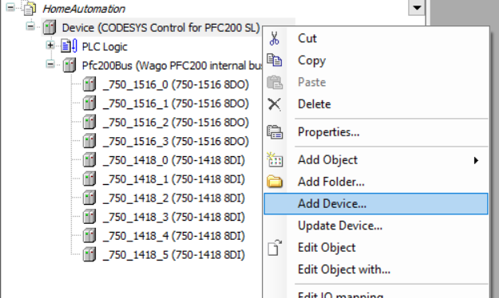
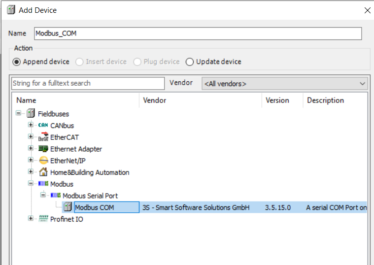
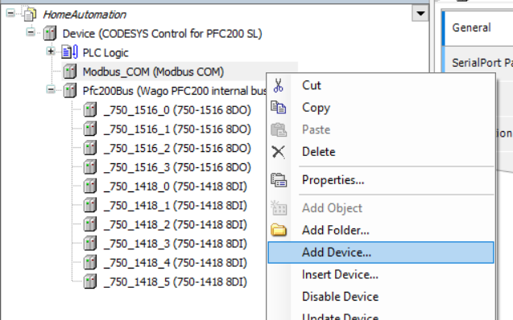
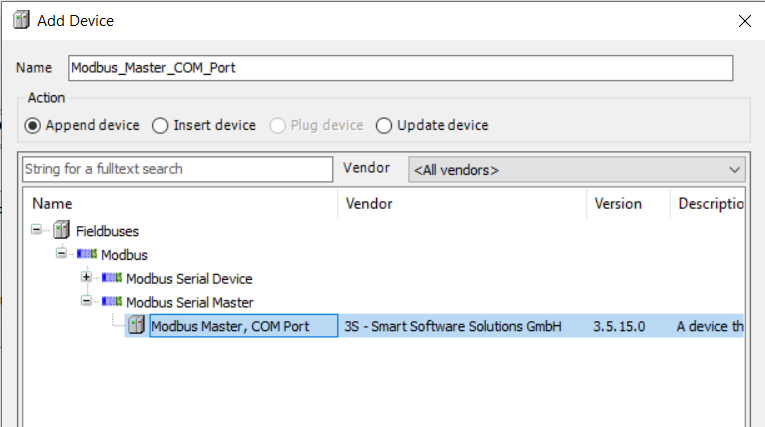
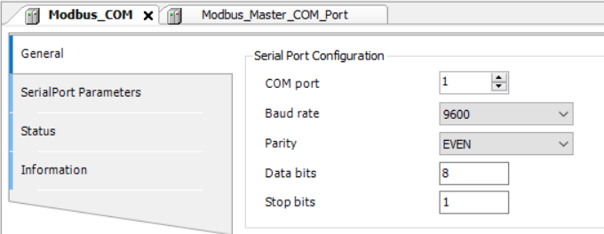
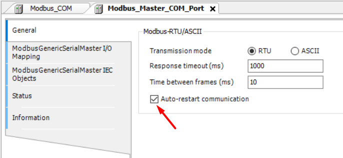
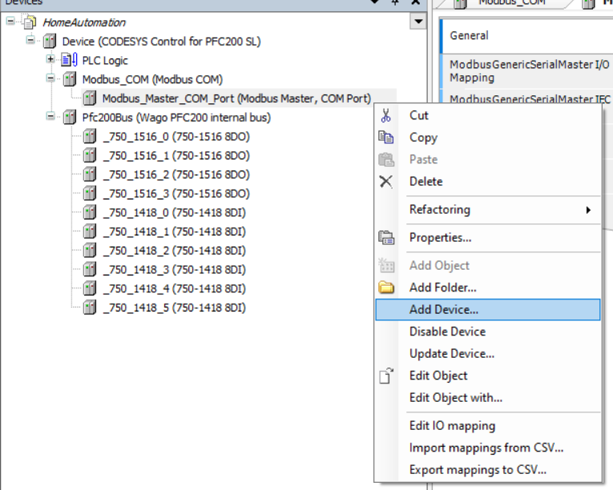
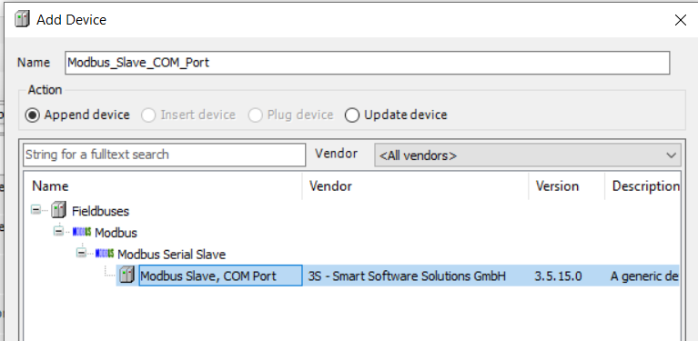

## Using Modbus RTU with the CODESYS 3S runtime

### __Content__
This page describes adding a modbus RTU device using the CODESYS 3S runtime.

- [Configuring the PLC master](#Configuring-the-PLC-master)
- [Adding a slave device](#Adding-a-slave-device)

### __Configuring the PLC master__
From the 'device' tab select the plc and add a new device. To start the com port needs to be added:

After adding the com port to the device tree it's possible to add the modbus master device:

With both present the modbus settings can be configured, to configure specific RS485 protocol settings use the configuration tab on the com port:

To configure specific modbus master settings use the configuration tab on the Modbus master:

Enable the 'Auto-communication restart' checkbox to prevent transient startup issues (for example) on slave devices to block modbus communication.

### __Adding a slave device__
From the 'device' tab select the modbus master added in previous step and add a new modbus slave device:

