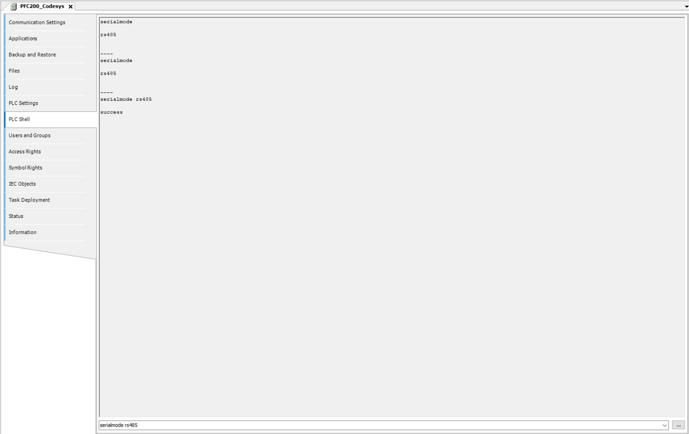
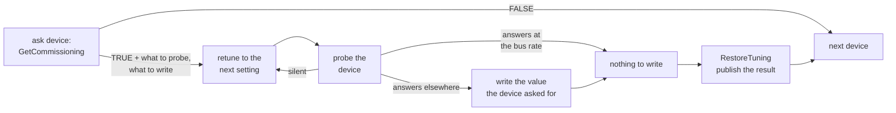

## Using Modbus RTU with the CODESYS 3S runtime

### **Content**
This page describes adding a Modbus RTU device using the CODESYS 3S runtime.
In case a function block for your specific device is not present in this project yet, please consider reading the [RS485 tips and tricks](../FAQ/RS485_tips_and_tricks.md) page if this is your first time connecting an RS485 device.

### **Assign the PLC serial port to the PLC runtime**
In order to use the onboard PLC serial port from the PLC runtime this needs to be configured from the Web-Based Management tool, under *Ports and Services / Serial Interface*, by assigning the serial interface to the PLC runtime instead of the Linux console.

Note that it's necessary to reboot the controller after a change to this setting.

### **Setting the serial mode on the PLC**

Assigning the port to the runtime does **not** put it into RS485 mode. That is a separate step,
and it is required **once per controller**:

1. Open CODESYS
1. Connect to your PLC
1. Use the PLC shell to set the serial mode to RS485:



The controller reboots afterwards and the setting survives it.

:rotating_light: **Do this even if the mode already reads RS485.** Explicitly setting it again
has fixed connectivity on a controller that reported the right mode and would not talk. Until it
is done the bus is simply silent — no error, no exception, nothing in any counter.

There is no IEC alternative: WAGO's `CmpPfcx00` library exposes LEDs, logging and error codes,
and nothing that reaches the serial mode. Treat it as commissioning, alongside setting the
device's Modbus address.

### **Required libraries**
Make sure the following libraries are present in the project:
```
SysCom
SysTypes2 Interfaces
```

`IoDrvModbus` is no longer used — see below.

### **How the project talks to the bus**

Three blocks, each with one job:

| | |
|:--|:--|
| [`FB_RS485_TRANSPORT_RTU`](../FunctionBlocks/FB_RS485_TRANSPORT_RTU.md) | Builds and judges Modbus RTU frames over `SysCom`. Implements `I_RS485_TRANSPORT`. |
| [`FB_RS485_BUSCONTROLLER`](../FunctionBlocks/FB_RS485_BUSCONTROLLER.md) | Decides whose turn it is and runs one device's transaction at a time. |
| [device blocks](RS485Device_Interface.md) | Say what they want read or written, and interpret what comes back. |

`PRG_RS485` wires them together in `RS485_INIT` and calls the controller in `RS485_RUN`. A
worked example lives there.

### **How fast the bus goes, and what actually decides it**

The single biggest performance decision on this bus is **the `RS485` task's cycle
time**, not the baud rate. It is set to **50 ms**.

The reason is that one Modbus exchange costs a fixed number of task *cycles* -
measured at roughly 6.5 to 8.5 per step - rather than a fixed amount of time.
Sending, collecting, judging and the silence afterwards each need at least one
cycle, and several need a cycle to reset a timer before they can start counting.
So the whole exchange scales with the task period:

| `RS485` task | per step | per transaction |
|:--|--:|--:|
| 200 ms | 1.30 s | 3.75 s |
| **50 ms** | **0.42 s** | **0.53 s** |

An SDM220 read is about 100 ms of actual wire time at 9600 baud, so even at 50 ms
the bus spends most of its time waiting for the next cycle rather than for the
slave. Lowering it further would keep paying, in smaller absolute amounts.
[FB_RS485_TRANSPORT_RTU](../FunctionBlocks/FB_RS485_TRANSPORT_RTU.md) has the full
comparison, including what the transport itself contributes.

Two things make a short interval safe here, and both are worth checking before
copying the setting into an installation project:

- **`RS485` runs at priority 15**, the lowest of the five tasks in this project -
  below `MainTask` (4), `MqttCommunication` (5) and `HvacTask` (8). It yields to
  all of them, so polling a meter faster cannot delay a light or a valve.
- **Every task in this project has its watchdog disabled.** That is a pre-existing
  convention rather than anything to do with the interval, but it is the reason
  there is nothing to catch an overrun: a task that cannot keep up degrades
  quietly. If the interval is ever pushed below 50 ms, enable the watchdog first
  so the failure is loud.

:bulb: **`StepsExecuted / Transactions` falling is the bus getting faster, not
batching breaking.** It measures how many of a device's register blocks were due
in the same grant, so a bus that keeps up with demand serves each one as it falls
due and the ratio drops - 2.7 with a 200 ms task, 1.4 with a 50 ms one.

### **A device that ships on the wrong baud rate**

One bus has one baud rate, and not every device agrees to it out of the box. A device that
disagrees is not slow to answer — it is inaudible, and no amount of polling will reach it. The
DFRobot SEN0492 rangefinder is the example in this project: it ships at **115200** with no switch
to change it.

**This is fixable from PLC logic alone**, with no configuration tool, no USB adapter and no vendor
software. The settings that matter live in ordinary holding registers, so they can be written over
Modbus like anything else; the catch is the chicken-and-egg, because to tell a device to change its
baud rate you have to talk to it at the rate it is on now. Two things solve that:

- [`FB_RS485_TRANSPORT_RTU.Retune`](../FunctionBlocks/FB_RS485_TRANSPORT_RTU.md) re-opens the port
  at a different rate or framing at runtime, and `RestoreTuning` puts it back — so the bus can be
  dropped to the device's speed and brought home again without the caller knowing anything about
  ports or parity.
- [`FB_RS485_COMMISSIONER`](../FunctionBlocks/FB_RS485_COMMISSIONER.md) drives that sweep, and
  **knows nothing about any device.** It asks each registered device one question and acts on the
  answer.


```mermaid
flowchart LR
  A["ask device:<br/>GetCommissioning"] -->|FALSE| Z["next device"]
  A -->|"TRUE + what to probe,<br/>what to write"| B["retune to the<br/>next setting"]
  B --> C["probe the<br/>device"]
  C -->|silent| B
  C -->|answers at<br/>the bus rate| Y["nothing to write"]
  C -->|answers elsewhere| D["write the value<br/>the device asked for"]
  D --> Y
  Y --> E["RestoreTuning<br/>publish the result"] --> Z
```

`PRG_RS485` calls the commissioner in `RS485_RUN` and holds the bus controller off until it
reports `Done`. Four things about it are deliberate:

- **The device decides, not the program.** What to probe, which register to write and what value
  to put in it come back from `I_RS485_DEVICE.GetCommissioning`; the program that owns the bus names
  no device and no register. Before this the sweep lived here as two hundred lines that knew one
  sensor's slave address — which is exactly the kind of thing that stops a bus being reusable.
- **It scans rather than assumes.** The first version wrote the new baud rate blind at the
  documented factory speed. When the device stayed silent afterwards there was no way to tell
  whether the write had missed or had landed and moved the device somewhere unexpected — a worse
  position than before. Nothing is written now into a bus whose contents have not been confirmed.
- **It tries the bus rate first.** A device that is already commissioned answers on the first
  probe and the sequence ends there, costing one Modbus exchange.
- **It sweeps framing as well as rate**, because those are the two things that silence a device on
  a working pair. Stop bits go in as the numeric SysCom code rather than a `SYS_COM_STOPBITS`
  enumerator, because the enumerator names are not portable across runtimes and a hunt has to be
  able to try codes it cannot name.

:rotating_light: **The reply to a baud-rate write cannot be heard.** The device changes speed the
moment it accepts the write, so its acknowledgement comes back at the new rate and the old one is
deaf to it. A failed write is therefore the *expected* result of a successful one, and nothing may
retry on it — a retry loop here spins forever on a device that already obeyed.

The result is published **retained**, one message per device that asked for commissioning, under
the bus prefix at the topic the device named:

```
probes=1 found=9600/255 maxrx=9 at=9600/255 written=FALSE
```

That channel matters more than it looks. The obvious place to read a commissioning result is an
online debug session, and on this bench that is the least reliable thing in the chain — the
runtime drops the session long before it drops MQTT. A result nobody can read is not a result.

:rotating_light: **When a sweep finds nothing, suspect the wiring before the settings — and the
byte count tells you which.** A bus with nothing on it returns zero bytes at every setting. A
device that is present but unreadable returns *something*: noise, partial characters, the leading
null this hardware produces as a driver enables. `maxrx` records the largest byte count and where,
and `LeadNulls` climbing while `Ok` stays at zero says the same thing.

That is exactly how the SEN0492 was diagnosed. It was silent through a sweep of every rate its own
register can select, while `LeadNulls` moved — so it was powered and talking, and only the polarity
of the pair could turn that into nothing framable. **A and B were swapped.** Once reversed, the
sweep found it on the first probe, at 9600 with ordinary framing, and `maxrx` became 9 — exactly
the length of the reply it had been trying to send all along.

### **Why this project frames its own RTU rather than using a driver**

Worth knowing before anyone tries to simplify it back.

`IoDrvModbus.ModbusRequest2` does not work on this hardware. Every reply from a slave arrives
wrapped in glitch bytes:

```
00 | 01 04 04 43 69 69 78 10 6E | 00
     └────── a perfect Modbus reply ──────┘
```

A `00` as the slave's driver enables onto the pair and another as it releases, because the line
is undriven between frames. Measured across 34 consecutive captures on the bench: **34 leading
nulls, 34 trailing nulls, 34 CRC-valid frames once trimmed, 0 CRC failures.** The data is fine;
the framing is what an off-the-shelf request block objects to.

`ModbusRequest2` rejects anything that is not a bare frame. WAGO's e!COCKPIT
`FbMbMasterSerial` frames on the 3.5-character silence that RTU actually specifies and discards
those bytes silently, which is why no e!COCKPIT installation ever saw this.

So `FB_RS485_TRANSPORT_RTU` does what RTU specifies: read until the line has been quiet, trim,
and let the CRC decide whether what remains is real. Its `LeadNulls` and `TrailNulls` counters
climbing in step with `Ok` is the **normal healthy picture** on this hardware, not a fault.

Whether `ModbusFB.ClientSerial` tolerates the same bytes has not been established — that is
[#181](https://github.com/MichielVanwelsenaere/HomeAutomation.CoDeSys3/issues/181). Because the
protocol sits behind `I_RS485_TRANSPORT`, adopting it would be an adapter rather than a redesign.
