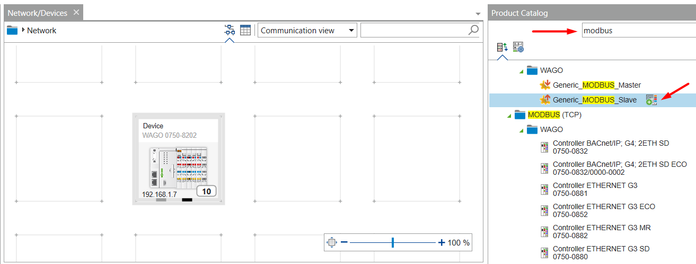
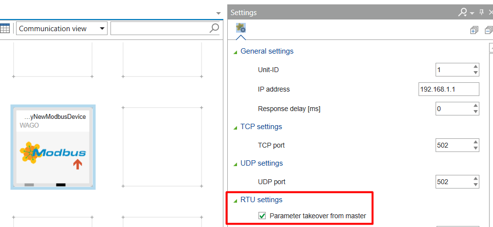
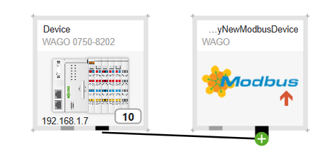

## Using Modbus RTU with the é!COCKPIT runtime

### __Content__
This page describes adding a modbus RTU device using the é!COCKPIT runtime.

- [Configuring the PLC master](#Configuring-the-PLC-master)
- [Adding a slave device](#Adding-a-slave-device)

### __Configuring the PLC master__
Go the 'Network/Device' overview and select the PLC to configure as a modbus master, 

??? Additionaly it's required to configure the serial port on the device to be used by the PLC runtime, this can easily be configured from the web based management view:

### __Adding a slave device__
To add a slave device to write and/or read register(s) using modbus go to the 'Network/Device' overview and add a 'Generic_MODBUS_Slave' device: 

Note that it's adviced to rename the device after creation in order to keep an overview on multiple modbus slave devices.
The slave device has by default the same modbus RTU settings as the master device:

Now the device has been created a communication relationship needs to be established between the master and slave device. To do this select the serial port from the master, hold it and drag the communication line to the serial port of the slave device:

