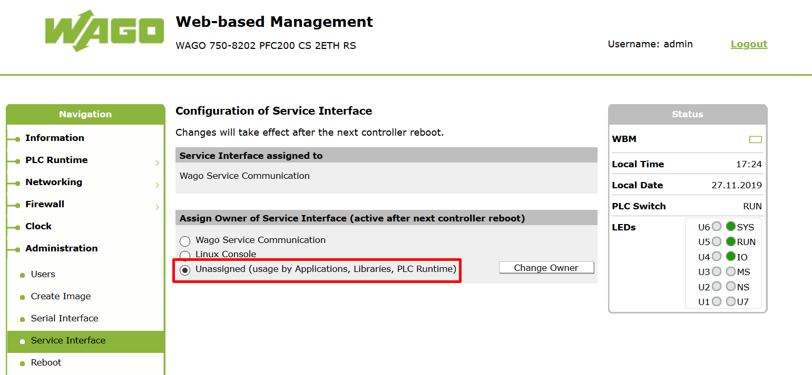

## Using Modbus RTU with the é!COCKPIT runtime

### __Content__
This page describes adding a modbus RTU device using the é!COCKPIT runtime.
In case a function block for your specific device is not present yet in this project. Please consider reading out your device first from a computer to gain more insights on the modbus specifications of your device. A guide to accomplish this can be found [here](./ReadingOutADeviceFromPC.md).


- [Assign the PLC serial port to the PLC runtime](#Assign-the-PLC-serial-port-to-the-PLC-runtime)
- [Required libraries](#Required-libraries)
- [Adding a dummy slave device](#Adding-a-slave-device)
- [Using code to access the RS485 serial port](#Using-code-to-access-the-RS485-serial-port)

### __Assign the PLC serial port to the PLC runtime__
In order use the onboard PLC serial port from the PLC runtime this needs to be configured from the web based management tool:



Note that it's necessary to reboot the controller after a change to this setting.

### __Required libraries__
Make sure the following libraries are present in the project:
```
WagoAppPlcModbus
```

### __Adding a dummy slave device__
In order to enable Modbus RTU communcation a dummy Modbus RTU device needs to be added in the device overview:

 <br /> 


### __Using code to access the RS485 serial port__
The device configurator overview can be used to add modbus RTU slave devices but it doesn't allow for troubleshooting. Therefore it's preferable to use code to read out the Modbus RTU devices.

A specific implementation example can be found inside the project:


