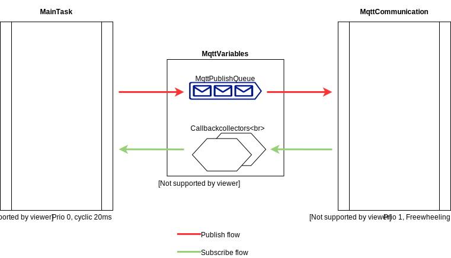
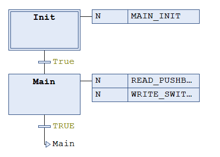
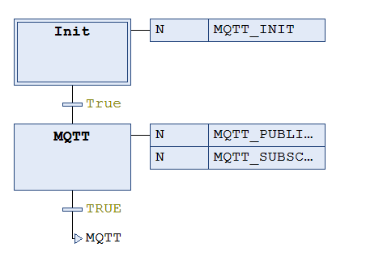

## SoftwareArchitecture

### __General Overview__
The software is designed to have a loosely coupled architecture making it possible to add new home automation functionality without the need to worry about the MQTT communication to much.
This results in a seperate task for the main home automation task and a task to handle the MQTT communication to the broker. A global variable list is used to share memory objects between the two tasks enabling communication.

### __Main Task (PLC_PRG_MAIN)__

The main task is build using a SFC (Sequential Function Chart) with the following actions:

1. `MAIN_INIT`: action ran once at startup to init FB's with static values/references.
2. `READ_PUSHBUTTONS`: action ran continously to read out digital inputs (FB's used in this action assume usage of pushbutton).
3. `WRITE_SWITCHES`: action ran continously after `READ_PUSHBUTTONS` to switch outputs using the results from `READ_PUSHBUTTONS`.

Each of the Function Blocks (FB's) used to read inputs and switch outputs has a reference to a `MQTTPublishQueue` which is used to queue events to send to the MQTT broker.
The events are send towards the broker in the MQTT Task which has a lower priority so it never interferes with the main task which does the critical work.

### __MQTT Task (PLC_PRG_MQTT)__
The main task is build using a SFC (Sequential Function Chart) with the following actions:

1. `MQTT_INIT`: action ran once at startup to init FB's with static values/references.
2. `MQTT_PUBLISH`: action ran continously to read the events to publish from the `MQTTPublishQueue`. Has a number of `MQTTPublishWorkers` who are able to send MQTT events simultanously.
3. `MQTT_SUBSCRIBE`: action ran continously after `MQTT_PUBLISH` to handle subscriptions.

### __Global Variable list MQTT (MQTTVariables)__

Contains function blocks to enable communication between the main task and the MQTT task. For example:
- `MQTTPublishQueue` FB where the main task queue's messages to be published.
- Callbackcollectors FB's so FB's can register for a callback event in case a message is received on a topic.