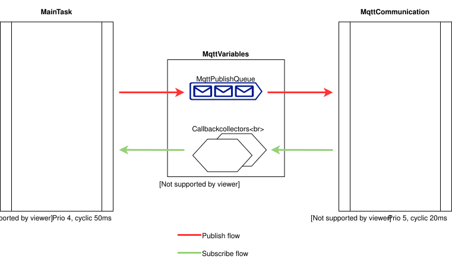
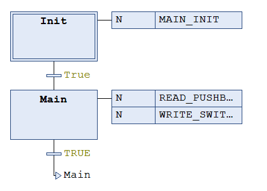
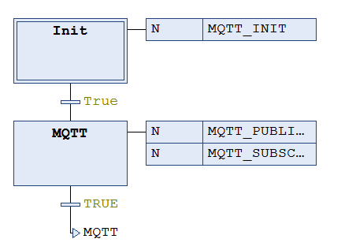

## SoftwareArchitecture

### **General Overview**
The software is designed to have a loosely coupled architecture making it possible to add new home automation functionality without the need to worry about the MQTT communication too much.
This results in a task for the main home automation logic and a separate task to handle the MQTT communication to the broker. A global variable list is used to share memory objects between the two tasks enabling communication.

### **Main Task (PRG_MAIN)**

The main task is built using an SFC (Sequential Function Chart) with the following actions:

1. `MAIN_INIT`: action ran once at startup to init FBs with static values/references.
2. `READ_PUSHBUTTONS`: action ran continuously to read out digital inputs (FBs used in this action assume usage of a pushbutton).
3. `WRITE_SWITCHES`: action ran continuously after `READ_PUSHBUTTONS` to switch outputs using the results from `READ_PUSHBUTTONS`.

Each of the Function Blocks (FBs) used to read inputs and switch outputs has a reference to an `MQTTPublishQueue` which is used to queue events to send to the MQTT broker.
The events are sent towards the broker in the MQTT Task which has a lower priority so it never interferes with the main task which does the critical work.

### **MQTT Task (PRG_MQTT)**
The MQTT task is built using an SFC (Sequential Function Chart) with the following actions:

1. `MQTT_INIT`: action ran once at startup to init FBs with static values/references.
2. `MQTT_PUBLISH`: action ran continuously to read the events to publish from the `MQTTPublishQueue`. Has a number of `MQTTPublishWorkers` which are able to send MQTT events simultaneously.
3. `MQTT_SUBSCRIBE`: action ran continuously after `MQTT_PUBLISH` to handle subscriptions.

### **Global Variable list MQTT (MQTTVariables)**

Contains function blocks to enable communication between the main task and the MQTT task. For example:
- `MQTTPublishQueue` FB where the main task queues messages to be published.
- Callback collector FBs so FBs can register for a callback event in case a message is received on a topic.